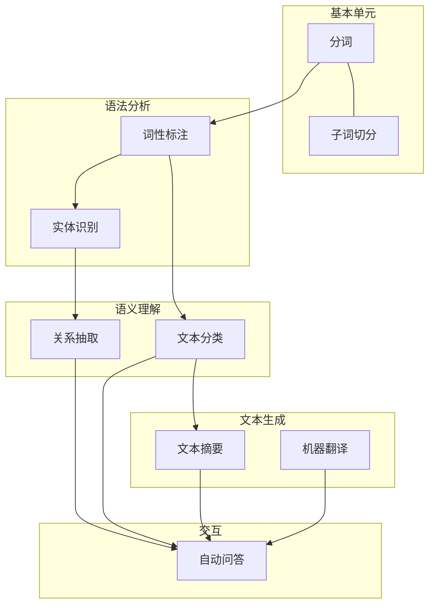
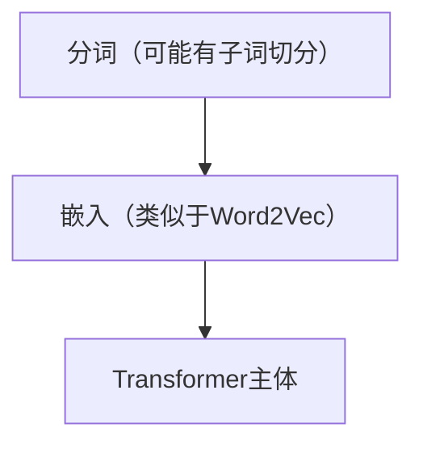

# NLP基础概念
[toc]

## NLP任务


||传统NLP任务|现在的LLM|
|-|-|-|
|模式|一任务一模型|一个大模型处理多任务|
|处理复杂任务|多个子任务组合|直接端到端|

## 文本表示
数字化 可计算 $\Rightarrow$ 向量

### VSM
每个词一个维度，形成句向量
**缺点**：
- 本来就稀疏，维度还高
- 不体现语义和关系
- 词序丢失

### N-gram
在前 N 个词出现的条件下，预测下一个词
> 用概率值代替简单的“存在性”，有关系、词序

**缺点：**
- $V^N$ 种情况，参数量太多，还是稀疏
- 上文范围有限
`我是中国人，我的母语是__`

### Word2Vec（核心思想）
把语义作为向量维度
> 更稠密，更低维度，更体现关系
```
向量为 [地位, 性别, 其他]
"男人": [0, 1, 0]
"女人": [0, -1, 0]
"国王": [100, 1, 0.5]
"女王": [100, -1, 0.5]
国王 - 男人 + 女人 = 女王
```
捕捉关系，点积表示相关性

**训练**：
神经网络实现
$$输入词 \xrightarrow{W_{input}} 向量 \xrightarrow{W_{output}} 预测词$$
最后保留 $W_{input}$，每行是一个词向量

CBOW
```
今天: [1, 0, 0, 0]
？？: [?, ?, ?, ?]
真好: [0, 0, 0, 1]
```
Skip-Gram
```
？？: [?, ?, ?, ?]
天气: [0, 0, 1, 0]
？？: [?, ?, ?, ?]
```

**缺点**：
- 一词一意
  `“香蕉”和“谷歌”距离远，那“苹果”在哪？`

#### ELMo
前向LSTM + 后向LSTM，多层加权
> 现场算取代查表，动态

- 预训练：LSTM参数
- 微调：层权重

## 在现代 Transformer 的应用

在后续注意力计算中，词向量一直在变，类似于ELMo的思路
