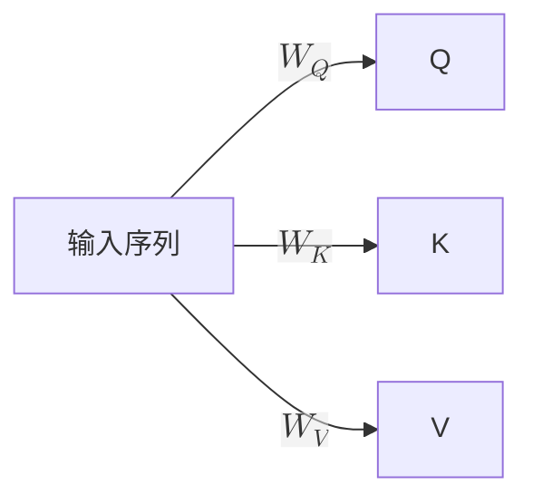

# Transformer
[TOC]

## 注意力机制


### 核心公式
相似度 $\rightarrow$ 权重

<svg viewBox="0 0 960 470" width="100%" role="img" aria-labelledby="attention-title attention-desc" xmlns="http://www.w3.org/2000/svg" style="display:block;width:100%;height:auto;aspect-ratio:960/470">
  <!-- Q 特征 -->
  <text x="562" y="82" text-anchor="middle" fill="currentColor" font-size="16" font-weight="600">Q</text>
  <circle cx="562" cy="112" r="16" fill="#f59e0b" stroke="#b45309" stroke-width="2"/>
  <text x="562" y="117" text-anchor="middle" fill="#3b2500" font-size="12" font-weight="600">q</text>
  <line x1="562" y1="131" x2="562" y2="183" stroke="#f59e0b" stroke-width="2" stroke-dasharray="5 5"/>
  <path d="M 555 174 L 562 184 L 569 174" fill="none" stroke="#f59e0b" stroke-width="2"/>
  <!-- 特征轴 -->
  <line x1="78" y1="195" x2="882" y2="195" stroke="currentColor" stroke-opacity="0.28" stroke-width="2"/>
  <path d="M 882 195 L 870 188 L 870 202 Z" fill="currentColor" opacity="0.28"/>
  <!-- K 行 -->
  <text x="44" y="201" text-anchor="middle" fill="#3b82f6" font-size="18" font-weight="600">K</text>
  <g fill="#3b82f6" stroke="#1d4ed8" stroke-width="2">
    <circle cx="100" cy="195" r="16"/>
    <circle cx="240" cy="195" r="16"/>
    <circle cx="380" cy="195" r="16"/>
    <circle cx="520" cy="195" r="16"/>
    <circle cx="660" cy="195" r="16"/>
    <circle cx="800" cy="195" r="16"/>
  </g>
  <g text-anchor="middle" fill="#ffffff" font-size="11" font-weight="600">
    <text x="100" y="199">k₁</text>
    <text x="240" y="199">k₂</text>
    <text x="380" y="199">k₃</text>
    <text x="520" y="199">k₄</text>
    <text x="660" y="199">k₅</text>
    <text x="800" y="199">k₆</text>
  </g>
  <!-- Q-K 水平距离 -->
  <g text-anchor="middle" fill="currentColor" opacity="0.72" font-size="12">
    <text x="100" y="231">|q-k₁| = 3.3</text>
    <text x="240" y="231">|q-k₂| = 2.3</text>
    <text x="380" y="231">|q-k₃| = 1.3</text>
    <text x="520" y="231">|q-k₄| = 0.3</text>
    <text x="660" y="231">|q-k₅| = 0.7</text>
    <text x="800" y="231">|q-k₆| = 1.7</text>
  </g>
  <!-- K 到 V 的对应关系 -->
  <g stroke="currentColor" stroke-opacity="0.22" stroke-width="1.5">
    <line x1="100" y1="214" x2="100" y2="305"/>
    <line x1="240" y1="214" x2="240" y2="305"/>
    <line x1="380" y1="214" x2="380" y2="305"/>
    <line x1="520" y1="214" x2="520" y2="305"/>
    <line x1="660" y1="214" x2="660" y2="305"/>
    <line x1="800" y1="214" x2="800" y2="305"/>
  </g>
  <!-- V 行：色相和明度不变，饱和度随权重增加 -->
  <text x="44" y="330" text-anchor="middle" fill="hsl(328, 88%, 50%)" font-size="18" font-weight="600">V</text>
  <g stroke="currentColor" stroke-opacity="0.28" stroke-width="1.5">
    <circle cx="100" cy="324" r="19" fill="hsl(328, 12%, 56%)"/>
    <circle cx="240" cy="324" r="19" fill="hsl(328, 20%, 56%)"/>
    <circle cx="380" cy="324" r="19" fill="hsl(328, 40%, 56%)"/>
    <circle cx="520" cy="324" r="19" fill="hsl(328, 96%, 56%)"/>
    <circle cx="660" cy="324" r="19" fill="hsl(328, 67%, 56%)"/>
    <circle cx="800" cy="324" r="19" fill="hsl(328, 29%, 56%)"/>
  </g>
  <g text-anchor="middle" fill="#ffffff" font-size="11" font-weight="600">
    <text x="100" y="328">v₁</text>
    <text x="240" y="328">v₂</text>
    <text x="380" y="328">v₃</text>
    <text x="520" y="328">v₄</text>
    <text x="660" y="328">v₅</text>
    <text x="800" y="328">v₆</text>
  </g>
  <g text-anchor="middle" fill="currentColor" font-size="12">
    <text x="100" y="360">w₁ = 0.020</text>
    <text x="240" y="360">w₂ = 0.055</text>
    <text x="380" y="360">w₃ = 0.149</text>
    <text x="520" y="360" font-weight="600">w₄ = 0.405</text>
    <text x="660" y="360">w₅ = 0.271</text>
    <text x="800" y="360">w₆ = 0.100</text>
  </g>
</svg>

$$ \text{相似度} = Q K^T $$
>一行 = 一词向量
相似度 = Q K 行点积

<svg viewBox="0 0 960 420" width="100%" role="img" aria-labelledby="qkv-matrix-title qkv-matrix-desc" xmlns="http://www.w3.org/2000/svg" style="display:block;width:100%;height:auto;aspect-ratio:960/420">
  <title id="qkv-matrix-title">Q、K、V 矩阵的形状</title>
  <desc id="qkv-matrix-desc">Q 矩阵有 n 行，K 和 V 矩阵有 m 行，三个矩阵都有 d k 列。n 与 m 不同。矩阵仅用横线区分各行。</desc>
  <!-- Q 矩阵：n × dₖ -->
  <text x="190" y="34" text-anchor="middle" fill="#f59e0b" font-size="22" font-weight="600">Q</text>
  <line x1="100" y1="80" x2="280" y2="80" stroke="currentColor" stroke-opacity="0.55" stroke-width="1.5"/>
  <path d="M 108 74 L 100 80 L 108 86" fill="none" stroke="currentColor" stroke-opacity="0.55" stroke-width="1.5"/>
  <path d="M 272 74 L 280 80 L 272 86" fill="none" stroke="currentColor" stroke-opacity="0.55" stroke-width="1.5"/>
  <text x="190" y="68" text-anchor="middle" fill="currentColor" font-size="16">dₖ</text>
  <line x1="70" y1="110" x2="70" y2="270" stroke="currentColor" stroke-opacity="0.55" stroke-width="1.5"/>
  <path d="M 64 118 L 70 110 L 76 118" fill="none" stroke="currentColor" stroke-opacity="0.55" stroke-width="1.5"/>
  <path d="M 64 262 L 70 270 L 76 262" fill="none" stroke="currentColor" stroke-opacity="0.55" stroke-width="1.5"/>
  <text x="50" y="196" text-anchor="middle" fill="currentColor" font-size="18">n</text>
  <rect x="100" y="110" width="180" height="160" fill="#f59e0b" fill-opacity="0.24" stroke="#d97706" stroke-width="2"/>
  <g stroke="#d97706" stroke-opacity="0.65" stroke-width="1.5">
    <line x1="100" y1="150" x2="280" y2="150"/>
    <line x1="100" y1="190" x2="280" y2="190"/>
    <line x1="100" y1="230" x2="280" y2="230"/>
  </g>
  <!-- K 矩阵：m × dₖ -->
  <text x="480" y="34" text-anchor="middle" fill="#3b82f6" font-size="22" font-weight="600">K</text>
  <line x1="390" y1="80" x2="570" y2="80" stroke="currentColor" stroke-opacity="0.55" stroke-width="1.5"/>
  <path d="M 398 74 L 390 80 L 398 86" fill="none" stroke="currentColor" stroke-opacity="0.55" stroke-width="1.5"/>
  <path d="M 562 74 L 570 80 L 562 86" fill="none" stroke="currentColor" stroke-opacity="0.55" stroke-width="1.5"/>
  <text x="480" y="68" text-anchor="middle" fill="currentColor" font-size="16">dₖ</text>
  <line x1="360" y1="110" x2="360" y2="350" stroke="currentColor" stroke-opacity="0.55" stroke-width="1.5"/>
  <path d="M 354 118 L 360 110 L 366 118" fill="none" stroke="currentColor" stroke-opacity="0.55" stroke-width="1.5"/>
  <path d="M 354 342 L 360 350 L 366 342" fill="none" stroke="currentColor" stroke-opacity="0.55" stroke-width="1.5"/>
  <text x="340" y="236" text-anchor="middle" fill="currentColor" font-size="18">m</text>
  <rect x="390" y="110" width="180" height="240" fill="#3b82f6" fill-opacity="0.24" stroke="#2563eb" stroke-width="2"/>
  <g stroke="#2563eb" stroke-opacity="0.65" stroke-width="1.5">
    <line x1="390" y1="150" x2="570" y2="150"/>
    <line x1="390" y1="190" x2="570" y2="190"/>
    <line x1="390" y1="230" x2="570" y2="230"/>
    <line x1="390" y1="270" x2="570" y2="270"/>
    <line x1="390" y1="310" x2="570" y2="310"/>
  </g>
  <!-- V 矩阵：m × dₖ -->
  <text x="770" y="34" text-anchor="middle" fill="#db2777" font-size="22" font-weight="600">V</text>
  <line x1="680" y1="80" x2="860" y2="80" stroke="currentColor" stroke-opacity="0.55" stroke-width="1.5"/>
  <path d="M 688 74 L 680 80 L 688 86" fill="none" stroke="currentColor" stroke-opacity="0.55" stroke-width="1.5"/>
  <path d="M 852 74 L 860 80 L 852 86" fill="none" stroke="currentColor" stroke-opacity="0.55" stroke-width="1.5"/>
  <text x="770" y="68" text-anchor="middle" fill="currentColor" font-size="16">dₖ</text>
  <line x1="650" y1="110" x2="650" y2="350" stroke="currentColor" stroke-opacity="0.55" stroke-width="1.5"/>
  <path d="M 644 118 L 650 110 L 656 118" fill="none" stroke="currentColor" stroke-opacity="0.55" stroke-width="1.5"/>
  <path d="M 644 342 L 650 350 L 656 342" fill="none" stroke="currentColor" stroke-opacity="0.55" stroke-width="1.5"/>
  <text x="630" y="236" text-anchor="middle" fill="currentColor" font-size="18">m</text>
  <rect x="680" y="110" width="180" height="240" fill="#db2777" fill-opacity="0.24" stroke="#be185d" stroke-width="2"/>
  <g stroke="#be185d" stroke-opacity="0.65" stroke-width="1.5">
    <line x1="680" y1="150" x2="860" y2="150"/>
    <line x1="680" y1="190" x2="860" y2="190"/>
    <line x1="680" y1="230" x2="860" y2="230"/>
    <line x1="680" y1="270" x2="860" y2="270"/>
    <line x1="680" y1="310" x2="860" y2="310"/>
  </g>
</svg>

维度高 $\Rightarrow$ 点积方差大 $\Rightarrow$ softmax 趋近 1 + 0 $\Rightarrow$ 梯度消失
$\therefore$ $\text{相似度} = \cfrac{Q K^T}{\sqrt{d_k}}$

相似度 $\xrightarrow{softmax}$ 权重 $\xrightarrow{\cdot V}$ 

### 自注意力
Q、K、V 来自同一序列

为什么非要经过 W ？
- 注意力计算固定，W 可学习
- 职责不同
  ```
  "小明18岁，他成年了"
  "他"   - Q: 需要匹配一个人
  "小明" - K: 可以匹配一个人
        - V: 小明的个人信息
  ```

### 掩码
只能看到上文

已有完整输入，但仍需要每个token的输出
> 训练 和 处理prompt 时用

给注意力分数 -inf，softmax 后为 0

### 多头
- 多组 $W_Q, W_K, W_V$ 把输入投影到不同子空间中
- 分别计算注意力
- 拼接，再经 $W_O$ 融合信息

允许模型在 不同的子空间 关注 不同的信息

## 其他零件
### FNN
- Attention 让词向量沾沾上下文信息（提取汇聚）
- FNN 真正去“回答问题”（输入转输出）
```
法国 的 首都 在 [哪里?]
                |Attention
                V
              [法国首都地点?]
                |FNN
                V
              [巴黎]        
```


### LayerNorm
$$ \frac{x - \mu}{ \sqrt{\sigma^2 + \epsilon}} \gamma + \beta \\ $$
消除量纲差异
> 保留内部关系，破坏外部关系
- 减均值: 平移
- 除标准差: 缩放
- 可学习参数 $\gamma$, $\beta$: 恢复表达能力

施加方向

<svg viewBox="0 0 960 420" width="100%" role="img" aria-labelledby="norm-scope-title norm-scope-desc" xmlns="http://www.w3.org/2000/svg" style="display:block;width:100%;height:auto;aspect-ratio:960/420">
  <!-- 特征方向 -->
  <line x1="220" y1="56" x2="780" y2="56" stroke="currentColor" stroke-opacity="0.5" stroke-width="1.5"/>
  <path d="M 228 50 L 220 56 L 228 62" fill="none" stroke="currentColor" stroke-opacity="0.5" stroke-width="1.5"/>
  <path d="M 772 50 L 780 56 L 772 62" fill="none" stroke="currentColor" stroke-opacity="0.5" stroke-width="1.5"/>
  <text x="500" y="42" text-anchor="middle" fill="currentColor" font-size="17" font-weight="500">特征 features</text>
  <!-- 样本方向 -->
  <line x1="174" y1="90" x2="174" y2="330" stroke="currentColor" stroke-opacity="0.5" stroke-width="1.5"/>
  <path d="M 168 98 L 174 90 L 180 98" fill="none" stroke="currentColor" stroke-opacity="0.5" stroke-width="1.5"/>
  <path d="M 168 322 L 174 330 L 180 322" fill="none" stroke="currentColor" stroke-opacity="0.5" stroke-width="1.5"/>
  <text x="142" y="210" text-anchor="middle" fill="currentColor" font-size="17" font-weight="500" transform="rotate(-90 142 210)">样本 samples</text>
  <!-- 数据矩阵 -->
  <rect x="220" y="90" width="560" height="240" fill="currentColor" fill-opacity="0.035" stroke="currentColor" stroke-opacity="0.42" stroke-width="2"/>
  <g stroke="currentColor" stroke-opacity="0.13" stroke-width="1">
    <line x1="290" y1="90" x2="290" y2="330"/>
    <line x1="360" y1="90" x2="360" y2="330"/>
    <line x1="430" y1="90" x2="430" y2="330"/>
    <line x1="500" y1="90" x2="500" y2="330"/>
    <line x1="570" y1="90" x2="570" y2="330"/>
    <line x1="640" y1="90" x2="640" y2="330"/>
    <line x1="710" y1="90" x2="710" y2="330"/>
    <line x1="220" y1="130" x2="780" y2="130"/>
    <line x1="220" y1="170" x2="780" y2="170"/>
    <line x1="220" y1="210" x2="780" y2="210"/>
    <line x1="220" y1="250" x2="780" y2="250"/>
    <line x1="220" y1="290" x2="780" y2="290"/>
  </g>
  <!-- BatchNorm：一个特征，跨所有样本 -->
  <rect x="430" y="90" width="70" height="240" fill="#3b82f6" fill-opacity="0.22" stroke="#2563eb" stroke-width="3"/>
  <!-- LayerNorm：一个样本，跨所有特征 -->
  <rect x="220" y="210" width="560" height="40" fill="#f59e0b" fill-opacity="0.22" stroke="#d97706" stroke-width="3"/>
  <!-- 直接标注 -->
  <line x1="465" y1="88" x2="465" y2="72" stroke="#2563eb" stroke-width="2"/>
  <circle cx="465" cy="68" r="5" fill="#3b82f6"/>
  <text x="480" y="73" fill="currentColor" font-size="14" font-weight="500">BatchNorm：同一特征，跨样本</text>
  <line x1="782" y1="230" x2="812" y2="230" stroke="#d97706" stroke-width="2"/>
  <circle cx="817" cy="230" r="5" fill="#f59e0b"/>
  <text x="832" y="225" fill="currentColor" font-size="14" font-weight="500">LayerNorm</text>
  <text x="832" y="246" fill="currentColor" font-size="13">同一样本</text>
  <text x="832" y="265" fill="currentColor" font-size="13">跨特征</text>
</svg>

> 这里一个样本是一个 token

### 残差连接
输入 = 上层输出 + 上层输入
信息不易丢失，底层信息直达最高层


### 位置编码
用一个向量表示数字（位置顺序）

**尽量不重复**
很多组周期函数 $p(\omega_i pos)$，频率随 $i$ 减小

类似于钟表，前面转动快，后面转动慢，形成嵌套分支

**体现距离**
$$ p_i \cdot p_j = g(i-j) $$
那一大堆推导，想证明 点积值能反映距离

**为什么直接加**
$$ h_i = x_i + p_i $$
- $x_i$ 表示语义
- $p_i$ 表示位置

这俩不在同一个空间

- 后面的线性层可能懂分离 $(x+p)W=xW+pW$
- embedding 训练时可能"躲"位置

> 现在 LLM 好像不太用这种编码方式

## 架构


第三个注意力层不是自注意力
- Decoder 上一轮输出转化 -> Q: 下一步还想知道什么
- Encoder 输出 -> K、V: 能告诉你什么
> 编码器、解码器间传递信息
```
翻译任务
Encoder 输入: "Hello world"
    -> K、V: 要表达"对世界说你好"
Dncoder 上轮输出: "你好"
    -> Q: 已经说了"你好"，下一个词该说什么？

本轮输出: "世界"
```
