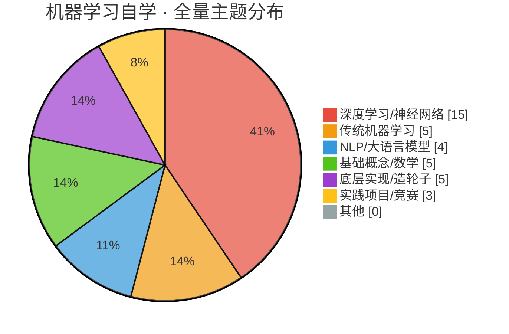
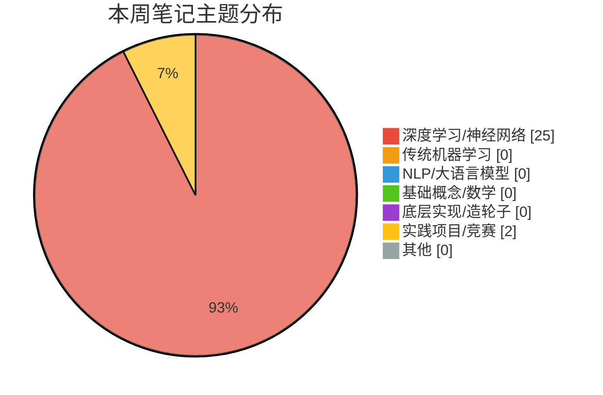

> 上次更新：2026-08-23

# 📚 机器学习自学 · 学习历程

---

## 📅 2026-08-22（第0期 · 初始建仓快照）

**统计周期**：2026-08-22（建仓首期，全量盘点）
**新增笔记**：37 篇（历史积累） | **D2L 进度**：01→15（最新：CNN总结）

> 🎉 首期快照！网安暂时休整，深度学习主线正式起航。本期把从前的积累全部盘点入档。

### 📝 本周学习内容（全量盘点）

#### 🧠 深度学习/神经网络（主线 · 15 篇）
- **《动手学深度学习》D2L**（12 个 notebook）：从线性回归 → softmax → 感知机/MLP → 训练技巧 → Kaggle房价实战 → PyTorch 基础 → CNN 卷积网络全家桶（基础→LeNet→AlexNet→VGG→NiN→总结）
- **零散自学/深度学习**（3 篇）：MLP 手写数字识别（含 GUI + 模型）、cos_mlp 实验

#### 🤖 传统机器学习（5 篇）
- 线性回归、KNN、SVM、随机森林、cox回归 —— 经典五件套齐了

#### 🔤 NLP/大语言模型（4 篇）
- happy-llm：NLP概念 → Transformer → 预训练语言模型 → 大语言模型 —— 与 D2L 的 CNN 主线形成「CV + NLP」双支线

#### ⚙️ 基础概念/数学（5 篇）
- 梯度下降、激活函数、感知机、tensor、MLP异或门

#### 🔩 底层实现/造轮子（5 篇）
- KNN.c + 线性回归 C 语言全家桶（一元/多元/多项式/正则化）—— 用 C 从零造轮子，硬核！

#### 🛠️ 实践项目/竞赛（3 篇）
- 房价预测（多元线性回归）、二手车价预测、阿里移动推荐

### 🎯 D2L 章节推进（主线）
- 进度：01→15（建仓盘点，历史推进）
- 已覆盖：线性回归 → softmax → MLP → 训练技巧 → Kaggle房价 → PyTorch → CNN基础 → LeNet → AlexNet → VGG → NiN → CNN总结
- 当前缺口：**12-14 缺号**（大概率是批量归一化、ResNet、DenseNet 这些现代卷积结构）
- 下一步建议：ResNet 是现代 CNN 的地基，建议补上 12-14；同时 happy-llm 已摸到 Transformer，D2L 后半程的 RNN→注意力机制正好能和 LLM 支线汇合 🚀

### 📊 本周主题分布（建仓全量）

### 💡 本周亮点 & 彩蛋
- 🏗️ **C 语言造轮子**是独门绝活——KNN.c、线性回归 C 全家桶，这波底层功力和「框架调包侠」高下立判，深度学习学起来会有通透加成
- 🧩 **双支线格局初现**：CV（D2L 卷积全家桶）和 NLP（happy-llm Transformer）两条线并行，最后会在注意力机制处汇合，画面很美

### 🔍 笔记审查结果
- 首期快照为全量盘点，未做逐篇深度审查。后续每期重点抽查新增笔记。
- 待办提醒：`动手深度学习/06-Pytorch神经网络.Ipynb` 扩展名大写（`.Ipynb`），macOS 下没问题但 git 跨平台可能踩坑，建议顺手改成小写 `.ipynb`。

### 🎯 下周展望
- 主线继续 D2L：优先补上 ResNet（12-14 缺口），CNN 体系就完整了
- 想换口味时，Transformer 笔记（happy-llm/2）值得二刷——它会是 CV 和 NLP 双线交汇的桥梁

### 🌐 Kaggle 本周进展
- 参赛比赛：**House Prices**（Getting Started，公开榜排名 **1648**）、**California House Prices**（Community）
- 本周提交（08-18）共 5 次：
  - House Prices：`submission.csv`（MLP, lr=0.01, wd=1.0, hidden=[128]）→ 0.13139；`kaggle_house_price.csv` → 0.13444
  - California：`prediction.csv` 0.57776 → **0.51505**（调参进步 📈）
- 凭证：✅ Kaggle API token 已接入（`~/.kaggle/access_token`），周报将自动拉取排名 + 提交轨迹

---

## 📌 给下一期（2026-08-23 周日）的提示

> ⚠️ **本文件首期（08-22）是全量盘点「初始快照」**，统计了建仓前所有历史笔记（37 篇），只是建仓基线。
>
> 周日的总结请**按正常的一周（7 天）节奏统计**：本期统计周期应为完整的学习周（约 **2026-08-16 → 2026-08-23**），而不是「上次更新（08-22）→ 今天（08-23）」的一天。
>
> **不要因为初始快照覆盖了历史就忽略本周内容**——即使本周新增为 0、或只是修改了已有 notebook，也要如实记录并输出新的一期（第1期）。

---

## 📅 2026-08-23（第1期）

**统计周期**：2026-08-17 → 2026-08-23（7 天）
**新增笔记**：27 篇 | **D2L 进度**：01→19（最新：3-04 数据增广，补齐 12-14 缺口）

### 📝 本周学习内容
本周是「CNN 完全体」的一周——首期快照留的 12-14 缺口（GoogLeNet/批量归一化/ResNet）被全部补齐，卷积网络从 1998 到 2015 的进化史彻底焊死，还顺势开进 D2L 第 3 部分（计算性能/并行训练）。另有两个新实战项目上线。

#### 🧠 深度学习/神经网络（主线 · 25 篇）
- **GoogLeNet**（2-06）：Inception 块多路径并行提取特征，1x1 卷积降维大法（参数量 0.16M vs 5x5 直卷 1.22M，血赚）
- **批量归一化**（2-07）：解决「前面慢后面快」问题，μ/σ 归一化 + γ/β 可学习参数；洞察「BN 本质是加噪声，和 dropout 别混用」
- **ResNet**（2-08）：残差连接 f(x)=x+g(x)，梯度恒等项 1 保证不消失；「模型学会摆烂」——学不好就原样输出，太有灵魂了
- **CNN 总结**（2-09）：LeNet→AlexNet→VGG→NiN→GoogLeNet→ResNet 时间线 + RTX 5090 实测数据表（参数量/计算量/训练速度/精度）
- **深度学习硬件**（3-01）：CPU/GPU/TPU 架构、内存带宽对比（CPU-GPU 仅 16GB/s PCIe 3.0，别老来回传数据）
- **单机多卡并行**（3-02）：数据并行 vs 模型并行 vs 通道并行，mermaid 时序图画得很清楚
- **分布式训练**（3-03）：多机多卡 + 参数服务器架构，同步 SGD 理论（n GPU ≈ n 倍速，但通信开销是瓶颈）
- **数据增广**（3-04）：⚠️ 空骨架，只建了文件没写内容，待填坑
- **util/ 工具库**（7 个 .py）：data/misc/nn/plt/train/tuning 封装，D2L 配套代码基建化

#### 🛠️ 实践项目/竞赛（2 篇）
- **加州 2020 房价预测**（动手深度学习/课程竞赛/）：41 特征 47K 样本，Address/Summary 清洗、异常值处理，新开的课程竞赛项目
- **SmartPhone-Addiction**（零散自学/实践项目/）：对应 Kaggle **playground-s6e8**，字符串特征/缺失值/归一化/数据转换器流程

### 🎯 D2L 章节推进（主线）
- 进度：01→19（本周 +4 编号区间，12-14 缺口补齐 + 第 3 部分 4 章）
- 本周新增章节：**2-06 GoogLeNet、2-07 批量归一化、2-08 ResNet**（正是上周展望的「补上 12-14」！）、**3-01~3-04 深度学习硬件/单机多卡/分布式/数据增广**
- 当前缺口：3-04 数据增广是空骨架（615B 无内容）；6-Pytorch神经网络.Ipynb 大写扩展名待改（上期遗留）
- 下一步建议：填上 3-04 数据增广，CNN 体系就闭环了；之后 D2L 主线将进入 RNN→注意力机制，正好和 happy-llm Transformer 支线汇合 🚀

### 🌐 Kaggle 本周进展
- 参赛比赛：House Prices（**排名 1635** ↑13）、California、**playground-s6e8（新参赛，排名 2633，8-31 截止）**、**classify-leaves（新参赛，暂无提交）**
- 本周提交：3 次（playground-s6e8，08-22）：0.52879 → 0.56192 → **0.47279**（当晚连调三发，越调越好 📈）
- 排名变化：House Prices 1648→1635（+13 名）；California 无公开榜变化

### 📊 本周主题分布

### 💡 本周亮点 & 彩蛋
- 🎯 **首期快照的预言成真了**：上周说「建议补上 ResNet（12-14 缺口）」，这周真就补了，还带着 GoogLeNet 和 BN 一起来——这学习执行力，我直呼内行
- 🧠 ResNet 笔记把「残差连接」比喻成**模型摆烂**（学不好就原样输出），这个理解角度堪称「一秒上头」级别
- 📊 2-09 的 CNN 总结做了一张 RTX 5090 实测对比表，从参数量到训练速度全列了——别人背知识点，Alex 直接造基准数据

### 🔍 笔记审查结果
抽查了本周新增的 GoogLeNet/批量归一化/ResNet/CNN总结/硬件/并行 notebook，知识点核对无误（残差梯度推导、BN 公式、CNN 时间线均正确）✅
- ⚠️ **3-04 数据增广.ipynb 是空骨架**（615B，无 markdown 无代码），需尽快填坑
- ⚠️ 遗留待办：`06-Pytorch神经网络.Ipynb` 扩展名大写，git 跨平台隐患，建议顺手改成小写

### 🎯 下周展望
- 主线：填上 3-04 数据增广 → 进入 D2L 后半程（RNN/LSTM → 注意力机制），和 happy-llm 的 Transformer 支线汇合，双线合流值得期待
- 竞赛：playground-s6e8 8-31 截止，SmartPhone-Addiction 项目正好是它的落地，可以继续冲分（当前 0.47279）；classify-leaves 是图像分类，和刚学完的 CNN 完美对口，建议开一局
- 工具链：util/ 已成型，后续 notebook 可以复用，写代码会更顺手

### ⚙️ 配置反馈
- Kaggle 新增 2 场参赛：**playground-series-s6e8**（Playground 月度赛，8-31 截止，有排名）、**classify-leaves**（无提交）→ 建议把 playground-series-s6e8 加进周报 cron 的 submissions 拉取列表
- 目录变化：动手深度学习/课程竞赛/ 出现（新子目录）；SmartPhone-Addiction 项目已归入 零散自学/实践项目/
- D2L 编号体系明确为「1-x / 2-xx / 3-xx」三段式（基础/CNN/计算性能），首期快照的「01→15」编号口径已过时，后续以文件实际编号为准
