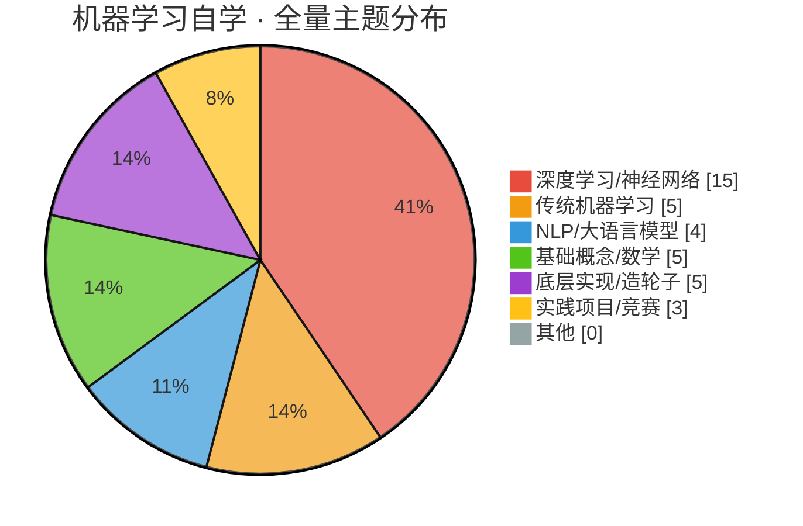

> 上次更新：2026-08-22

# 📚 机器学习自学 · 学习历程

---

## 📅 2026-08-22（第0期 · 初始建仓快照）

**统计周期**：2026-08-22（建仓首期，全量盘点）
**新增笔记**：37 篇（历史积累） | **D2L 进度**：01→15（最新：CNN总结）

> 🎉 首期快照！网安暂时休整，深度学习主线正式起航。本期把从前的积累全部盘点入档。

### 📝 本周学习内容（全量盘点）

#### 🧠 深度学习/神经网络（主线 · 15 篇）
- **《动手学深度学习》D2L**（12 个 notebook）：从线性回归 → softmax → 感知机/MLP → 训练技巧 → Kaggle房价实战 → PyTorch 基础 → CNN 卷积网络全家桶（基础→LeNet→AlexNet→VGG→NiN→总结）
- **零散自学/深度学习**（3 篇）：MLP 手写数字识别（含 GUI + 模型）、cos_mlp 实验

#### 🤖 传统机器学习（5 篇）
- 线性回归、KNN、SVM、随机森林、cox回归 —— 经典五件套齐了

#### 🔤 NLP/大语言模型（4 篇）
- happy-llm：NLP概念 → Transformer → 预训练语言模型 → 大语言模型 —— 与 D2L 的 CNN 主线形成「CV + NLP」双支线

#### ⚙️ 基础概念/数学（5 篇）
- 梯度下降、激活函数、感知机、tensor、MLP异或门

#### 🔩 底层实现/造轮子（5 篇）
- KNN.c + 线性回归 C 语言全家桶（一元/多元/多项式/正则化）—— 用 C 从零造轮子，硬核！

#### 🛠️ 实践项目/竞赛（3 篇）
- 房价预测（多元线性回归）、二手车价预测、阿里移动推荐

### 🎯 D2L 章节推进（主线）
- 进度：01→15（建仓盘点，历史推进）
- 已覆盖：线性回归 → softmax → MLP → 训练技巧 → Kaggle房价 → PyTorch → CNN基础 → LeNet → AlexNet → VGG → NiN → CNN总结
- 当前缺口：**12-14 缺号**（大概率是批量归一化、ResNet、DenseNet 这些现代卷积结构）
- 下一步建议：ResNet 是现代 CNN 的地基，建议补上 12-14；同时 happy-llm 已摸到 Transformer，D2L 后半程的 RNN→注意力机制正好能和 LLM 支线汇合 🚀

### 📊 本周主题分布（建仓全量）

### 💡 本周亮点 & 彩蛋
- 🏗️ **C 语言造轮子**是独门绝活——KNN.c、线性回归 C 全家桶，这波底层功力和「框架调包侠」高下立判，深度学习学起来会有通透加成
- 🧩 **双支线格局初现**：CV（D2L 卷积全家桶）和 NLP（happy-llm Transformer）两条线并行，最后会在注意力机制处汇合，画面很美

### 🔍 笔记审查结果
- 首期快照为全量盘点，未做逐篇深度审查。后续每期重点抽查新增笔记。
- 待办提醒：`动手深度学习/06-Pytorch神经网络.Ipynb` 扩展名大写（`.Ipynb`），macOS 下没问题但 git 跨平台可能踩坑，建议顺手改成小写 `.ipynb`。

### 🎯 下周展望
- 主线继续 D2L：优先补上 ResNet（12-14 缺口），CNN 体系就完整了
- 想换口味时，Transformer 笔记（happy-llm/2）值得二刷——它会是 CV 和 NLP 双线交汇的桥梁

### 🌐 Kaggle 本周进展
- 参赛比赛：**House Prices**（Getting Started，公开榜排名 **1648**）、**California House Prices**（Community）
- 本周提交（08-18）共 5 次：
  - House Prices：`submission.csv`（MLP, lr=0.01, wd=1.0, hidden=[128]）→ 0.13139；`kaggle_house_price.csv` → 0.13444
  - California：`prediction.csv` 0.57776 → **0.51505**（调参进步 📈）
- 凭证：✅ Kaggle API token 已接入（`~/.kaggle/access_token`），周报将自动拉取排名 + 提交轨迹

---

## 📌 给下一期（2026-08-23 周日）的提示

> ⚠️ **本文件首期（08-22）是全量盘点「初始快照」**，统计了建仓前所有历史笔记（37 篇），只是建仓基线。
>
> 周日的总结请**按正常的一周（7 天）节奏统计**：本期统计周期应为完整的学习周（约 **2026-08-16 → 2026-08-23**），而不是「上次更新（08-22）→ 今天（08-23）」的一天。
>
> **不要因为初始快照覆盖了历史就忽略本周内容**——即使本周新增为 0、或只是修改了已有 notebook，也要如实记录并输出新的一期（第1期）。
