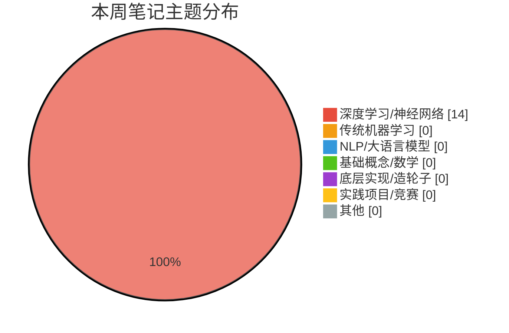

> 上次更新：2026-09-06

# 📚 机器学习自学 · 学习历程

---

## 📅 2026-09-06（第3期 · 9月新文件首期）

**统计周期**：2026-08-31 → 2026-09-06（7 天，跨月）
**新增笔记**：14 篇 | **D2L 进度**：33→41（本周 +8 章，主线最新：5-10 编码器解码器）

### 📝 本周学习内容
本周是「**循环神经网络 RNN 全家桶**」的一周——从 5-04 RNN 一路推到 5-10 编码器解码器，把序列建模的经典架构一次集齐，还顺手用 RNN 续写宋词（5-15）。全部内容集中在 D2L 主线。

#### 🧠 深度学习/神经网络（主线 · 14 篇）
- **5-04 RNN**：潜变量 h_t 总结过去信息，h_t = σ(W_hh·h_{t-1} + W_xh·x_{t-1})；**困惑度 perplexity = e^π**（1=完美，V=随机）；梯度剪裁解决 O(T) 乘法链爆炸/消失
- **5-05 GRU**：门控机制改进 RNN——**更新门**（记重点）+ **重置门**（能遗忘）；候选隐藏状态 H̃_t = tanh(W_xh·x_t + W_hh(R_t⊙h_{t-1}))，用 ⊙ 逐元素选择性遗忘
- **5-06 LSTM**：记忆单元 C_t 保长期依赖，**输入门/遗忘门/输出门**三闸门控信息流；C_t = F_t⊙C_{t-1} + I_t⊙C̃_t（老记忆×遗忘 + 新记忆×输入）
- **5-07 深度循环神经网络**：堆叠多层 RNN，第 i 层隐藏状态作第 i+1 层输入，`num_layers` 参数搞定
- **5-08 双向循环神经网络**：正向 + 反向两个隐藏状态，能看上下文（如完形填空）；`bidirectional=True` 即可
- **5-09 机器翻译数据集**：下载预处理 + token 频率直方图，为 seq2seq 备数据
- **5-10 编码器解码器**：Encoder-Decoder 架构，机器翻译/序列生成的骨架
- **5-15 宋词续写**（实战 🎋）：RNN + 4 层 + 100 epochs 续写宋词，`load_data_songci` 加载词库
- **util/ 工具库**：data/misc/model/train 随 RNN 适配更新（load_data_songci 等新函数）

### 🎯 D2L 章节推进（主线）
- 进度：33→41（本周 +8 章），主线最新 **5-10 编码器解码器**，另有 5-15 宋词续写实战
- 本周新增：5-04 RNN、5-05 GRU、5-06 LSTM、5-07 深度RNN、5-08 双向RNN、5-09 机器翻译数据集、5-10 编码器解码器、5-15 宋词续写
- 当前缺口：**5-11~5-14 缺号**（推测是 seq2seq 训练、注意力机制、Transformer——上期预测的 RNN→注意力汇合点快到了！）
- 下一步建议：补上 5-11~5-14（大概率含**注意力机制**），正好和 happy-llm 的 Transformer 支线正面汇合 🚀

### 🌐 Kaggle 本周进展
- 参赛比赛：House Prices（**1464**，再升 119 名！）、California、playground-s6e8（8-31 已截止，final 3500）、classify-leaves、dog-breed、cifar-10
- 本周提交：**0 次**（各比赛最后一次提交均在 08-25 前，本周专注学 RNN 没打比赛）
- 排名变化：House Prices **1583→1464**（两周累计 1648→1464，+184 名，稳步爬升 📈）

### 📊 本周主题分布

### 💡 本周亮点 & 彩蛋
- 🎋 **宋词续写**是本周最大彩蛋——用 RNN 续写宋词，`load_data_songci` 加载词库、4 层网络 100 epochs，让模型学「今宵酒醒何处」的意境，技术和浪漫撞了个满怀
- 🔄 RNN→GRU→LSTM 三连进化线记得特别清晰：RNN 记不住 → GRU 用更新/重置门「有选择的记忆」→ LSTM 用三闸门 + 记忆单元「长期保鲜」，层层递进像打怪升级
- 🧭 双向 RNN 笔记点破一个真相：原训练函数「没什么意义」——能看上下文的模型，单向训练确实浪费
- 📊 困惑度定义（e^π）记得好：1 是完美、V 是瞎猜，量化了「模型有多懵」

### 🔍 笔记审查结果
抽查了 RNN/GRU/LSTM/深度RNN/双向RNN 全部新 notebook，公式推导核对无误（RNN 隐藏状态更新、GRU 重置门作用位置、LSTM 记忆单元融合、perplexity 定义均正确）✅ 本周笔记质量在线，继续保持！
- 无错误提醒。5-15 宋词续写无 markdown 笔记（纯代码实现），知识点都在前几节的理论 notebook 里。

### 🎯 下周展望
- 主线：5-11~5-14 是重头戏——**seq2seq + 注意力机制 + Transformer**，这是 D2L 与 happy-llm 支线（已到 Transformer）的**汇合点**，补上后 CV 和 NLP 双线正式会师
- 学完注意力后，建议回头把 5-15 宋词续写升级成「带注意力的版本」，体验从 RNN 到 Attention 的效果跃迁
- Kaggle：House Prices 排名稳步爬升中，可考虑再提交一版；classify-leaves（0.96022）和 cifar-10 也值得回头优化

### ⚙️ 配置反馈
- **跨月**：新建 2026-09.md（本文件），8 月总结保留在 2026-08.md（至 08-31 第2期）
- **D2L 编号**：5-x 已推进到 5-10，出现**先建 5-15 实战、后补 5-11~5-14 理论**的跳跃式学习节奏（5-15 宋词续写 09-02 创建，早于 5-09/5-10 的 09-04）
- **Kaggle**：playground-s6e8 已截止（final rank 3500/3531），可从 cron submissions 拉取列表移除或保留查询
