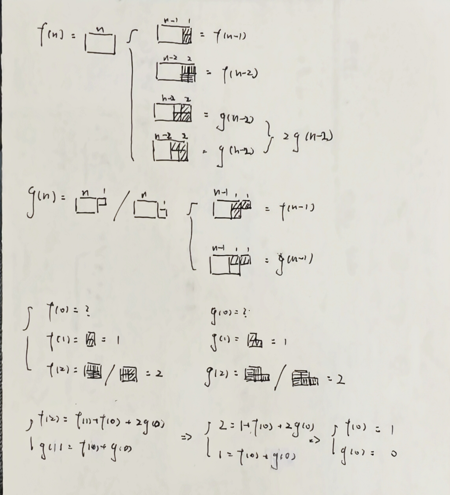

# 线性递推之铺墙
———— *洛谷P1990*

## 目录
[TOC]

## 题目描述
- $N \times 2$ 的墙壁
- 两种砖头
    - I 型覆盖 2 个单元
    - L 型覆盖 3 个单元
```
0   0
0   0 0
```

砖头可旋转，无限制提供。
计算覆盖 $N\times 2$ 的墙壁的方法。

输出最后 4 位。

## 递推公式
### 定义
- $f(n)$：长度为n的区域方法数
- $g(n)$：长度为n且多出一块的区域方法数
### 公式
$$ 
\begin{cases}
f(n) = f(n-1) + f(n-2) + 2 \cdot g(n-1) \\
g(n) = f(n-1) + g(n-1)
\end{cases}
$$
### 初始值
$$ 
\begin{cases}
f(0)=1,\ f(1)=1\\
g(0)=1,\ g(1)=1
\end{cases}
$$

## 代码实现
```cpp
#include <iostream>
#include <vector>
using namespace std;
int modn = 10000;

int main(){
    int n;
    cin >> n;
    vector<int> f(n+1), g(n+1);
    f[0] = 1; f[1] = 1;
    g[0] = 0; g[1] = 1;
    for(int i = 2;i <= n;i++){
        f[i] = (f[i-1] + f[i-2] + (2 * g[i-2]) % modn) % modn;
        g[i] = (f[i-1] + g[i-1]) % modn;
    }
    cout << f[n] % modn;
    return 0;
}
```
## 图解

