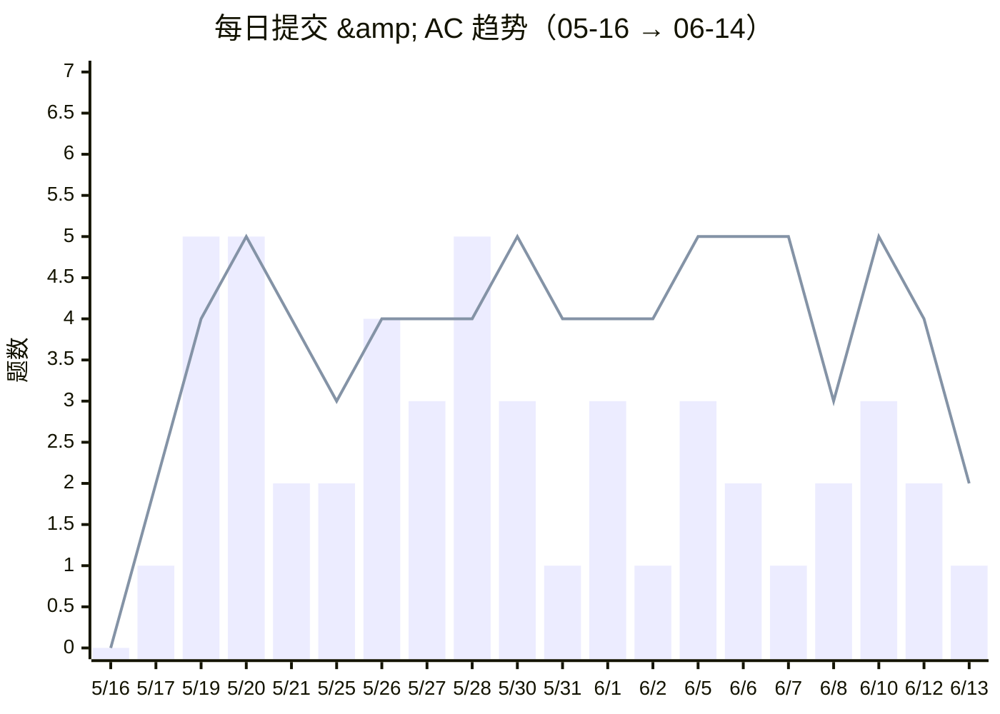

# 做题趋势

> 每日做题量的波动追踪 📈
> 数据来源：洛谷每日提交记录 + 本地笔记修改记录

---

## 最近 30 天趋势

> 🟦 柱状 = 提交次数 | 🟥 折线 = AC 次数
> 📊 6/10 是分块主题赛日！3 提交换 5 AC，生产效率拉满 🏆

> 🟦 柱状 = 提交次数 | 🟥 折线 = AC 次数

## 节奏分析（5/16 → 6/14）

| 模式 | 天数 | 特征 |
|:---|---:|:---|
| **🔥 高强度**（提交 ≥5） | 4 天 | 5/19 5/20 5/28，学啥刷啥 |
| **🧠 补刀型**（提交少，AC 多） | 10 天 | AC > 提交，回头收割 |
| **📖 学习型**（提交少，AC 少） | 6 天 | 啃理论日 |
| **🏆 竞赛日**（6/10） | 1 天 | 分块主题赛，3 提 5 AC |
| **休息日**（无数据） | 9 天 | 合理节奏

## 月度汇总

> 数据自 3 月 22 日起有记录，以下统计基于洛谷 API 拉取的完整历史数据。

| 指标 | 三月 | 四月 | 五月 | 六月* | **合计** |
|:---|---:|---:|---:|---:|---:|
| 活跃天数 | 3 天 | 22 天 | 20 天 | 9 天 | **54 天** |
| 总提交 | 4 次 | 84 次 | 68 次 | 25 次 | **181 次** |
| 总 AC | 2 题 | 61 题 | 66 题 | 36 题 | **165 题** |
| 笔记/代码 | 3 篇 | 17 篇 | 37 篇 | 30 篇 | **87 篇** |
| 日均提交 | 1.3 | 3.8 | 3.4 | 2.8 | **3.4** |
| AC 率 | 50% | 72.6% | 97.1% | 144% | **91.2%** |

> \* 六月为半月数据（截至 6/14），AC 率超过 100% 是因为大量补刀——实际新增题目 +10（两期共 20 题），AC 记录却有 36 次。看来补刀已从隐藏技能进化为默认技能 😎

---

## 活跃度对比

### 🟩 提交热力图

> 统计范围：3/22 → 6/14（13 周）。六月的绿色集中在 6/10 比赛日附近，其余为轻度活跃。
> 🥚 **4/14 提交巅峰**：一天交了 9 次（但只 AC 了 2 题），至今仍是单日提交纪录 🤔

### 🔵 笔记热力图

> 统计范围：3/22 → 6/14。六月笔记三波高潮：6/4（最短路+MST，6 篇）→ 6/7（bug 修复+配对堆，4 篇）→ 6/14（树论+莫队，7 篇，今天刚出炉）
> 📐 6/14 是笔记密度最高的一天——上午树/下午莫队，可谓「周日卷王」🔥

> 🍒 由 Cherry 每周自动更新，上次更新：2026-06-14
