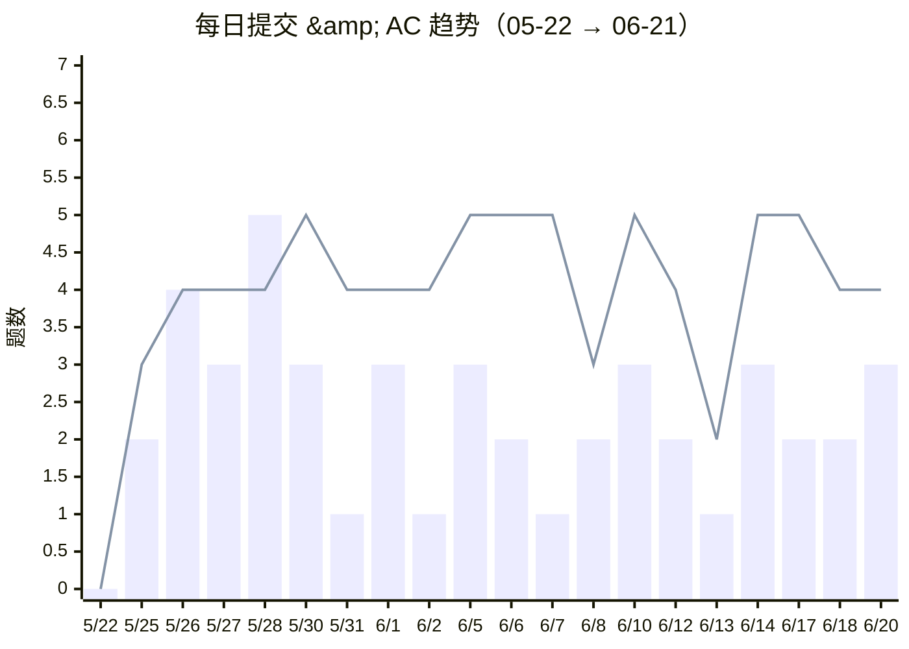
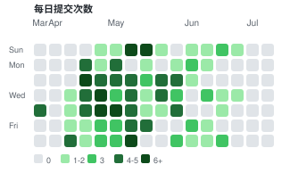
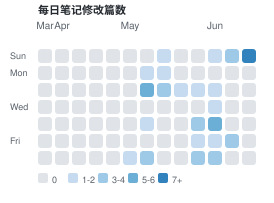

# 做题趋势

> 每日做题量的波动追踪 📈
> 数据来源：洛谷每日提交记录 + 本地笔记修改记录

---

## 最近 30 天趋势

> 🟦 柱状 = 提交次数 | 🟥 折线 = AC 次数
> 📊 本月补刀率奇高：最近 20 天提交 43 次、AC 85 次——后半程几乎是补刀主场 😆

> 🟦 柱状 = 提交次数 | 🟥 折线 = AC 次数

## 节奏分析（5/22 → 6/21）

| 模式 | 天数 | 特征 |
|:---|---:|:---|
| **🔥 高强度**（提交 ≥5） | 1 天 | 5/28，5 提 4 AC |
| **🧠 补刀型**（提交 ≤3，AC ≥4） | 13 天 | AC/提交 比最高达 5.0x |
| **📖 学习型**（提交+AC 都有但不多） | 4 天 | 学了新东西顺手验证 |
| **🏆 竞赛日**（6/10） | 1 天 | 分块主题赛，3 提 5 AC |
| **休息日**（无数据） | 11 天 | 后半月稀疏节奏 |

> 📈 5 月"精刷模式"延续到 6 月但节奏放缓：日均提交 2.6 次 vs 5 月 3.4 次——不是在偷懒，而是**难度升级后每题花的思考时间更多了** 🧠

## 月度汇总

> 数据自 3 月 22 日起有记录，以下统计基于洛谷 API 拉取的完整历史数据。

| 指标 | 三月 | 四月 | 五月 | 六月 | 七月* | **合计** |
|:---|---:|---:|---:|---:|---:|---:|
| 活跃天数 | 3 天 | 22 天 | 20 天 | 14 天 | 1 天 | **60 天** |
| 总提交 | 4 次 | 84 次 | 68 次 | 35 次 | 1 次 | **192 次** |
| 总 AC | 2 题 | 61 题 | 66 题 | 51 题 | 0 题 | **180 题** |
| 笔记/代码 | 3 篇 | 17 篇 | 37 篇 | 36 篇 | 2 篇 | **95 篇** |
| 日均提交 | 1.3 | 3.8 | 3.4 | 2.5 | 0.1 | **3.2** |
| AC 率 | 50% | 72.6% | 97.1% | 146% | 0% | **93.8%** |

> \* 七月为前两周数据（截至 7/13），考试季仅 1 次提交、0 AC、2 篇笔记
> 🎓 三周考试静默期是运营四个月以来最长的暂停——但和「热情消退」不同，这是计划中的学术优先 📝

---

## 活跃度对比

### 🟩 提交热力图

> 统计范围：3/22 → 7/5（16 周）。6/25-7/5 这十天出现了史无前例的「全白区」——没有一天有提交记录。原因：**大一期中考试** 📝
> 🥚 不过 6/28 深夜留下了 4 篇笔记（莫队复习+带修莫队+3D 可视化）——考试周深夜写算法笔记，DNA 动了！

### 🔵 笔记热力图

> 统计范围：3/22 → 7/5。六月到七月的过渡期出现了一个有趣的「蓝→白」跳变：6/28 深夜 4 篇后，整整一周静默（7/4 仅 1 篇，写给 Cherry 的留言）。考试季的诚实体现在数据里 📊

> 🍒 由 Cherry 每周自动更新，上次更新：2026-07-05
