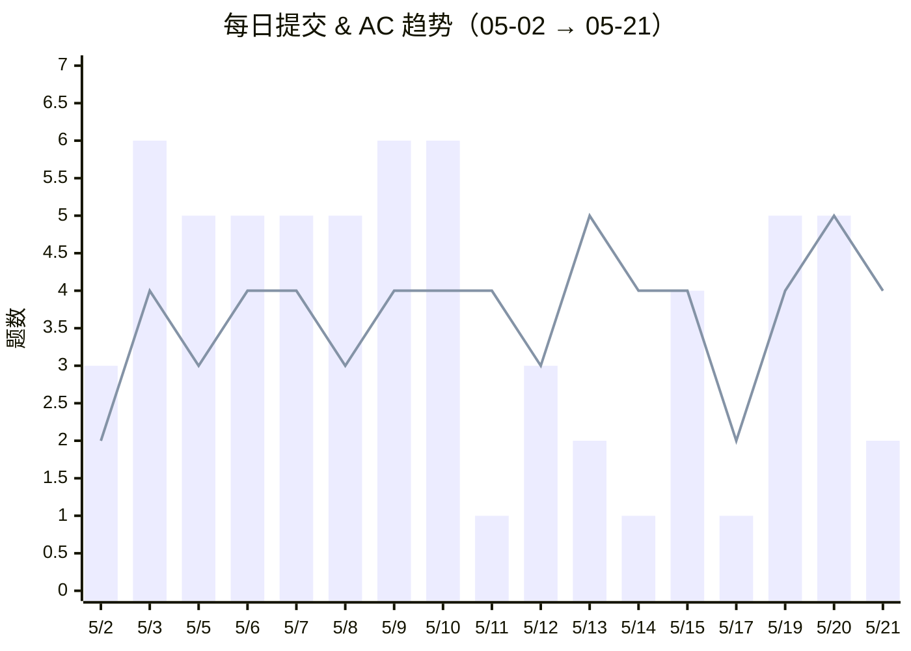

# 做题趋势

> 每日做题量的波动追踪 📈
> 数据来源：洛谷每日提交记录 + 本地笔记修改记录

---

## 最近 20 天趋势

> 🟦 柱状 = 提交次数 | 🟥 折线 = AC 次数

## 节奏分析

| 模式 | 天数 | 特征 |
|:---|---:|:---|
| **🔥 高强度**（提交 ≥5） | 9 天 | 边学边刷，学啥刷啥 |
| **🧠 思考型**（提交 ≤2, AC 多） | 4 天 | 啃理论、消化后再收割 |
| **📖 学习型**（提交少，AC 少） | 3 天 | 纯学新知识，不急着做题 |
| **休息日**（无数据） | 3 天 | 该休息休息 |

## 月度汇总

> 数据自 3 月 22 日起有记录，以下统计基于洛谷 API 拉取的完整历史数据。

| 指标 | 三月 | 四月 | 五月 | **合计** |
|:---|---:|---:|---:|---:|
| 活跃天数 | 3 天 | 22 天 | 20 天 | **45 天** |
| 总提交 | 4 次 | 84 次 | 68 次 | **156 次** |
| 总 AC | 2 题 | 61 题 | 66 题 | **129 题** |
| 笔记/代码 | 3 篇 | 17 篇 | 37 篇 | **57 篇** |
| 日均提交 | 1.3 | 3.8 | 3.4 | **3.5** |
| AC 率 | 50% | 72.6% | 97.1% | **82.7%** |

> 🥚 四月日均提交 3.8 次，是五月的 1.1 倍！但五月 AC 率冲到 97.1%，说明进入「精刷模式」了。四月是在广撒网，五月开始精准捕捞 🎯

---

## 活跃度对比

### 🟩 提交热力图

> 矩传统计范围：3/22 → 5/23，共 9 周。四月的深绿色说明刷题量持续在线。
> 🥚 **4/14 提交巅峰**：一天交了 9 次（但只 AC 了 2 题，这是在跟哪题死磕呢 🤔）

### 🔵 笔记热力图

> 笔记高峰在 5/5（8 篇）和 5/12（6 篇），正好对应数据结构高密度输出日。
> 四月的蓝色明显比绿色稀疏——那段时候在猛刷题，没怎么停下来写笔记 📝

> 🍒 由 Cherry 每周自动更新
