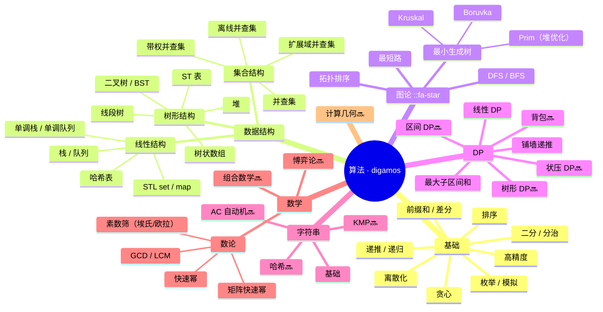

# 知识图谱

> 当前算法技能覆盖一览 🌳
> 基于 2026-05 学习数据生成

---

## 技能树

---

## 覆盖统计

| 领域 | 题量 | 覆盖度 |
|:---|---:|:---:|
| 🟢 图论 | 62 题次 | 核心区 ✅ |
| 🟢 数据结构 | 29 题次 | 扎实 ✅ |
| 🟡 DP | 18 题 | 中等，待扩展 |
| 🟡 数学 | 17 题 | 中等，待补充 |
| 🔴 字符串 | 16 题 | 基础，深度不够 |
| ⚫ 计算几何 | 0 题 | 空白 |

> 🍒 由 Cherry 每周自动更新
