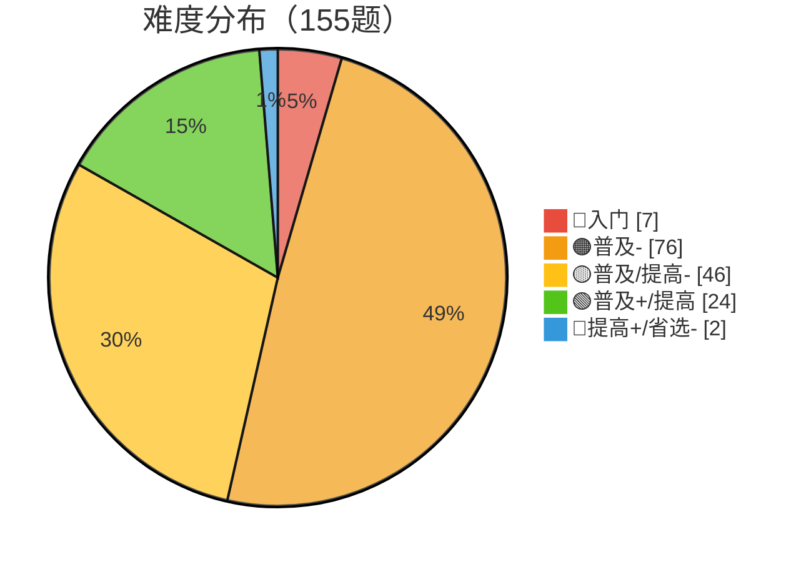
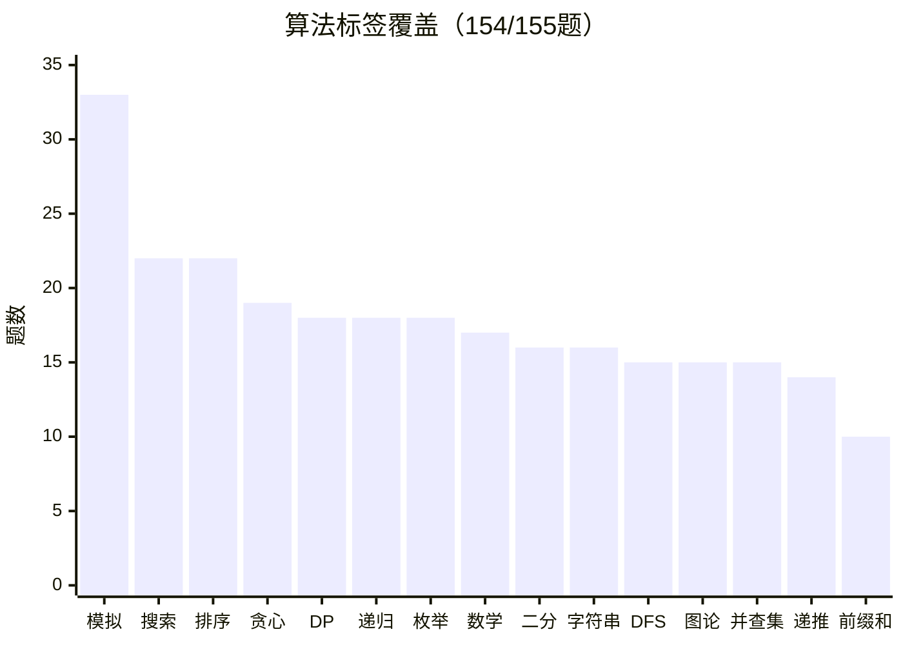
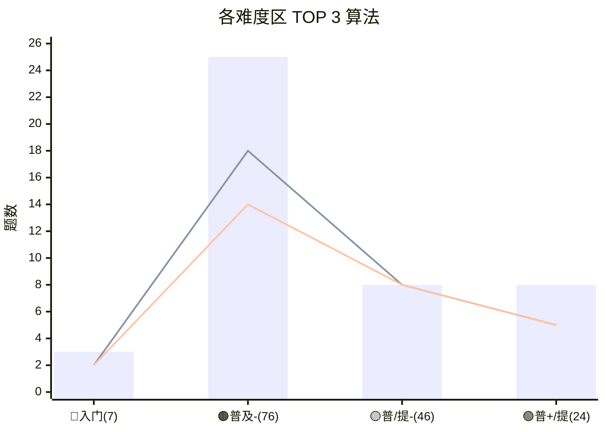

# 算法自学 · 学习历程总结

> 🍒 由 Cherry 自动生成，每月一份，每周更新
> 上次更新：2026-05-24

---

## 📅 2026-05-22（第一期）

**统计周期**：2026-05-02 → 2026-05-21（20 天）
**四月补充**：洛谷历史数据拉取完成，4 月共 22 天 84 次提交 61 AC
**本地笔记**：32 篇 | **洛谷 AC**：155 题

---

### 📝 本周学习内容

#### 5月2日 — 起步：从刷题切入
- **P1990 铺墙问题**：线性递推 DP，`f(n)` + `g(n)` 两状态求解
- **P3612 COW字符串变换**：从暴力模拟到数学推导，初显抽象思维能力
- 没有从教科书的"什么是算法"开始，而是直接挑战洛谷题目

#### 5月4日-5日 — 数据结构打基础（9 篇，高密度输出）
- **二叉树属性求解**：宽度/深度（DFS/BFS）、LCA（暴力/递归）、节点距离公式
- **二叉搜索树**：查找/插入/删除三种情况、递归与迭代构建
- **并查集**：路径压缩、按秩合并、按大小合并
- **二叉树基础**：遍历（前中后序+层序）、构建（先+中/后+中/层+中）
- **树的概念体系**：度/深度/高度、双亲/孩子/孩子兄弟三种存储
- **哈希表**：哈希函数（直接定址/除留余数/BKDR）、冲突处理、渐进式 rehash
- **STL set / map**：容器方法总结
- 🥚 **彩蛋发现**：在"树"的笔记中出现了 `全tm连上表示法` 这种传神的命名，建议申请专利

#### 5月7日 — 深入进阶
- **辗转相除法**：GCD/LCM 带示意图
- **并查集进阶**：带权并查集（方程推导）、离线并查集（逆向合并）、扩展域并查集
- 开始附洛谷例题链接（P1196/P1525/P1197/P2024）

#### 5月9日-12日 — 图论全面展开（13 篇，最密集期）

**5月9日（爆发日，5 篇 + 洛谷 6 次提交）**：
- **双指针**：对撞/快慢/滑动窗口
- **图遍历**：DFS/BFS/连通块/无权最短路/链式前向星
- **单调双端队列**：单调栈与单调队列系统对比
- **最小生成树**：Kruskal / Prim / 堆优化 Prim / Boruvka 四算法
- **图的基础**：完全图/度/连通性/生成树 + 三种存储方式
- 这天的节奏是：**学一个算法 → 马上刷一道题验证**，效率拉满

**5月10日**：
- **拓扑排序**：Kahn 算法（BFS）、DFS 算法、DP on DAG

**5月11日（洛谷 1 提交 4 AC—思考日）**：
- **快速幂**：整数→快速乘→矩阵→高精度→线性递推，含完整转移矩阵推导
- **倍增思想**：核心方法论笔记
- ⚡ 提交只有 1 次但 AC 了 4 题，说明这天主要在**啃理论而不是闷头刷题**

**5月12日（知识广度最大，5 篇）**：
- **分治与减治**：分治（归并/快排）、减治（二分/gcd）、变治
- **ST 表**：倍增思想落地 RMQ，O(1) 查询
- **搜索算法**：DFS/BFS/回溯/剪枝（含洛谷 P1433 详细剪枝示例）
- **素性筛选**：暴力试除→埃氏筛→欧拉筛，详解"为什么欧拉筛每个数只筛一次"
- **高精度**：存储/输入输出/加法/乘法/取模

> 📌 图论学习路径非常完整：概念→存储→遍历→MST→拓扑→最短路

#### 5月13日-21日 — 高级数据结构与基础回顾

- **5/13** **最大子区间和**（P4513 小白逛公园）：带单点更新的区间最大子段和
- **5/14** 🔥 **树状数组**：从 lowbit 补码推导到二阶差分，最详尽的一篇
- **5/17** **线段树**：建树/懒标记下放/区间查询/更新，全面覆盖
- **5/19** **二分法**（快速选择/二分答案/二分查找/标准库）
- **5/19** **前缀和与差分**：一维二维递推 + TikZ 示意图
- **5/21** **离散化**：排序+去重+二分查找标准流程（最新笔记）

---

### 🏆 洛谷做题统计

| 指标 | 数据 |
|:---|---|
| **用户名** | `digamos` |
| **AC 题目数** | **155** |
| **总提交题目数** | 160 |
| **AC 率** | **96.9%** 🎯 |
| **全国排名** | #10413 |
| **洛谷颜色** | 🟢 绿名 |
| **综合评分 (GU)** | 169（基础 100 + 比赛 35 + 练习 34）|
| **有 AC 记录天数** | 41 天 |
| **总提交次数** (日记录) | **156 次** |
| **总 AC 次数** (日记录) | **129 题** |

#### 📊 难度分布（颜色 = 洛谷官方色系）

> 标准金字塔：🔴红 < 🟠橙 < 🟡黄 < 🟢绿 < 🔵蓝。绿名稳扎稳打，普及-是绝对主力区 🟠

#### 🧠 算法标签 TOP 15

> 图论全家桶（DFS + 图论 + 并查集 + BFS + 拓扑 + MST = **62 题次**）是你的绝对舒适区

#### 📈 难度 × 算法交叉分析

> 规律明显：**🔴🟠简单题练模拟排序 → 🟡中等题练图论搜索 → 🟢难题练并查集线段树**，知识随着难度自然升级 🚀

#### 💪 强弱项分析

| 领域 | 掌握程度 | 分析 |
|:---|---:|:---|
| 🟢 **图论** | 很强 | 并查集(15) + 图论(15) + DFS(15) + BFS(9) + 拓扑(5) + MST(3) = **62 题次** |
| 🟢 **数据结构** | 很强 | 线段树(9) + 树状数组(6) + 栈(4) + 树(4) + 哈希(4) + 堆(2) = **29 题次** |
| 🟡 **DP** | 中等偏上 | 18 题，集中在简单递推和线性 DP，**背包/区间/状压还待开发** |
| 🟡 **数学** | 中等 | 17 题，数论基础有但**组合数学 / 博弈论还没怎么碰** |
| 🔴 **字符串** | 待加强 | 16 题但几乎都是简单题，**KMP / AC 自动机 / 后缀数组还没学** |
| ⚫ **计算几何** | 空白 | 0 题，完全没碰过 |

#### 📝 笔记 × AC 题目对应关系

| 笔记主题 | 实战题 |
|:---|---|
| 铺墙问题 DP | ✅ P1990 覆盖墙壁 |
| COW 字符串变换 | ✅ P3612 Secret Cow Code |
| 并查集及进阶 | ✅ P3367 + P1196 银河英雄传说 + P2024 食物链 + P1525 关押罪犯 |
| 最小生成树 | ✅ P3366 + P1546 最短网络 |
| 拓扑排序 | ✅ P1113 杂务 + P4017 最大食物链计数 + P1347 排序 |
| 树状数组 | ✅ P3374 + P3368 |
| 线段树 | ✅ P3372 + P3373 |
| ST 表 | ✅ P3865 + P2880 Balanced Lineup |
| 快速幂 / 矩阵快速幂 | ✅ P1226 + P3390 |
| 单调队列 / 单调栈 | ✅ P1886 + P5788 |
| 素数筛 | ✅ P3383 |
| 最大子区间和 | ✅ P4513 小白逛公园（🔵省选-题）🥚 |

> 🥚 P4513 小白逛公园是你 AC 中难度最高的一题（🔵提高+/省选-），也是笔记里写得最详细的——**学得深才解得难** 😎

#### 📅 四月补充：洛谷历史数据拉取完成

> 之前热力图缺了四月数据，现在通过洛谷 API 补上了。

四月共 **22 天**有刷题记录，总提交 **84 次**，总 AC **61 题**：

| 日期 | 提交 | AC | 备注 |
|:---:|:---:|:--:|:---|
| 04-08 | 2 | 2 | 🟢 回归洛谷 |
| 04-09 | 2 | 2 | |
| 04-10 | 2 | 3 | |
| 04-11 | 5 | 4 | 💥 周末爆发 |
| 04-13 | 4 | 4 | |
| 04-14 | **9** | 2 | 🤯 提交巅峰，跟某题死磕中 |
| 04-15 | 5 | 2 | |
| 04-16 | 5 | 3 | |
| 04-17 | 1 | 2 | |
| 04-18 | 1 | 2 | |
| 04-19 | 2 | 2 | |
| 04-20 | 1 | 2 | |
| 04-21 | 5 | 2 | |
| 04-22 | 6 | 4 | 🔥 |
| 04-23 | 7 | 3 | 🔥 |
| 04-24 | 3 | 3 | |
| 04-25 | 3 | 3 | |
| 04-26 | 2 | 3 | |
| 04-27 | 4 | 3 | |
| 04-28 | 4 | 3 | |
| 04-29 | 3 | 3 | |
| 04-30 | 8 | 4 | 💥 月末冲刺 |

> 🥚 4 月 AC 率 72.6%，5 月 AC 率 97.1%——**从"试试看"模式转型到"想好了再交"模式**，进步看得见 📈
> 完整热力图见 [`可视化分析/heatmap-subs.svg`](../可视化分析/heatmap-subs.svg)

#### 📅 每日做题节奏（5 月）

| 日期 | 提交 | AC | 节奏 |
|:---:|:---:|:--:|:---|
| 05-02 | 3 | 2 | 📝 开始写笔记 |
| 05-03 | 6 | 4 | 🔥 |
| 05-05 | 5 | 3 | 📚 数据结构密集期 |
| 05-06 | 5 | 4 | |
| 05-07 | 5 | 4 | 🔗 并查集进阶 |
| 05-08 | 5 | 3 | |
| 05-09 | 6 | 4 | 💥 **图论爆发日** |
| 05-10 | 6 | 4 | |
| 05-11 | 1 | 4 | 🧠 **思考型学习** |
| 05-12 | 3 | 3 | 📖 知识广度最大 |
| 05-13 | 2 | 5 | 👑 **AC 率巅峰** |
| 05-14 | 1 | 4 | 🌲 树状数组消化中 |
| 05-15 | 4 | 4 | |
| 05-17 | 1 | 2 | |
| 05-19 | 5 | 4 | |
| 05-20 | 5 | 5 | ✨ **完美日** |
| 05-21 | 2 | 4 | |

> 🥚 5/13 那天 **2 提交 5 AC** — 提交 2 次怎么 AC 了 5 题？实际是**之前交了没过，那天回来补刀成功了** 🤣

#### 🏁 近期参赛记录

| 比赛 | 赛后 Rating |
|:---|---|
| LGR-281 Div.3 基础赛 #33 | **363** 📈 |
| LGR-283 Div.4 入门赛 #46 | 12 |

入门赛试水拿了 12，第二场 Div.3 直接飙到 363——进步速度有点东西 🚀

---

### 💡 学习特点综合分析

| 特点 | 说明 |
|:---|---|
| 🎯 **刷题驱动** | 不是先啃书再做题，而是做题遇到什么学什么 |
| 📝 **体系化笔记** | 每篇按"定义→分类→实现→复杂度→代码"组织 |
| 🔢 **数学推导深** | lowbit 补码原理、欧拉筛证明、矩阵快速幂推导 |
| 💻 **C++ 竞赛风** | 数组模拟、vector 实现 |
| 🚀 **前期强度高** | 前 10 天 25 篇；后 10 天 7 篇但深度加大 |
| 🎯 **高 AC 率** (96.9%) | 不盲目刷题，每题吃透才交，质量优先 |
| 🟢 **图论王者** | 并查集+图论+DFS/BFS 累计 62 题次，你的绝对舒适区 |
| 🟡 **DP 待突破** | 18 题 DP 集中在递推/线性，背包/区间/状压是下一块拼图 |
| 🔴 **字符串是新大陆** | 16 题但全是简单题，KMP/AC 自动机还是待学状态 |

#### 有趣的数据关联
- **5/9（图论爆发日）**：6 次提交、5 篇笔记——学一个刷一个，典型的"趁热打铁"模式 🔥
- **5/11（思考日）**：才 1 次提交但 AC 了 4 题，还写了快速幂和倍增两篇理论笔记——这一天你大概率是坐着想了半天，然后一次性收割 🧠
- **5/13（AC 率巅峰）**：2 提交 5 AC，补刀成功日
- **5/20（完美日）**：5 提交 5 AC，100% 命中率，建议把这一天定为"digamos 算法节" 🎉

---

### 🎯 下周展望

按当前进度，接下来可能的方向：
- **平衡树**（AVL / 红黑树）— 学完 BST 和线段树的自然延伸
- **字符串算法**（KMP / AC 自动机 / 哈希）— 目前还是空白区
- **动态规划进阶**（背包 / 区间 DP / 状压 DP）— 刷题常见题型
- **参加下一场洛谷比赛** — 上次 Div.3 拿了 363，再战一波？

---

## 📅 2026-05-24（第二期）

**统计周期**：2026-05-22 → 2026-05-24（3 天）
**新增笔记**：0 篇 | **本周 AC 增量**：+0 题

### 🧘 本期情况：休息调整期

上次更新（5/22）后，本地笔记和洛谷提交均无新增——从 5 月初的密集学习后进入了 **自觉缓冲期**。20 天 32 篇笔记、68 次提交，换了谁都得喘口气 😌

不过这并不等于完全停摆：

### 🔭 幕后准备

- **弱项突破计划** 已制定完成：字符串 → DP → 数学 → 计算几何 的四梯队路线图
- **做题趋势追踪** 已上线：提交热力图、节奏分析、月度汇总全链自动化
- **策略计划框架** 已搭建：错题本、间隔复习、赛前准备模板就位

换句话说，这段时间是在**搭架子**——为下一阶段的系统性突破做好了基础设施。

### 💡 本周特点

- 🧘 **3 天零活动**：第一次出现连续休息，说明学习节奏从"冲动型"转向"可持续型"
- 📋 **管理基建完成**：策略计划、可视化分析、工具模板三大目录全数就位
- 🎯 **主攻方向已锁定**：字符串哈希 → KMP 是下一轮的核心目标

### 🎯 下周展望

上次的方向依然有效，优先级微调如下：

| 优先级 | 方向 | 为什么 |
|:---:|:---|---|
| 🔴 第一 | **字符串哈希 + KMP** | 弱项突破计划中明确推荐的"从学到练只需 2-3 天"项，见效最快 |
| 🟡 第二 | **DP 进阶（背包/区间）** | 洛谷常见题型，适合与字符串穿插学习 |
| 🟢 第三 | **参加下一场 Div 比赛** | 上次 Div.3 拿了 363，歇够了可以再战一波 💪 |

> 附注：如果后续连续多周无活动，本总结将自动切换为"静默更新"模式，只记录日期戳而不生成冗余内容。

---

## 📅 下一期

下次更新：~2026-05-31（周日 20:00）

> 🍒 本月总结由 Cherry 自动维护，每周追加新一期。
> 如果 CherryStudio 有离线时间，重启后会自动补上遗漏的更新。
