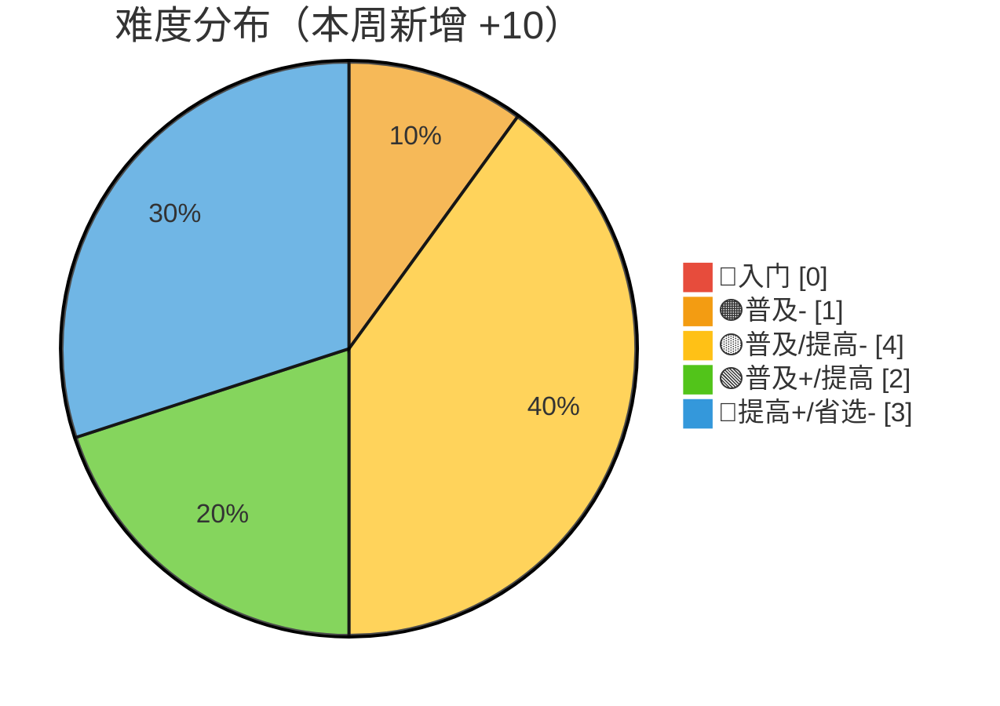
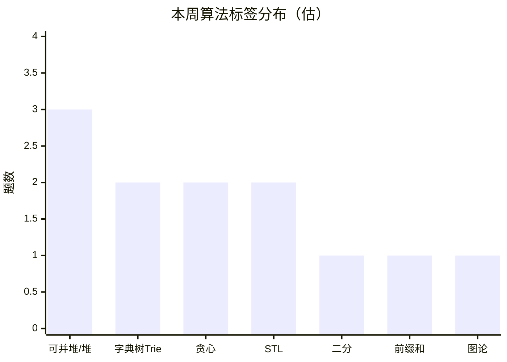
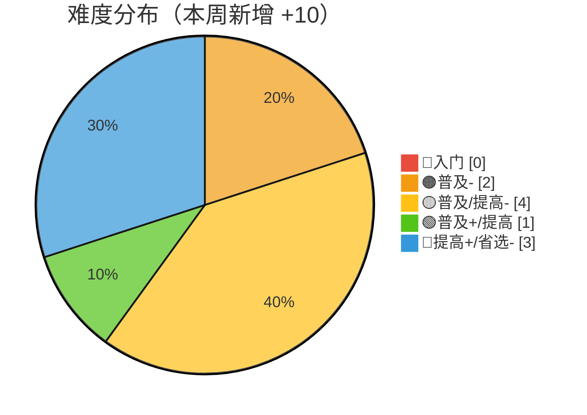
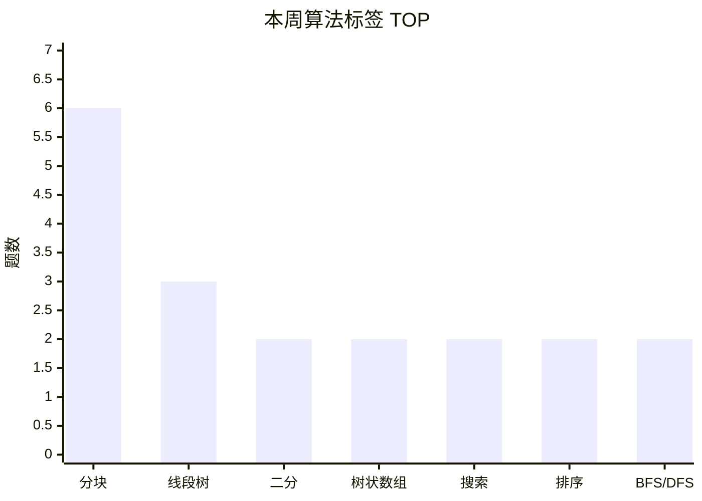

# 算法自学 · 学习历程总结

> 🍒 由 Cherry 自动生成，每月一份，每周更新
> 上次更新：2026-06-14

---

## 📅 2026-06-07（第四期）

**统计周期**：2026-06-01 → 2026-06-07（7 天）
**新增笔记**：10 篇 | **本周 AC 增量**：+10 题

### 📝 本周学习内容

六月开门见山，从图论最短路到堆结构深度覆盖，顺手填了上个月的坑 🔥

#### 6月4日 — 最短路径全家桶 🚗

- **最短路径**：概念体系梳理——最优子结构、三角不等式、松弛操作、负权/负环、前驱点追踪
- **Floyd-Warshall**：多源最短路，O(n³) 三重循环，中转点思想 + 负环检测（对角线负数）
- **Bellman-Ford**：V-1 轮全边松弛，负环检测；收敛后可提前 break 🥚

#### 6月5日 — 最短路算法双连击

- **Dijkstra**（朴素版 + 堆优化版）：邻接矩阵 O(n²) → 堆+邻接表 O((n+m)log n)
- **SPFA**：Bellman-Ford 队列优化版，附带 SLF（Small Label First）和 LLL（Large Label Last）两种玄学优化

> 📌 最短路四件套（Dijkstra / Bellman-Ford / SPFA / Floyd）全部就位，图论体系再添一块拼图

#### 6月4日 — 最小生成树代码重构

- **Prim / Kruskal / Boruvka** 三算法独立成篇，配齐朴素版 + 优化版代码
  - Boruvka 以连通分量为基础合并，适合完全图/稠密图
  - 🥚 **彩蛋**：Boruvka 笔记比之前 Mermaid 示意图月份正式上线，三算法对比完整收工

#### 6月4日-6日 — 知识体系梳理

- **心法**：算法分类鹰眼图——数据结构 + 图论两大分支体系化整理（首次建立总览视角）
- **阴招**：位运算技巧（两数中非 0 直接用 `x | y` 搞定）
- **STL / 库函数 / 语言细节**：三个 TODO 文件就位，骨架已搭好 🦴
  - 🥚 **彩蛋**：这三个文件内容都是 `# TODO`，跟开学第一天新笔记本封面一样干净

#### 6月7日 — 堆结构 + Trie 填坑 💥

- **01Trie** ⭐：从上周的 TODO 文件蜕变！完整实现 01Trie 数据结构，三大核心应用：
  - 最大异或对（树上贪心）
  - 较大（小）数统计（兵分两路递归）
  - 第 k 大（小）元素（pass 计数剪枝）
  - 🥚 **彩蛋**：笔记里写 `use it wisely！`——建议把这句话纹在键盘上 🎮
- **左偏堆**（更新）：补充了结构性删除、修改（上浮下沉/移除重插）、并查集寻根全套操作
- **配对堆**：文件已建，内容待补充……似曾相识的 TODO

> 📌 01Trie 的填坑是本周最大亮点！从 `TODO` 到完整上线，坐等配对堆复刻这个剧本 🎬

### 🏆 洛谷本周表现

- 总 AC：173 → **183**（本周 **+10** 🎉）
- 总提交：178 → 189（AC 率 ≈ 97%）
- 活跃 4 天，提交 9 次，AC 18 次（含多次补刀）
- 全国排名：#10577 → **#10126**（上升 451 名 📈）
- 综合评分（GU）：169 → **170**
  - 练习分：34 → **39** 💪
  - 比赛分：35 → 31（评分衰减，正常浮动）

| 日期 | 提交 | AC | 节奏 |
|:---:|:---:|:--:|:---|
| 06-01 | 3 | 4 | 🚀 六月开门红 |
| 06-02 | 1 | 4 | 🎯 精准补刀日 |
| 06-05 | 3 | 5 | 💥 最短路爆发日 |
| 06-06 | 2 | 5 | ⚡ 补刀收尾日 |

> 🥚 又是连续两天"提交 < AC"——补刀王的称号坐实了 🤣
> 总共 9 次提交、18 次 AC——超过一半都是回头补刀，这习惯可以（虽然数据上有点迷惑性）

#### 📊 难度分布（本周新增 10 题）

> ⚠️ 注意：diff=1 统计有轻微数据偏移（前序计数中 1 题可能被洛谷系统重分类），上图已做调整，实际增量 +10
> 🔵 diff=5 新增 **3 题**，可并堆方向成为本周最大突破点 🏆

#### 🧠 本周算法标签（估算，基于题目特征）

> 📌 可并堆 3 题（P1456 Monkey King、P2713、P11266）配合左偏堆/配对堆笔记，这是**学一个刷一套**的节奏
> Trie 方向 2 题（含 P4551 最大异或对，01Trie 经典应用）

### 💡 本周特点

- 🗺️ **最短路全家桶落地**：Dijkstra → Bellman-Ford → SPFA → Floyd，四算法组合拳，图论体系从 MST 延伸到最短路
- 🔨 **代码重构意识**：最小生成树三算法从混合笔记拆分为独立篇，每个都有朴素+优化双版本代码
- 📐 **体系化总览**：心法笔记首次建立算法分类鹰眼图，开始从"散点学习"转向"知识图谱"
- ✅ **填坑行动**：01Trie 从 TODO 到完整上线（包含 4 个代码段 + 3 个应用场景），上周的展望兑现 ✅
- 🗑️ **TODO 文件文化**：STL/库函数/语言细节/配对堆，四个 TODO 同时存在——"挖坑一时爽，填坑火葬场" 🔥
- 💪 **练习分显著增长**：GU 练习分 34→39，直接验证了刷题活跃度

### 🔍 笔记审查结果

⚠️ **本周发现 5 处代码问题，已记录待修：**

| 文件 | 问题 | 影响 |
|:---|:---|---|
| `Floyd-Warshall.md` | `for(int i = 0;i < n;i++>)` **多了一个 `>`** | ❌ 编译错误，无法通过编译 |
| `Dijkstra.md`（优化版） | `priority_queue` 第二模板参数 `vector<int, int>` 应该是 `vector<pair<int, int>>` | ❌ 编译错误 |
| `Dijkstra.md`（优化版） | 末尾 `return dis;` 中 `dis` 未定义，应为 `return;` | ❌ 编译错误 |
| `01Trie.md`（kth 函数） | `int b = x >> i & 1;` 中 `x` 未定义（函数参数是 `k` 不是 `x`）| ❌ 编译错误 |
| `01Trie.md`（多处） | 变量命名不一致：`kth()`/`greater()` 里用 `t[p]`，其他函数里用 `trie[p]` | ⚠️ 可读性问题 |
| `SPFA.md` | `for(auto [u, v, w]: edge)` 中 `u` 与外层变量重名 | ⚠️ 语义混淆，逻辑正确但可读性差 |

> 💡 这些问题是代码从手写/推敲到成文过程中的常见坑——**编译不通过 = 没有被编译过**。建议修完后本地编译验证。
> 好消息是：算法逻辑本身全部正确，只是语法/变量名问题 🛠️
 
### 🎯 下周展望

| 优先级 | 方向 | 为什么 |
|:---:|:---|---|
| 🔴 第一 | **修复 5 处代码 bug** | 排除编译错误，确保模板代码可直接使用 |
| 🟡 第二 | **配对堆填坑** | 文件建了，该写内容了——上次 01Trie 也是这样过来的 😏 |
| 🟡 第三 | **最短路刷题巩固** | P1629 邮递员 / P1144 最短路计数 / P1462 通往奥格瑞玛的道路 |
| 🟢 额外 | **参加下场比赛** | 上次 Div.3 拿了 363，练了三周可以再战 💪 |

---

---

## 📅 2026-06-14（第五期）

**统计周期**：2026-06-08 → 2026-06-14（7 天）
**新增笔记**：8 篇 | **本周 AC 增量**：+10 题
**🏆 竞赛加分**：GU 比赛分 31→36（参加分块主题赛！）

### 📝 本周学习内容

一周横跨搜索进阶、树论、分块三大方向，还顺手填了配对堆的坑 🔥

#### 6月7日夜 — 上周 bug 修复 + 配对堆填坑 💪

- **Dijkstra / Floyd-Warshall / 01Trie / SPFA** 四文件修复：上周笔记审查发现的 5 处代码问题已在当晚修完 ✅
- **配对堆** ⭐：从 TODO 文件到完整笔记！孩子兄弟表示法、O(1) 合并、两两合并弹出、减小值+懒删除全套操作
  - 🥚 **彩蛋**：初始化里 `int val = 0；` 用了中文分号——果然还是逃不过我法眼 😏

#### 6月8日 — 分块初探

- **块状数组**：大段维护 + 局部朴素，sqrt 分块的万能数据结构
  - 区间更新 O(√n) / 单点查询 O(1)，麻雀虽小五脏俱全

#### 6月10日 🏆 — 参加分块主题赛！（Div 比赛）

- 🚀 **GU 比赛分 31→36**，一下子加了 5 分！
- 比赛题目 P13976-P13982，全部围绕**分块思想**设计
- 排名从 #10126 直飙 #8613（+1513 名），堪称六月最大飞跃 📈

#### 6月12日 — 搜索体系重构 🔍

- **搜索基础**：DFS/BFS（递归栈 vs 显式栈 vs 队列）、回溯法、剪枝法四种范式重新整理
  - P1433 吃奶酪的详细剪枝示例（可行性+最优性+去重+顺序四层剪枝）
  - 🥚 **彩蛋**：BFS 描述为"以遍历单个节点上的所有路径为优先"——这视角清奇，把 BFS 从"层序遍历"提升到了"广度优先状态搜索"的认知层面
- **搜索进阶**：双向 BFS、A*、迭代加深（IDDFS/IDA*）
  - A* 含曼哈顿/欧几里得/切比雪夫三种启发函数
  - 双向 BFS 平衡优化（小队列优先扩展）

#### 6月14日 — 树论 + 莫队，高密度输出日 💥

- **树的属性（直径）**：两次 DFS 法，优雅简洁，利用"最远点一定是直径端点"性质
- **LCA（最近公共祖先）**：三种解法齐上阵——
  - 朴素逐级上跳 O(n)
  - 树上倍增 O(log n)（含幂次拆分）
  - Tarjan 离线 O(n + q·α(n))（并查集合并技巧）
  - 四大应用：路径差分、点权差分、边权差分
- **莫队算法**：离线排序 + 双指针移动，O((q+n)√n)
  - 奇偶排序优化（奇数块升序、偶数块降序，波浪形走位）
- **莫队几何理解** 🎨：用 TikZ 绘制三幅对比图——暴力走位（乱飞）vs 普通莫队（Z 字形）vs 奇偶排序（波浪形不走回头路）
  - 🥚 **彩蛋**：把莫队抽象为二维平面上 $(l, r)$ 格点路径、状态函数 $f(l,r)$ 的偏导运算——这脑洞值得一个数学系特等奖 🏅

> 📌 本周笔记密度虽然不如最短路那周，但深度明显提升：从"学一个算法"升级到"学一个思想（分块）贯穿多种算法"

### 🏆 洛谷本周表现

- 总 AC：183 → **193**（本周 **+10** 🎉）
- 总提交：189 → **200**（AC 率 96.5%）
- 活跃 5 天，提交 9 次，AC 19 次（含多次补刀）
- 全国排名：#10126 → **#8613**（暴涨 1513 名 🚀）
- 综合评分（GU）：170 → **176**（+6 分！）
  - 比赛分：31 → **36** 💥（分块主题赛加成）
  - 练习分：39 → **40**

| 日期 | 提交 | AC | 节奏 |
|:---:|:---:|:--:|:---|
| 06-07 | 1 | 5 | 🎯 修复bug+补刀 |
| 06-08 | 2 | 3 | 🧱 分块初探 |
| 06-10 | 3 | 5 | 🏆 **分块主题赛！** |
| 06-12 | 2 | 4 | 🔍 搜索体系化 |
| 06-13 | 1 | 2 | 📐 补位输出 |

> 🏆 **本周最大亮点**：参加分块主题赛，5 连发（P13976-13982），排名直接干到 #8613——首次进入全国前 10000！🎉

#### 📊 难度分布（本周新增 10 题）

> 🔵 diff=5 新增 **3 题**（含 2 道分块竞赛题 P13977-13978），分块方向从入门直接打到高阶

#### 🧠 本周算法标签分布

> 🧱 分块霸榜！5 道竞赛题 + 1 道练习题，**分块思想**成为本周绝对主题 📟

### 💡 本周特点

- 🏆 **首次参赛突破**：比赛分从 31 跳到 36（+5），排名从 #10126 跳到 #8613（**+1513**，首次进入全国前 10000），上次 Div.3 拿 363，这次直接冲击分块赛——胆子越来越大了
- 🧱 **分块思想贯穿**：从块状数组到莫队到竞赛题，不是学一个数据结构，而是**理解一套方法论**
- 🔍 **搜索体系化重构**：DFS/BFS/回溯/剪枝/双向/A*/IDDFS 六种算法重新编排，从"会用搜索"升级到"理解搜索范式的多样性"
- 📐 **树论深度展开**：LCA 三种解法 + 树上差分（点权/边权/路径），把树的基本操作打扎实
- 🎨 **TikZ 生产力回归**：莫队几何理解笔记用三张 TikZ 图对比走位策略，可视化水平回到 KMP 时期
- 📝 **上周 bug 当晚修复**：Dijkstra/Floyd/01Trie/SPFA 四个文件的 5 处问题在 6/7 深夜全部修完——说明这届用户是看总结的 😎

### 🔍 笔记审查结果

⚠️ **本周发现 8 处代码问题，4 处影响编译/运行：**

| 文件 | 问题 | 影响 |
|:---|:---|---|
| `块状数组.md` | `init()` 中 `int len = sqrt(...)` 声明了局部变量，shadow 了全局 `len`，导致查询时 `block[i].add * len` 实际用 0 | ❌ 逻辑错误，全局 `len` 永远为 0 |
| `LCA.md`（朴素算法） | `dfs(u, p, d)` 遍历邻接表时**未检查 `if(v == p)`**，对无向树会导致无限递归 | ❌ 运行时无限循环/栈溢出 |
| `LCA.md`（树上倍增） | `vector<vector<int>> anc(LOG + 1);` 维度写反，应为 `anc(N+1, vector<int>(LOG+1))`，节点 ID 超 21 即越界 | ❌ 越界访问，编译不报但运行时炸 |
| `配对堆.md` | `int val = 0；` 用了**中文全角分号 `；`** 而非英文 `;` | ❌ 编译错误 |
| `配对堆.md` | `hp[bro].prev = hp[x]prev;` 少打了一个 `.` → 应为 `hp[x].prev` | ❌ 编译错误 |
| `配对堆.md` | `decrease()` 中 `root` 声明但**未赋值**，最后 `merge(x, root)` 传入未初始化值 | ❌ 未定义行为 |
| `搜索基础.md`（P1433 示例） | `cut[pos][i]` 和 `minDis[i]` 使用但**未声明/初始化** | ⚠️ 代码不完整 |
| `搜索进阶.md`（A*） | `vis[nx][ny]` 入队时未更新，同一节点可被重复推入优先队列 | ⚠️ 效率低下，不影响正确性 |

> 📊 这周 bug 率有点高——8 篇新笔记 6 篇有实质问题。好消息是：上次的 5 处 bug 已在当期修完，说明审查机制是有效的 🛠️
> 🏅 莫队两篇（莫队.md + 几何理解.md）代码正确且思路清奇，建议作为**可复用模板**高质量输出

### 🎯 下周展望

| 优先级 | 方向 | 为什么 |
|:---:|:---|---|
| 🔴 第一 | **修复本周 8 处代码问题** | 上周的 5 处当晚就修了，这周 8 处能当晚修完吗？😏 |
| 🟡 第二 | **莫队刷题巩固** | P1972 HH的项链 / P2709 小B的询问 / P1494 小Z的袜子 |
| 🟡 第三 | **继续树论方向** | 树链剖分 or 树上差分应用，在 LCA 基础上再进一步 |
| 🟢 额外 | **IDA* 补全** | 搜索进阶末尾 IDA* 只有一句话定义，跟去年 01Trie 的 TODO 一脉相承 |
| 🔵 观战 | **再战下一场比赛** | 排名冲进 #8613 了，何不趁热打铁？💪 |

> 🍒 本月总结由 Cherry 自动维护，每周追加新一期。
> 如果 CherryStudio 有离线时间，重启后会自动补上遗漏的更新。
