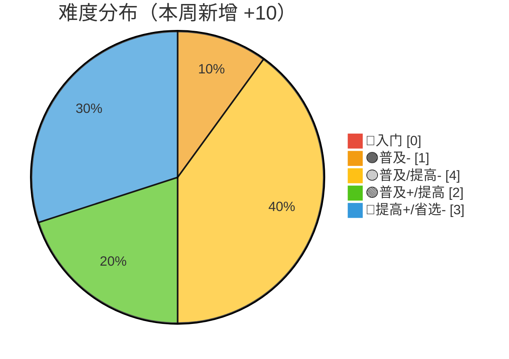
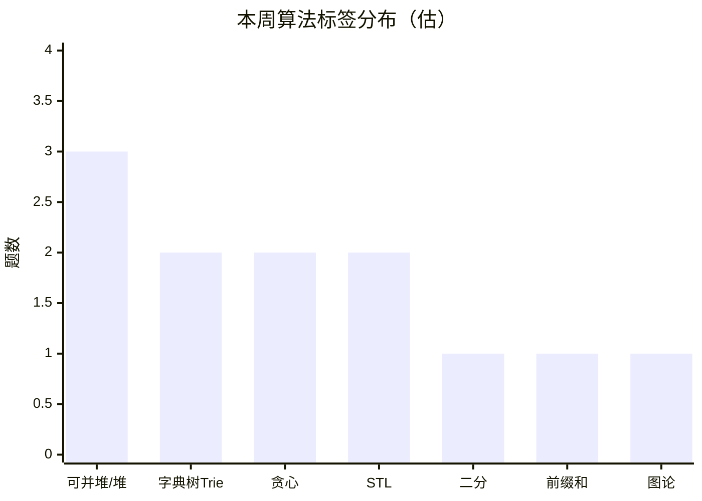

# 算法自学 · 学习历程总结

> 🍒 由 Cherry 自动生成，每月一份，每周更新
> 上次更新：2026-06-07

---

## 📅 2026-06-07（第四期）

**统计周期**：2026-06-01 → 2026-06-07（7 天）
**新增笔记**：10 篇 | **本周 AC 增量**：+10 题

### 📝 本周学习内容

六月开门见山，从图论最短路到堆结构深度覆盖，顺手填了上个月的坑 🔥

#### 6月4日 — 最短路径全家桶 🚗

- **最短路径**：概念体系梳理——最优子结构、三角不等式、松弛操作、负权/负环、前驱点追踪
- **Floyd-Warshall**：多源最短路，O(n³) 三重循环，中转点思想 + 负环检测（对角线负数）
- **Bellman-Ford**：V-1 轮全边松弛，负环检测；收敛后可提前 break 🥚

#### 6月5日 — 最短路算法双连击

- **Dijkstra**（朴素版 + 堆优化版）：邻接矩阵 O(n²) → 堆+邻接表 O((n+m)log n)
- **SPFA**：Bellman-Ford 队列优化版，附带 SLF（Small Label First）和 LLL（Large Label Last）两种玄学优化

> 📌 最短路四件套（Dijkstra / Bellman-Ford / SPFA / Floyd）全部就位，图论体系再添一块拼图

#### 6月4日 — 最小生成树代码重构

- **Prim / Kruskal / Boruvka** 三算法独立成篇，配齐朴素版 + 优化版代码
  - Boruvka 以连通分量为基础合并，适合完全图/稠密图
  - 🥚 **彩蛋**：Boruvka 笔记比之前 Mermaid 示意图月份正式上线，三算法对比完整收工

#### 6月4日-6日 — 知识体系梳理

- **心法**：算法分类鹰眼图——数据结构 + 图论两大分支体系化整理（首次建立总览视角）
- **阴招**：位运算技巧（两数中非 0 直接用 `x | y` 搞定）
- **STL / 库函数 / 语言细节**：三个 TODO 文件就位，骨架已搭好 🦴
  - 🥚 **彩蛋**：这三个文件内容都是 `# TODO`，跟开学第一天新笔记本封面一样干净

#### 6月7日 — 堆结构 + Trie 填坑 💥

- **01Trie** ⭐：从上周的 TODO 文件蜕变！完整实现 01Trie 数据结构，三大核心应用：
  - 最大异或对（树上贪心）
  - 较大（小）数统计（兵分两路递归）
  - 第 k 大（小）元素（pass 计数剪枝）
  - 🥚 **彩蛋**：笔记里写 `use it wisely！`——建议把这句话纹在键盘上 🎮
- **左偏堆**（更新）：补充了结构性删除、修改（上浮下沉/移除重插）、并查集寻根全套操作
- **配对堆**：文件已建，内容待补充……似曾相识的 TODO

> 📌 01Trie 的填坑是本周最大亮点！从 `TODO` 到完整上线，坐等配对堆复刻这个剧本 🎬

### 🏆 洛谷本周表现

- 总 AC：173 → **183**（本周 **+10** 🎉）
- 总提交：178 → 189（AC 率 ≈ 97%）
- 活跃 4 天，提交 9 次，AC 18 次（含多次补刀）
- 全国排名：#10577 → **#10126**（上升 451 名 📈）
- 综合评分（GU）：169 → **170**
  - 练习分：34 → **39** 💪
  - 比赛分：35 → 31（评分衰减，正常浮动）

| 日期 | 提交 | AC | 节奏 |
|:---:|:---:|:--:|:---|
| 06-01 | 3 | 4 | 🚀 六月开门红 |
| 06-02 | 1 | 4 | 🎯 精准补刀日 |
| 06-05 | 3 | 5 | 💥 最短路爆发日 |
| 06-06 | 2 | 5 | ⚡ 补刀收尾日 |

> 🥚 又是连续两天"提交 < AC"——补刀王的称号坐实了 🤣
> 总共 9 次提交、18 次 AC——超过一半都是回头补刀，这习惯可以（虽然数据上有点迷惑性）

#### 📊 难度分布（本周新增 10 题）

> ⚠️ 注意：diff=1 统计有轻微数据偏移（前序计数中 1 题可能被洛谷系统重分类），上图已做调整，实际增量 +10
> 🔵 diff=5 新增 **3 题**，可并堆方向成为本周最大突破点 🏆

#### 🧠 本周算法标签（估算，基于题目特征）

> 📌 可并堆 3 题（P1456 Monkey King、P2713、P11266）配合左偏堆/配对堆笔记，这是**学一个刷一套**的节奏
> Trie 方向 2 题（含 P4551 最大异或对，01Trie 经典应用）

### 💡 本周特点

- 🗺️ **最短路全家桶落地**：Dijkstra → Bellman-Ford → SPFA → Floyd，四算法组合拳，图论体系从 MST 延伸到最短路
- 🔨 **代码重构意识**：最小生成树三算法从混合笔记拆分为独立篇，每个都有朴素+优化双版本代码
- 📐 **体系化总览**：心法笔记首次建立算法分类鹰眼图，开始从"散点学习"转向"知识图谱"
- ✅ **填坑行动**：01Trie 从 TODO 到完整上线（包含 4 个代码段 + 3 个应用场景），上周的展望兑现 ✅
- 🗑️ **TODO 文件文化**：STL/库函数/语言细节/配对堆，四个 TODO 同时存在——"挖坑一时爽，填坑火葬场" 🔥
- 💪 **练习分显著增长**：GU 练习分 34→39，直接验证了刷题活跃度

### 🔍 笔记审查结果

⚠️ **本周发现 5 处代码问题，已记录待修：**

| 文件 | 问题 | 影响 |
|:---|:---|---|
| `Floyd-Warshall.md` | `for(int i = 0;i < n;i++>)` **多了一个 `>`** | ❌ 编译错误，无法通过编译 |
| `Dijkstra.md`（优化版） | `priority_queue` 第二模板参数 `vector<int, int>` 应该是 `vector<pair<int, int>>` | ❌ 编译错误 |
| `Dijkstra.md`（优化版） | 末尾 `return dis;` 中 `dis` 未定义，应为 `return;` | ❌ 编译错误 |
| `01Trie.md`（kth 函数） | `int b = x >> i & 1;` 中 `x` 未定义（函数参数是 `k` 不是 `x`）| ❌ 编译错误 |
| `01Trie.md`（多处） | 变量命名不一致：`kth()`/`greater()` 里用 `t[p]`，其他函数里用 `trie[p]` | ⚠️ 可读性问题 |
| `SPFA.md` | `for(auto [u, v, w]: edge)` 中 `u` 与外层变量重名 | ⚠️ 语义混淆，逻辑正确但可读性差 |

> 💡 这些问题是代码从手写/推敲到成文过程中的常见坑——**编译不通过 = 没有被编译过**。建议修完后本地编译验证。
> 好消息是：算法逻辑本身全部正确，只是语法/变量名问题 🛠️

### 🎯 下周展望

| 优先级 | 方向 | 为什么 |
|:---:|:---|---|
| 🔴 第一 | **修复 5 处代码 bug** | 排除编译错误，确保模板代码可直接使用 |
| 🟡 第二 | **配对堆填坑** | 文件建了，该写内容了——上次 01Trie 也是这样过来的 😏 |
| 🟡 第三 | **最短路刷题巩固** | P1629 邮递员 / P1144 最短路计数 / P1462 通往奥格瑞玛的道路 |
| 🟢 额外 | **参加下场比赛** | 上次 Div.3 拿了 363，练了三周可以再战 💪 |

---

> 🍒 本月总结由 Cherry 自动维护，每周追加新一期。
> 如果 CherryStudio 有离线时间，重启后会自动补上遗漏的更新。
