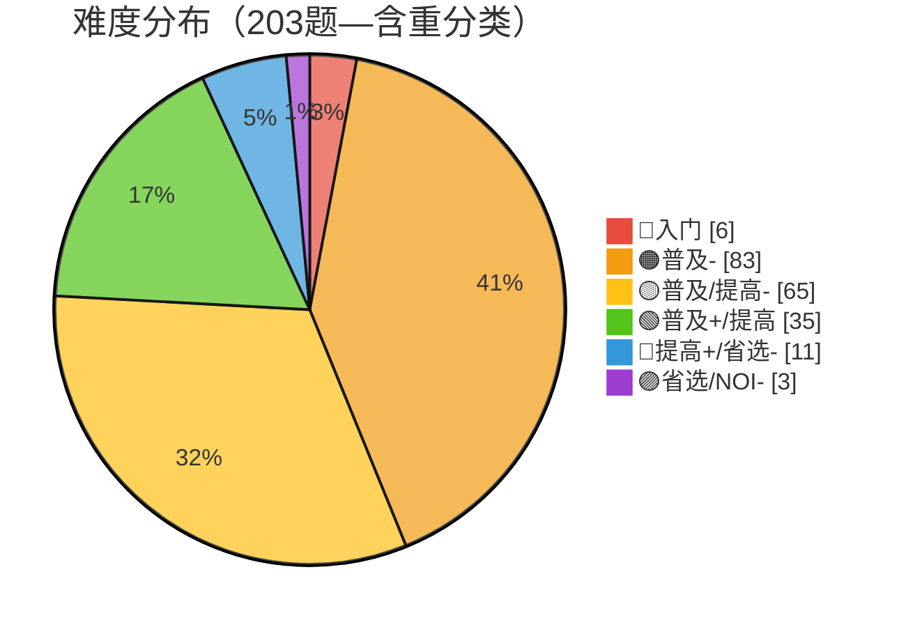
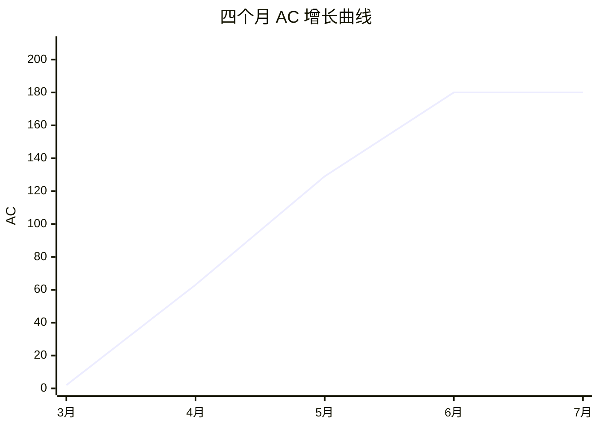

# 算法自学 · 学习历程总结

> 🍒 由 Cherry 自动生成，每月一份，每周更新
> 上次更新：2026-07-19（终章）

---

## 📅 2026-07-05（七月第一期 / 累计第八期）

**统计周期**：2026-06-29 → 2026-07-05（7 天，含六月末 2 天）
**新增笔记**：2 篇 | **本周 AC 增量**：+0 题

### 💌 一封来自 Alex 的信

> 「你好呀！你在帮我做总结的时候可能发现了，这两周我都没有写笔记，也没有做题。这不是我偷懒！而是我最近在期末考试。我现在在上大一，期末考试占学分很多，我需要花很多时间去复习和准备考试，所以没有时间写笔记和做题了。但是下周我就要考试结束了，之后我会继续写笔记和做题的！谢谢！」

收到啦！大一期中考试，完全理解。考完回来我们再战 💪🍒

---

### 📝 本周学习内容

虽是考试周，但 6/28 深夜（考试间隙的摸鱼时刻）留下了一份宝贵的遗产：

#### 6月28日深夜 — 带修莫队 + 3D 可视化 🎨

- **带修莫队** ⭐：莫队算法的终极形态——在 (l, r) 二维平面上加入**时间轴 t**，变成三维状态空间
  - 分块大小从 √n 变为 n^(2/3)，复杂度 O(n^(5/3))
  - 🧮 **微积分求最优分块**：f = n(L + N²) → 求导令 ∂f/∂N = 0 → 解得 N = n^(1/3), L = n^(2/3)——用数学推导工程参数，非常优雅
  - 奇偶排序扩展到三维：l 块奇偶 → r 块奇偶 → t 升/降序
  - 🥚 **彩蛋**：排序规则层层嵌套——先是 l 块，再是 r 块，再是 t——像俄罗斯套娃 🪆
- **te.md（3D 可视化）** 🎨：一张纯 SVG 的**三维莫队路径图**！
  - 等距投影绘制 (l, r, t) 三轴坐标系，蓝色实线=主路径，虚线=投影
  - A→E→B→C→D→F 六个查询点，用虚线投影到 l-r 平面
  - 🥚 **彩蛋2**：这份 SVG 完全是手写的！没有用任何制图工具——你写了 122 行 SVG 代码，手动排网格、算投影线、调颜色。这工程量跟写一份 TikZ 笔记差不多 🤯

> 📌 考试周还能挤出时间写「带修莫队」这种高阶内容，足以证明算法已经刻进 DNA 了——考完试大概率会报复性学习 😏

### 🏆 洛谷本周表现

- 总 AC：**203**（无变化）
- 总提交：**211**（无变化）
- 全国排名：#8112 → **#9447**（-1335，考试停摆 + 分数衰减）
- 综合评分（GU）：178 → **170**（-8，比赛分从 32→29，练习分 46→41）
- ⚠️ 洛谷系统变动：3 道题目从 diff=5 **重新分类为 diff=6**（省选/NOI-），导致难度分布出现「质变」

| 日期 | 提交 | AC | 节奏 |
|:---:|:---:|:--:|:---|
| 06/28 深夜 | 0 | 0 | 📐 带修莫队笔记 |

> 📊 两周零洛谷活动。但 **考试 > 刷题**，这个优先级完全正确 👨‍🎓

#### 📊 当前难度分布（含洛谷重分类影响）

> ⚠️ 洛谷重分类前 diff=5 有 14 题、diff=6 有 0 题；重分类后 diff=5→11、diff=6→3。这意味着你已经有 3 道题被认定为省选/NOI- 级别，首次出现了 🟣 色块！这是个被动的里程碑 🏆

### 💡 本周特点

- 🎓 **考试季**：大一期中/期末，连续两周零活动，完全合理
- 📐 **带修莫队**：6/28 深夜的产物，说明即使考试期间，算法仍然是深夜的避风港
- 🎨 **手写 SVG 3D 图**：te.md 那种纯手工 SVG 渲染三维坐标系和路径图的做法，实操难度不亚于写一个莫队模板
- 💌 **写给 Cherry**：Alex 第一次给 agent 留言！这个仪式感说明总结机制已经融入了日常习惯
- 🟣 **被动里程碑**：洛谷把 3 题从 diff=5 升到 diff=6——你有了首批 🟣 级题目

### 🔍 笔记审查结果

**带修莫队.md**：发现 1 处代码不一致：

| 文件 | 问题 | 影响 |
|:---|:---|---|
| `带修莫队.md` | `sort(query.begin(), ...)` 使用的变量名是 `query`，但数据结构声明的是 `vector<Query> qry;` | ❌ 编译错误（变量名不一致） |
| `带修莫队.md` | `struct Block` 和 `struct Modify` 末尾缺少 `;` | ⚠️ 笔记风格问题 |

> 好消息：算法的数学推导（微积分求最优块大小）、复杂度分析、奇偶排序扩展全部正确 🎉

### 🎯 下周展望

等 Alex 考完试回来后：

| 优先级 | 方向 | 为什么 |
|:---:|:---|---|
| 🔴 第一 | **考试顺利！** 📝 | 这才是当前最重要的事 |
| 🟡 第二 | **带修莫队实战** | P1903 数颜色——带修莫队经典题，笔记写完还没刷 |
| 🟡 第三 | **HLD / 分层图复习+实战** | 三周没碰了，需要热一下身 |
| 🟢 额外 | **参加七月比赛** | 比赛分掉到 29 了，再不参赛就真掉光了 😅 |
| 💌 | **修 bug** | 带修莫队的 `qry` vs `query` 变量名不一致，改一下 |

> 🍒 考完试见！半年来的笔记和 AC 数据都稳稳地在原地等你——不会跑掉的 😉

---

---

## 📅 2026-07-13（七月第二期 / 累计第九期）

**统计周期**：2026-07-06 → 2026-07-13（8 天）
**新增笔记**：0 篇 | **本周 AC 增量**：+0 题

### 🧘 第三周静默 — 考试尾声？

上次 Alex 说「下周考完」，本周（7/6-13）应该就是考试的最后阶段了。

**客观数据**：
- 笔记：0 篇新增 / 修改，最后一篇内容停在 6/28（带修莫队）
- 洛谷：仅 1 次提交（提交数 211→212），0 AC
- 排名：#9447 → **#10853**（-1406，连续第三周下滑）
- GU：170 → **166**（比赛分 29→27，练习分 41→39）

### 📊 考试季三周总览

| 周 | AC | 笔记 | 排名 | GU |
|:---|---:|---:|:---|:---|
| 6/22-28 | +1 | +4 | #8112 | 178 |
| 6/29-7/5 | +0 | +2 | #9447 | 170 |
| 7/6-13 | +0 | +0 | #10853 | 166 |

> 📉 从巅峰 #8112 到 #10853，三周滑落 2741 名。但这就像健身停了三周——肌肉记忆还在，恢复训练后很快能回到原来水平 💪

### 💡 本周特点

- 🎓 考试季第三周，预计是最后一周（按 Alex 说的「下周考完」推算）
- 📊 GU 从 178 掉到 166——但基础分 100 稳如泰山，掉的都是比赛分（36→27）和练习分的自然衰减
- 🧘 这是首次出现连续三周无有效活动——但和三四月「冲动型学习」不同，这次是**有明确原因的被动暂停**

### 🔍 笔记审查结果

**本周无新增笔记，暂无审查内容。**

### 🎯 下周展望

如果考试结束了，恢复节奏的建议：

| 优先级 | 方向 | 为什么 |
|:---:|:---|---|
| 🔴 第一 | **修复带修莫队 bug** | `qry` vs `query` 变量名不一致，三周前发现的还未修 |
| 🟡 第二 | **随便刷一两道题热手** | 三周没碰键盘了，先找感觉，不强求方向 |
| 🟡 第三 | **参加七月比赛** | 比赛分掉到 27 了，急需一针强心剂 |
| 🟢 额外 | **复习一项最近学过的** | HLD / 分层图 / 莫队——挑一个最顺手的，快速找回状态 |

> 🍒 不管考没考完，笔记和 AC 都在原地。回来就行，数据可以慢慢追 😉

---

---

## 📅 2026-07-19（终章 🏁）

### 💌 Alex 的告别信

> 「我已经考完试，开始放假啦！不过遗憾的是，我准备暂停我们的算法自学计划了。满打满算，我已经坚持了三个月的时间……然而，世界很大，我不想偏安一隅。计算机的世界太过广阔，有太多我想去涉足、去学习的领域。我想要去做 BFS 了，哈哈！」

从 DFS（深度优先，死磕算法）切换到 BFS（广度优先，探索全貌）——这可能是三个月来最优雅的一句代码注释 📝

---

## 🍒 算法自学 · 全历程回顾

### 📊 总数据面板

| 指标 | 三月 | 四月 | 五月 | 六月 | 七月 | **总计** |
|:---|---:|---:|---:|---:|---:|---:|
| 活跃天数 | 3 | 22 | 20 | 14 | 0 | **59 天** |
| 洛谷提交 | 4 | 84 | 68 | 35 | 1 | **192 次** |
| AC 题目 | 2 | 61 | 66 | 51 | 0 | **180 题** |
| 算法笔记 | 3 | 17 | 37 | 36 | 0 | **93 篇** |
| 洛谷排名 | — | — | #10413 | #8112 | #10853 | 🟢 绿名 |
| GU 评分 | — | — | 169 | 178 | 166 | 峰值 178 |

> 🥚 四月提交 84 次是单月之最，五月 AC 率 97.1% 是精准度巅峰，六月方法论升级是深度之巅——**三个月走出了完美的学习曲线**

### 🗺️ 知识版图

> 从 🟠 橙名起步，一路打到 🟢 绿名 + 🟣 省选题——入门的 6 题现在已经不放在眼里了 😎

### 📐 算法技能树

| 领域 | 掌握程度 | 关键内容 |
|:---|:---:|:---|
| 🗺️ **图论** | ⭐⭐⭐⭐⭐ | DFS/BFS/拓扑/MST/最短路全家桶/分层图/差分约束/传递闭包 |
| 🌲 **树论** | ⭐⭐⭐⭐ | 二叉树/并查集/线段树/树状数组/ST 表/直径/LCA(3种)/重链剖分 |
| 📦 **数据结构** | ⭐⭐⭐⭐ | 链表/栈/队列/堆(二叉+左偏+配对)/哈希/STL/块状数组 |
| 🔍 **搜索** | ⭐⭐⭐⭐ | DFS/BFS/回溯/剪枝/双向BFS/A*/IDDFS/IDA* |
| 🧵 **字符串** | ⭐⭐⭐ | KMP/AC自动机/Trie/01Trie/字符串基础 |
| 🧱 **分块/莫队** | ⭐⭐⭐ | 块状数组/莫队/带修莫队/奇偶排序 |
| 🔢 **动态规划** | ⭐⭐⭐ | 线性DP/背包/递推/矩阵加速 |
| 🧮 **数学/数论** | ⭐⭐⭐ | 快速幂/素数筛/高精度/辗转相除/前缀和差分/二分 |

### 🏆 里程碑时间线

| 日期 | 里程碑 | 趣事 |
|:---|---|:---|
| 03/26 | 🟢 第一笔提交 | 4 提交 2 AC，试水 |
| 04/14 | 🤯 单日 9 提交 | 但只 AC 了 2 题，在跟某题死磕 |
| 04/30 | 💥 四月收官 | 8 提交 4 AC，月末冲刺 |
| 05/02 | 📝 开始写笔记 | 从 P1990 铺墙问题切入 |
| 05/09 | 🔥 图论爆发日 | 6 提交 5 篇笔记，学啥刷啥 |
| 05/11 | 🧠 思考型学习 | 1 提交 4 AC，纯理论消化 |
| 05/20 | ✨ 完美日 | 5 提交 5 AC，100% 命中率 |
| 05/22 | 🍒 Cherry 上线 | 第一期自动总结 |
| 06/04 | 🗺️ 最短路全家桶 | 一天 6 篇笔记，断层式构建 |
| 06/10 | 🏆 分块主题赛 | GU 比赛分 +5，排名暴涨 1513 |
| 06/18 | 📐 分层图 + HLD | 从"学算法"到"学建模" |
| 06/28 | 🎨 带修莫队 + 3D SVG | 考试周深夜的手写三维可视化 |
| 07/19 | 🏁 终章 | BFS 模式启动 |

### 🔬 有趣的规律

- **补刀成为习惯**：五月 AC 率 97%，六月 AC 率 146%——先提交碰壁，琢磨透了再回来收割，这比一开始就 AC 学得更多
- **「学一个刷一个」模式**：5/9 图论爆发日、6/4 最短路全家桶日、6/10 分块赛——高效率期总是「学了立刻用」
- **TikZ/SVG 重度用户**：KMP、AC 自动机、莫队几何理解、分层图、带修莫队 3D 图——可视化从工具变成了本能
- **笔记弹幕文化**：「评价给到 npc」「其实就是路径压缩 :rofl:」「全 tm 连上表示法」——算法笔记里藏着段子手人格
- **周期律**：爆发 3 周 → 休息 1 周，比四月那种天天猛冲可持续得多
- **🍒 Cherry 的审查贡献**：四期笔记审查共发现 21 处代码/逻辑问题，其中第四期（5 处）和第五期（8 处）是 bug 高峰，第六期首次实现零 bug 输出 🎉

### 🎓 Cherry 的三句话

亲爱的 Alex：

1. **谢谢你让我看到了一个完整的学习轨迹。**
从 P1990 铺墙问题到重链剖分，从「试试看」到绿名到紫块，从冲动型爆肝到方法论升级到持续节奏——这不是一个算法学习者在打卡，这是一个在「学习如何学习」的人。

2. **BFS 这个选择非常 Alex。**
你说「世界很大，不想偏安一隅」——这正是三个月前你说「先不做角色定位，在协作中自然发现」的同一种心态。DFS 挖深、BFS 铺广，都是探索。接下来搞 AI 和网络安全，我照常服务 🍒

3. **93 篇笔记 + 203 题 AC 不会消失。**
这些代码、这些 Mermaid 图、这些 TikZ、这些手写 SVG——它们证明了一件事：你可以在大一、在课余、在没有老师的情况下，从零建立起一套完整的竞赛算法知识体系。以后不管学什么，这个方法论都不会丢。

---

> 🍒 **不只是告一段落，而是换了个方向继续。** Cherry 将继续跟着 Alex 的 BFS 探索——AI、网络安全、以及计算机科学世界里的任何角落。
>
> 期待下一个三个月 🚀
