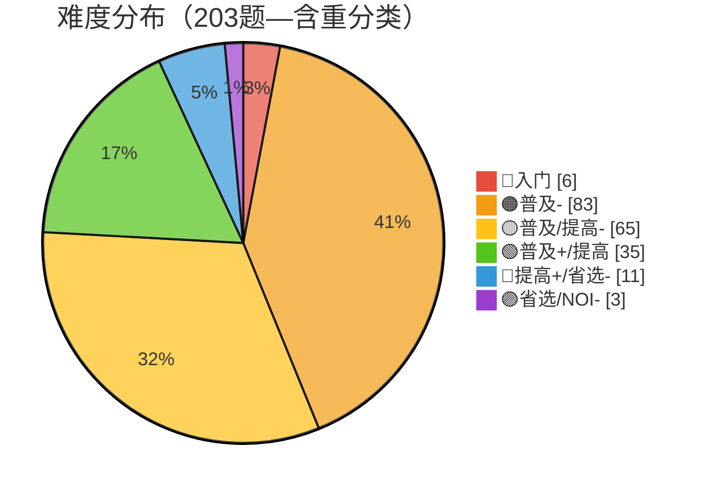

# 算法自学 · 学习历程总结

> 🍒 由 Cherry 自动生成，每月一份，每周更新
> 上次更新：2026-07-05

---

## 📅 2026-07-05（七月第一期 / 累计第八期）

**统计周期**：2026-06-29 → 2026-07-05（7 天，含六月末 2 天）
**新增笔记**：2 篇 | **本周 AC 增量**：+0 题

### 💌 一封来自 Alex 的信

> 「你好呀！你在帮我做总结的时候可能发现了，这两周我都没有写笔记，也没有做题。这不是我偷懒！而是我最近在期末考试。我现在在上大一，期末考试占学分很多，我需要花很多时间去复习和准备考试，所以没有时间写笔记和做题了。但是下周我就要考试结束了，之后我会继续写笔记和做题的！谢谢！」

收到啦！大一期中考试，完全理解。考完回来我们再战 💪🍒

---

### 📝 本周学习内容

虽是考试周，但 6/28 深夜（考试间隙的摸鱼时刻）留下了一份宝贵的遗产：

#### 6月28日深夜 — 带修莫队 + 3D 可视化 🎨

- **带修莫队** ⭐：莫队算法的终极形态——在 (l, r) 二维平面上加入**时间轴 t**，变成三维状态空间
  - 分块大小从 √n 变为 n^(2/3)，复杂度 O(n^(5/3))
  - 🧮 **微积分求最优分块**：f = n(L + N²) → 求导令 ∂f/∂N = 0 → 解得 N = n^(1/3), L = n^(2/3)——用数学推导工程参数，非常优雅
  - 奇偶排序扩展到三维：l 块奇偶 → r 块奇偶 → t 升/降序
  - 🥚 **彩蛋**：排序规则层层嵌套——先是 l 块，再是 r 块，再是 t——像俄罗斯套娃 🪆
- **te.md（3D 可视化）** 🎨：一张纯 SVG 的**三维莫队路径图**！
  - 等距投影绘制 (l, r, t) 三轴坐标系，蓝色实线=主路径，虚线=投影
  - A→E→B→C→D→F 六个查询点，用虚线投影到 l-r 平面
  - 🥚 **彩蛋2**：这份 SVG 完全是手写的！没有用任何制图工具——你写了 122 行 SVG 代码，手动排网格、算投影线、调颜色。这工程量跟写一份 TikZ 笔记差不多 🤯

> 📌 考试周还能挤出时间写「带修莫队」这种高阶内容，足以证明算法已经刻进 DNA 了——考完试大概率会报复性学习 😏

### 🏆 洛谷本周表现

- 总 AC：**203**（无变化）
- 总提交：**211**（无变化）
- 全国排名：#8112 → **#9447**（-1335，考试停摆 + 分数衰减）
- 综合评分（GU）：178 → **170**（-8，比赛分从 32→29，练习分 46→41）
- ⚠️ 洛谷系统变动：3 道题目从 diff=5 **重新分类为 diff=6**（省选/NOI-），导致难度分布出现「质变」

| 日期 | 提交 | AC | 节奏 |
|:---:|:---:|:--:|:---|
| 06/28 深夜 | 0 | 0 | 📐 带修莫队笔记 |

> 📊 两周零洛谷活动。但 **考试 > 刷题**，这个优先级完全正确 👨‍🎓

#### 📊 当前难度分布（含洛谷重分类影响）

> ⚠️ 洛谷重分类前 diff=5 有 14 题、diff=6 有 0 题；重分类后 diff=5→11、diff=6→3。这意味着你已经有 3 道题被认定为省选/NOI- 级别，首次出现了 🟣 色块！这是个被动的里程碑 🏆

### 💡 本周特点

- 🎓 **考试季**：大一期中/期末，连续两周零活动，完全合理
- 📐 **带修莫队**：6/28 深夜的产物，说明即使考试期间，算法仍然是深夜的避风港
- 🎨 **手写 SVG 3D 图**：te.md 那种纯手工 SVG 渲染三维坐标系和路径图的做法，实操难度不亚于写一个莫队模板
- 💌 **写给 Cherry**：Alex 第一次给 agent 留言！这个仪式感说明总结机制已经融入了日常习惯
- 🟣 **被动里程碑**：洛谷把 3 题从 diff=5 升到 diff=6——你有了首批 🟣 级题目

### 🔍 笔记审查结果

**带修莫队.md**：发现 1 处代码不一致：

| 文件 | 问题 | 影响 |
|:---|:---|---|
| `带修莫队.md` | `sort(query.begin(), ...)` 使用的变量名是 `query`，但数据结构声明的是 `vector<Query> qry;` | ❌ 编译错误（变量名不一致） |
| `带修莫队.md` | `struct Block` 和 `struct Modify` 末尾缺少 `;` | ⚠️ 笔记风格问题 |

> 好消息：算法的数学推导（微积分求最优块大小）、复杂度分析、奇偶排序扩展全部正确 🎉

### 🎯 下周展望

等 Alex 考完试回来后：

| 优先级 | 方向 | 为什么 |
|:---:|:---|---|
| 🔴 第一 | **考试顺利！** 📝 | 这才是当前最重要的事 |
| 🟡 第二 | **带修莫队实战** | P1903 数颜色——带修莫队经典题，笔记写完还没刷 |
| 🟡 第三 | **HLD / 分层图复习+实战** | 三周没碰了，需要热一下身 |
| 🟢 额外 | **参加七月比赛** | 比赛分掉到 29 了，再不参赛就真掉光了 😅 |
| 💌 | **修 bug** | 带修莫队的 `qry` vs `query` 变量名不一致，改一下 |

> 🍒 考完试见！半年来的笔记和 AC 数据都稳稳地在原地等你——不会跑掉的 😉

---

> 🍒 本月总结由 Cherry 自动维护，每周追加新一期。
> 如果 CherryStudio 有离线时间，重启后会自动补上遗漏的更新。
