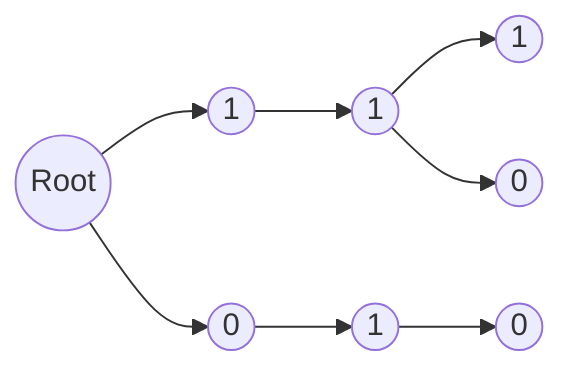

# 01 Trie
[toc]
## 定义
用 Trie 存储数字的二进制位，可以
- 按位统计或比较，处理计数问题
- 树上贪心，处理异或问题
> Trie 二进制思想自带二分特性，按位自带计数特性，且有共享前缀压缩空间，功能堪比平衡树！use it wisely！

## 示例
这棵 Trie 里存在
- `110` = 6
- `111` = 7
- `010` = 2


## 实现
### 存储
每个节点存两个next就行，一般还要维护 pass 记录经过当前节点的路径数
```cpp
struct Node{
    int next[2] = {0};
    bool end = false;
    int pass = 0;
};
vector<Node> trie(1);
```

### 插入
从高到低看二进制位，原理和普通 Trie 一样
```cpp
void insert(int x){
    int p = 0;
    // 从高位到低位，这里假设 x < 2^32
    for(int i = 31;i >= 0;i--){
        // b 是 x 的第 i 二进制位
        int b = x >> i & 1;
        if(!trie[p].next[b]){
            trie[p].next[b] = trie.size();
            trie.emplace_back();
        }
        p = trie[p].next[b];
        trie[p].pass++;
    }
    trie[p].end = true;
}
```

### 查找
从高到低看二进制位，原理和普通 Trie 一样
```cpp
bool find(int x){
    int p = 0;
    for(int i = 31;i >= 0;i--){
        int b = x >> i & 1;
        if(!trie[p].next[b]) return false;
        p = trie[p].next[b];
    }
    return trie[p].end;
}
```

## 应用
### 最大异或
输入数x，从 Trie 里找到与 x 异或值最大的数
#### 步骤
- 从高到低看二进制位，Trie 里是否有 x 的位反分枝
- 尽量走 x 的位反分枝，如果不存在则走同分枝

#### 正确性
- 存在反分枝的位越高，异或值越大
> 在第 $i$ 位走反分枝，异或值 $+2^i$
- 不存在反分枝是，一定会有同分枝
> 01Trie 深度固定，每条枝长度相等，如果没有 $1$ 边连接，一定有 $0$ 边连接
> 要么根本不连通，要么一路连到底

#### 代码
这里只计算异或值了，没有考虑与 x 异或的是谁
```cpp
int maxXor(int x){
    int p = 0, res = 0;
    for(int i = 31;i >= 0;i--){
        int b = x >> i & 1;
        // 选择反分枝
        if(trie[p].next[!b]){
            p = trie[p].next[!b];
            res |= 1 << i;
        }
        else p = trie[p].next[b];
    }
    return res;
}
```
#### 用法
- **最大异或对**：一边插入一边找当前最大异或对
- **最大异或子数组**：转化为前缀异或数组的最大异或对问题
> 异或中的重要性质：$A \oplus B \oplus B = A$

### 较大（小）数
输入数x，统计 Trie 里比 x 大（小）的数
#### 原理
- 从高到低看 x 的二进制位 $b_x$
- 如果 $b_x$ = 0， Trie里所有 1 分枝上的数都比 x 大
- 如果 $b_x$ = 1， Trie里所有 0 分枝上的数都比 x 小

#### 实现
> 以找比 x 大的数为例

可能兵分两路，所以递归实现
- **没有 1 分枝**（必有 0 分枝）
  - **$b_x$ = 0**：这一位同0，去 0 分枝继续
  - **$b_x$ = 1**：这一位小了，后面不可能比 x 大
- **有 1 分枝**（未必有 0 分枝）
  - **$b_x$ = 0**：可去 0 也可去 1
    - **去 1 分枝**：这一位大了，后面都比 x 大
    - **去 0 分枝（前提是有）**：这一位同0，去 0 分枝继续
  - $b_x$ = 1：这一位同1，去 1 分枝继续
```cpp
int greater(int x, int p = 0, int i = 31){
    if(i < 0) return 0;
    int bx = x >> i & 1
    int go1 = t[p].next[1], go0 = t[p].next[0];
    // 没有 1 分枝
    if(!go1){
        // bx = 1，后面不可能比 x 大
        if(bx) return 0;
        // bx = 0，去 0 分枝继续
        return greater(x, go0, i - 1);
    }
    // 有 1 分枝
    // bx = 1，去 1 分枝继续
    if(bx) return greater(x, go1, i - 1);
    // bx = 0，可去 0 也可去 1
    // t[0].pass = 0，兼容 go1 不存在的情况
    return t[go1].pass + greater(x, go0, i - 1);
}
```
#### 用法
- **逆序对**：一边插入一边找比当前小的元素个数
- **第k大（小）元素**：基于比 x 大（小）的元素数量，在值域内二分查找
> 在异或第k大等问题中，这种方法比下面的更适用

### 第k大（小）元素
输入数k，找 Trie 里第 k 大（小）的数

#### 原理
- 0 分枝上路径数 $pass_0$ 是 $\leq$ 当前 的元素个数
- 1 分枝上路径数 $pass_1$ 是 $\gt$ 当前 的元素个数

#### 实现
> 以找第 k 大元素为例
- 如果 $pass_0 \geq k$，去 0 分枝继续找第 $k$
- 否则去 1 分枝找第 $k - pass_0$
```cpp
int kth(int k){
    int p = 0, res = 0;
    for(int i = 31;i >= 0;i--){
        int go1 = t[p].next[1], go0 = t[p].next[0];
        // t[0].pass = 0，兼容 go0 不存在的情况
        // 去 0 分枝继续找第 k
        if(t[go0].pass >= k) p = go0;
        // 去 1 分枝找第 k - pass_0，更新res
        else p = go1, k -= t[go0].pass, res |= (1 << i);
    }
    return res;
}
```
