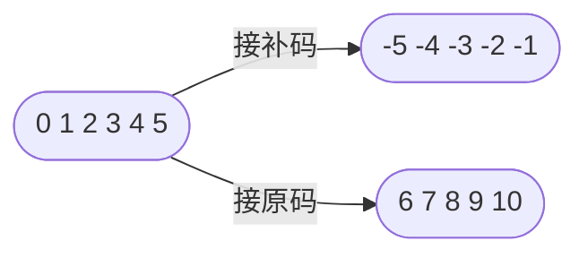
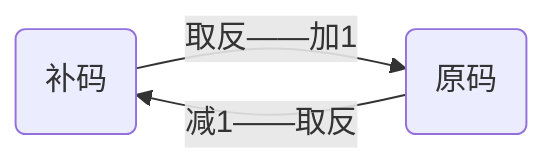

# 树状数组
[toc]

## 介绍
用数组存储的树形结构，用于
- 前缀查询
- 区间查询
- 单点修改

经过扩展也可实现
- 区间修改
- 单点查询

## 前置知识
### 取反的意义
位宽为 $w$ 的整数，设集合 $U = [0, w]$ 
- 全 $1$ 的数 $N$，$N = \sum 2^i,i \in U$
- 部分位为 $1$ 的数 $n$，$1$ 所在位构成集合 $S$，$n=\sum 2^i,i \in S$
- 取反：$!n=\sum 2^i,i \in C_uS$，$C_uS$ 为 $U$ 对 $S$ 的补集
- $!n= N-n$

### 补码
将整数表示范围的后半段作为负数

设最大表示范围 N
- 正数 $k\rightarrow$ 补码 $k$
- 负数 $-k\rightarrow$ 补码 $N-k+1$
$\because N-k =\space !k$
$\therefore -k =\space !k + 1$
$\therefore -k=\space !(k - 1)$

### lowbit
取二进制位的最后一个 $1$ 表示大小
- 直接 `x & !x` 得到的是 $0$
- 理解一
  - 先 `x - 1` 使最后一个 $1$ 变 $0$，后面的 $0$ 变 $1$
  - 再 `!(x - 1)`，原本最后一个 $1$ 变回 $1$
  - 此时 `x & !(x - 1)` 得到的是 `lowbit(x)`
- 理解二
  - 先 `!x` 使最后一个 $1$ 变 $0$，后面的 $0$ 变 $1$
  - 再 `!x + 1`，原本最后一个 $1$ 变回 $1$
  - 此时 `x & (!x + 1)` 得到的是 `lowbit(x)`

$\because$ `-x = !(x - 1) = !x + 1`
$\therefore$ `lowbit(x) = x & -x`

## 存储结构
编号为 $i$ 的节点存储如下区间信息
- 右端点为 $i$ 
- 区间长为 $lowbit(i)$

即 $[i-lowbit(i)+1,\ i]$
<table>
    <tr>
        <th>$a_1$</th><th>$a_2$</th>
        <th>$a_3$</th><th>$a_4$</th>
        <th>$a_5$</th><th>$a_6$</th>
        <th>$a_7$</th><th>$a_8$</th>
    </tr>
    <tr>
        <td>$t_8$</td><td></td><td></td>
        <td></td><td></td><td></td>
        <td></td><td></td>
    </tr>
    <tr>
        <td>$t_4$</td><td></td><td></td>
        <td></td><td> </td>
        <td></td><td></td><td></td>
    </tr>
    <tr>
        <td>$t_2$</td><td></td><td> </td>
        <td></td><td>$t_6$</td>
        <td></td><td> </td><td></td>
    </tr>
    <tr>
        <td>$t_1$</td><td> </td>
        <td>$t_3$</td><td> </td>
        <td>$t_5$</td><td> </td>
        <td>$t_7$</td><td> </td>
    </tr>
</table>

## 维护原数组
- 树状数组 $t$ 维护原数组 $a$
- 前缀查询 $t_i$ 即查询 $a_i$ 的前缀和
- 区间查询 $t_{[l,r]}$ 即查询 $a_{[l,r]}$ 的区间和
### 初始化
一个个加 $a_i$ 到树状数组中
> 单点加方法见下
```cpp
// 注意，a 必须是 1-based 数组
void build(const vector<int> &a){
    t.resize(a.size(), 0);
    for(int i = 1;i < a.size();i++) add(i, a[i]);
}
```
### 单点修改
从左向右修改所有包含 $i$ 的区间
#### 步骤
- 修改 $t_i$
- 将 $i$ 变为 $i + lowbit(i)$
- 重复直到 $i \gt n$
> 以修改 $a_1$ 为例
<table>
    <tr>
        <th>$a_1$</th><th>$a_2$</th>
        <th>$a_3$</th><th>$a_4$</th>
        <th>$a_5$</th><th>$a_6$</th>
        <th>$a_7$</th><th>$a_8$</th>
    </tr>
    <tr>
        <td bgcolor=#999999>$t_8$</td>
        <td></td><td></td>
        <td></td><td></td>
        <td></td><td></td>
        <td></td>
    </tr>
    <tr>
        <td bgcolor=#999999>$t_4$</td>
        <td></td><td></td>
        <td></td><td> </td>
        <td></td><td></td><td></td>
    </tr>
    <tr>
        <td bgcolor=#999999>$t_2$</td>
        <td></td><td> </td>
        <td></td><td>$t_6$</td>
        <td></td><td> </td><td></td>
    </tr>
    <tr>
        <td bgcolor=#999999>$t_1$</td>
        <td> </td><td>$t_3$</td>
        <td> </td><td>$t_5$</td>
        <td> </td><td>$t_7$</td>
        <td> </td>
    </tr>
</table>

#### 代码
```cpp
void add(int x, int k){
    while(x <= n) 
        t[x] += k, 
        x += lowbit(x); 
}
```

### 前缀查询
用各节点从右向左拼接完整区间
#### 步骤
- 计算 $t_i$ 的前缀
- 将 $i$ 变为 $i - lowbit(i)$
- 重复直到 $i \leq 0$

>以查询 $a_7$ 的前缀为例 
<table>
    <tr>
        <th>$a_1$</th><th>$a_2$</th>
        <th>$a_3$</th><th>$a_4$</th>
        <th>$a_5$</th><th>$a_6$</th>
        <th>$a_7$</th><th>$a_8$</th>
    </tr>
    <tr>
        <td>$t_8$</td><td></td><td></td>
        <td></td><td></td><td></td>
        <td></td><td></td>
    </tr>
    <tr>
        <td bgcolor=#999999>$t_4$</td>
        <td></td><td></td>
        <td></td><td> </td>
        <td></td><td></td><td></td>
    </tr>
    <tr>
        <td>$t_2$</td><td></td>
        <td> </td><td></td>
        <td bgcolor=#999999>$t_6$</td>
        <td></td><td> </td><td></td>
    </tr>
    <tr>
        <td>$t_1$</td><td> </td>
        <td>$t_3$</td><td> </td>
        <td>$t_5$</td><td> </td>
        <td bgcolor=#999999>$t_7$</td>
        <td> </td>
    </tr>
</table>

#### 代码
```cpp
int querySum(int x){
    int res = 0;
    while(x > 0) 
        res += t[x], 
        x -= lowbit(x);
    return res;
}
```

### 区间查询
查询区间 $[l,r]$，减两个前缀即可
```cpp
int queryRangeSum(int l, int r){
    return querySum(r) - querySum(l-1);
}
```

## 维护差分数组
- 树状数组 $f$ 维护 $a$ 的差分数组
- 查询 $f_i$ 即查询 $a_i$
- 区间查询 $f_{[l,r]}$ 即查询 $a_{[l,r]}$ 的增量

### 单点更新
更新 $f_i$ 和所有后续区间
> 实际意义是更新区间 $[i, n]$，但不直接调用，只做工具函数
```cpp
void update(int x, int k){
    while(x <= n) 
        f[x] += k, 
        x += lowbit(x); 
}
```

### 初始化
作为差分数组初始化
```cpp
// 同样 a 必须是 1-based 数组
void build(const vector<int> &a){
    f.resize(a.size(), 0);
    update(1, a[1]);
    for(int i = 2;i < a.size();i++) 
        update(i, a[i] - a[i-1]);
}
```

### 区间修改
对区间 $[l,r]$ 进行类似 $+k$ 的修改
#### 步骤
- $f_l$ 加 $k$，相当于给 $l$ 及之后的元素 $+k$
- $f_{r+1}$ 减 $k$，相当于给 $r+1$ 及之后的元素 $-k$
- 叠加起来效果是区间 $[l, r]$ 加 $k$
#### 代码
```cpp
void addRange(int l, int r, int k){
    update(l, k);
    if(r + 1 <= n) update(r + 1, -k);
}
```

### 单点修改
相当于修改区间 $[l, l]$
```cpp
void addPoint(int x, int k){
    addRange(x, x, k);
}
```

### 单点查询
查询 $a_i$ 的值，即差分数组 $f_i$ 的前缀和，那就和普通树状数组一样了
#### 代码
```cpp
int query(int x){
    int res = 0;
    while(x > 0) 
        res += f[x], 
        x -= lowbit(x);
    return res;
}
```
