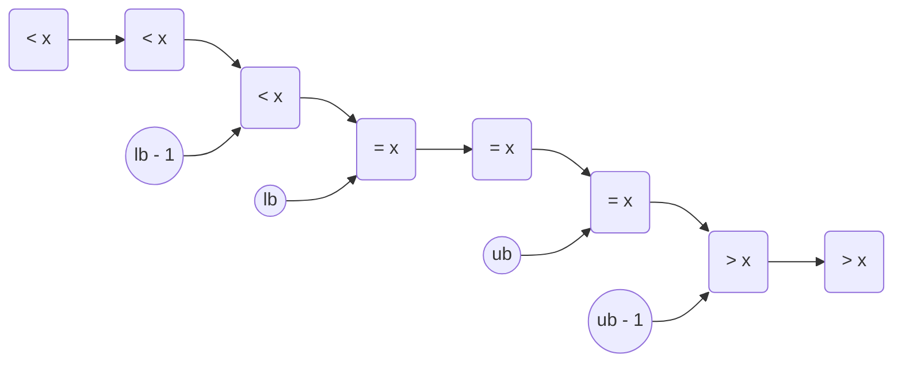

# 二分法
[toc]
## 介绍
一种将减治算法
- 将问题分解为两个子问题
- 选择其中一个有效问题
- 递归直到子问题可解

## 快速选择
求数列中第 $k$ 小的数
- 选择基准数，将数列分为两半
- 根据基准数排名，判断第 $k$ 数在哪一半
```cpp
// 分开数组，基准左边的数都比它小，右边都比它大
int partition(vector<int>> &a, int start, int end, int pivot){
    int a_p = a[pivot];
    // 先把基准放到最左边
    swap(a[pivot], a[start]);
    // 分界点，左小右大，界本身是大值
    int sep = start + 1;
    for(int i = start;i <= end;i++){
        // 如果当前数比基准小
        if(a[i] < a_p){
            // 把小数换到分界点，界点本身是大数所以正好放后面
            swap(a[i], a[sep]);
            // 分界点右移，保证界点本身仍然是大数
            sep++;
        }
    }
    // 基准换回分界点前，界点前一个正好是最后一个小数
    swap(a[start], a[sep-1]); // sep从start开始++，sep-1不会越界
    // 返回基准位置
    return sep - 1;
}
// 返回第k小数的位置
int getak(vector<int> &a, int l, int r, int k){
    int pivot = (l + r) / 2;
    // 以pivot为基准分开数组，得到基准位置，即基准前有几个数比他小，即基准数为第几小
    int pos = partition(a, l, r, pivot);
    // 正好
    if(pos == k) return pos;
    // 基准偏大，说明第k小在左边，从左边找
    else if(pos > k) return getak(a, l, pos - 1, k);
    // 基准偏小，从右边找
    else return getak(a, pos + 1, r, k);
}
```

## 二分答案
在答案可能范围内二分，找满足条件的数
### 边界控制：
- 满足条件 $\rightarrow$ 包括 $mid$ 
- 不满足条件 $\rightarrow$ 不包括 $mid$ 

- 找左边界 $\rightarrow$ $r$ 包括 $mid$  $\rightarrow$ 向下取整
- 找右边界 $\rightarrow$ $l$ 包括 $mid$  $\rightarrow$ 向上取整
### 取整方式：
- 向上取整：$(a + b - 1) / b$
- 向下取整：$a / b$

### 示例
```cpp
// 定义一个单调函数
int f(int x){
    if(-10 <= x && x <= 10) return 0;
    else if(x < -10) return x;
    else return 2 * x;
}
// 第一个 > x 的数
int first_greater(int x){
    int l = -100, r = 100, mid;
    while(l < r){
        //* 向下取整
        // 用区间长防止溢出
        mid = l + (r - l) / 2;
        // 满足条件，继续往左找，包括mid
        // 这里改成 >= 就是第一个 >= x 的数了
        if(f(mid) > x) r = mid; 
        // 不满足条件，往右找，不包括mid
        else l = mid + 1; 
    }
    // 循环结束时l==r
    return l;
}
// 最后一个 < x 的数
int last_less(int x){
    int l = -100, r = 100, mid;
    while(l < r){
        //* 向上取整
        mid = l + (r - l + 1) / 2;
        // 满足条件，继续往右找，包括mid
        if(f(mid) < x) l = mid; 
        // 不满足条件，往左找，不包括mid
        else r = mid - 1; 
    }
    // 循环结束时l==r
    return l;
}
```


## 二分查找
已有有序数组，在数组里找满足条件的数
> 逻辑与二分答案类似，不再赘述

## 标准库中的二分查找
### 函数
标准库的algorithm中提供了两个二分函数
- **lower_bound**：第一个 $>= target$ 的元素位置
- **upper_bound**：第一个 $> target$ 的元素位置

> 时间复杂度都是 $O(logn)$，适用于有序数组

### 用法
可以用于其他任务
- **lower_bound $- 1$**：最后一个 $< target$ 的元素位置
- **upper_bound $- 1$**：最后一个 $<= target$ 的元素位置
### 示意
```
 < < < < < = = = = = > > > > > > 
         ^ ^       ^ ^
         | |       | |
      lb-1 lb   ub-1 ub
```

