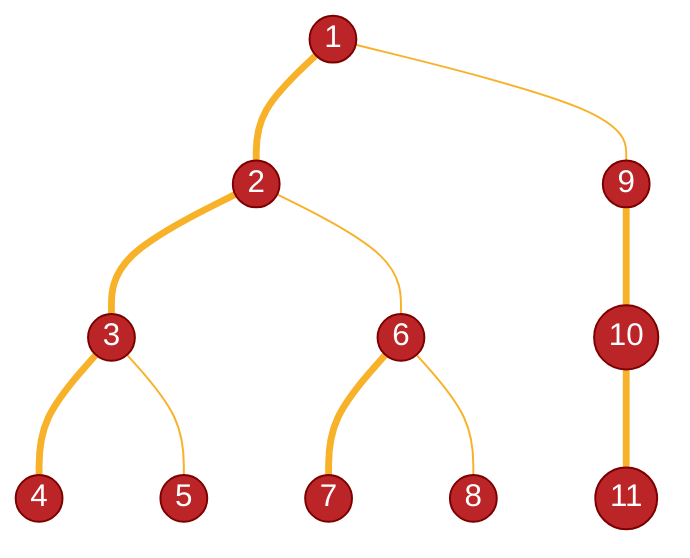

# 重链剖分
[toc]

## 介绍
把树转换成若干条**线性**且**不相交**的链，将复杂的树上问题转化为线性问题。

## 概念
- **子树大小**：以某个节点为根的树中节点个数。
- **重子节点**：子节点中子树最大的节点。
- **重边**：连接重子节点的边。
- **重链**：若干条首尾相连的重边，或单独的节点
- **链顶**：重链上深度最浅的节点
> 轻子节点、轻边、轻链定义为除重*以外所有这些东西

## 性质
- 轻子节点子树大小 $\leq$ $\dfrac{1}{2}$ 父节点子树大小
- 每次沿轻边转移，子树大小至少减半
- 每个轻子节点必然是一条重链的链顶
- 最多有 $O(\log n)$ 条重链

## 图示


## 实现
### 侦查 dfs
第一次 dfs 记录每个节点的如下信息：
- 子树大小
- 深度
- 父节点
- 重子节点
```cpp
// 邻接表
vector<vector<int>> adj;
// 节点信息
vector<int> size, depth, father, heavy;
// 侦查 dfs
void detect(int u, int fa){
    // 记录父节点
    father[u] = fa;
    // 记录深度
    depth[u] = depth[fa] + 1;
    // 初始化子树大小（根节点一个，后面递归完再加）
    size[u] = 1;
    // 最重子树大小用于后续更新重子节点
    int maxSize = 0;
    // 遍历所有子节点
    for(int v: adj[u]){
        // 跳过父节点
        if(v == fa) continue;
        // 递归侦查子节点
        detect(v, u);
        // 更新子树大小
        size[u] += size[v];
        // 更新重子节点
        if(size[v] > maxSize)
            maxSize = size[v], heavy[u] = v;
    }
}
detect(1, 0);
```

### 剖分 dfs
第二次 dfs 记录每个节点的如下信息：
- 重链顶
- 节点编号 $\to$ dfs 序号
- dfs 序号 $\to$ 节点编号
> 这两个映射是 $树形结构\leftrightarrow 线性序列$ 的关键
```cpp
vector<int> top, dfn, rnk;
int cnt = 0; // dfs 计数器
// 剖分 dfs
void cut(int u, int t){
    // 记录重链顶
    top[u] = t;
    // 记录节点编号与 dfs 序号映射
    dfn[u] = ++cnt;
    rnk[cnt] = u;
    // 优先处理重子节点
    if(heavy[u]) cut(heavy[u], t);
    // 遍历所有子节点
    for(int v: adj[u])
        // 跳过父节点和重子节点
        if(v != father[u] && v != heavy[u])
            // 轻子节点自己是重链顶
            cut(v, v);
}
cut(1, 1);
```

## 应用
> 有点类似分块思想（但不是严格根号平衡分块），因为重链有如下性质：
> - 两节点不在一条链时，跳深链一定不会经过交汇点
> - 跳深链不超 $\log n$ 次一定能转移到同一个链
>
>就像把序列分成几个块，这里是把路径分成几条链（或链的一部分），用大段跃进代替逐点遍历。
### LCA
- 两节点在一条重链上，较浅的就是 LCA
- 让链顶较深的节点越过链顶，跳到上一个重链里
- 直到跳进同一个链
```cpp
int lca(int a, int b){
    // a、b 不在一条链
    while(top[a] != top[b]){
        // 让 a 是链顶更深的节点
        if(depth[top[a]] < depth[top[b]]) swap(a, b);
        // 跳到上一个重链
        a = father[top[a]];
    }
    // a、b 在一条链，找到较浅的 
    return depth[a] < depth[b] ? a : b;
}
```

### 树上“区间”问题
借助 dfs 序把树上问题转化为链上线性问题，再用线性算法（如线段树）解决。
#### 路径点权修改
- 两节点在一条重链上，直接修改这条链
- 让链顶较深的节点越过链顶，顺便修改这条链，再跳到上一个重链里
- 直到跳进同一个链
```cpp
SegTree seg; // 线段树
void modify(int a, int b, int val){
    // a、b 不在一条链
    while(top[a] != top[b]){
        // 让 a 是链顶更深的节点
        if(depth[top[a]] < depth[top[b]]) swap(a, b);
        // 修改这条链
        seg.modify(dfn[top[a]], dfn[a], val);
        // 跳到上一个重链
        a = father[top[a]];
    }
    // a、b 在一条链，修改这条链
    if(dfn[a] > dfn[b]) swap(a, b);
    seg.modify(dfn[a], dfn[b], val);
}
```
#### 路径点权和查询
和修改类似，就是把“修链”改成“查链”
```cpp
int query(int a, int b){
    int res = 0;
    // a、b 不在一条链
    while(top[a] != top[b]){
        // 让 a 是链顶更深的节点
        if(depth[top[a]] < depth[top[b]]) swap(a, b);
        // 查这条链
        res += seg.query(dfn[top[a]], dfn[a]);
        // 跳到上一个重链
        a = father[top[a]];
    }
    // a、b 在一条链，查这条链
    if(dfn[a] > dfn[b]) swap(a, b);
    res += seg.query(dfn[a], dfn[b]);
    return res;
}
```
#### 子树点权修改
子树是一个连续区间，直接修改这个区间
> u 的子树区间是 `[u, u + size[u] - 1]`
```cpp
void modify(int u, int val){
    // 修改子树区间
    seg.modify(dfn[u], dfn[u] + size[u] - 1, val);
}
```
#### 子树点权和查询
和子树修改一样，直接查询这个区间
```cpp
int query(int u){
    // 查询子树区间
    return seg.query(dfn[u], dfn[u] + size[u] - 1);
}
```

### 边权换点权
有时候是边权的“区间”问题，要把边权换点权
- 所有边权下放到下层节点，根节点补 0
- 其余解法与点权解法一致

