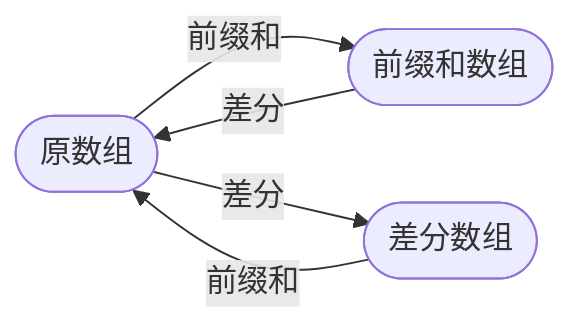

# 前缀和与差分
[toc]
## 介绍
一组对偶运算


## 作用
|运算|查询|更新|功能|
|-|-|-|-|
|前缀和|$O(1)$区间查询|$O(n)$单点更新|快速求区间聚合值|
|差分|$O(n)$单点查询|$O(1)$区间更新|快速区间更新|

## 前缀和
### 一维前缀和
```tikz
\begin{tikzpicture}[gray]
    \foreach \i in {0,...,4}
        \draw[fill=gray!50] rectangle (\i+1,1);
    \foreach \i in {0, 1}
        \draw[fill=gray!15] rectangle (\i+1,1);
    \draw grid (0,0) grid (7,1);
    \foreach \i in {0,...,6} 
        \node at (\i+0.5,0.5) {\i};
    \draw[->,thick] (1.5,-0.5) -- (1.5,0);
    \node at (1.5, -0.7) {L-1};
    \draw[->,thick] (2.5,-0.5) -- (2.5,0);
    \node at (2.5, -0.7) {L};
    \draw[->,thick] (4.5,-0.5) -- (4.5,0);
    \node at (4.5, -0.7) {R};
\end{tikzpicture}
```
#### 递推公式
$sum_i = sum_{i-1} + a_i$
#### 区间和
$sum_{(l,r)} = sum_r - sum_{l-1}$

### 二维前缀和
```tikz
\begin{tikzpicture}[gray]
    \foreach \i in {0,...,4}
        \foreach \j in {5,...,1}
            \draw[fill=gray!50] (\i,\j) rectangle (\i+1,\j+1);
    \foreach \i in {0,...,4}
        \foreach \j in {5, 4}
            \draw[fill=gray!5] (\i,\j)rectangle (\i+1,\j+1);
    \foreach \i in {0,1}
        \foreach \j in {4,...,1}
            \draw[fill=gray!5] (\i,\j)rectangle (\i+1,\j+1);
    \foreach \i in {0, 1}
        \foreach \j in {5, 4}
            \draw[fill=gray!50] (\i,\j)rectangle (\i+1,\j+1);
    \draw grid (0,0) grid (6,6);
    \node at (4.5,1.5) {$x_1$, $y_1$};
    \node at (2.5,3.5) {$x_2$, $y_2$};
    \node at (4.5,4.5) {$x_1$ , $y_2$-1};
    \node at (1.5,1.5) {$x_2$-1, $y_1$};
    \node at (1.5,4.5) {$x_1$-1, $y_1$-1};
\end{tikzpicture}
```
#### 递推公式
$sum_{i,j} = sum_{i-1,j} + sum_{i,j-1} - sum_{i-1,j-1} + a_{i,j}$
#### 区间和
$sum_{(x_1,y_1),(x_2,y_2)} = sum_{x_2,y_2} - sum_{x_1-1,y_2} - sum_{x_2,y_1-1} + sum_{x_1-1,y_1-1}$

## 差分
```tikz
\begin{tikzpicture}[gray]
\foreach \i in {0,...,4}
    \draw[fill=gray!50] (\i+2,1) rectangle (\i+3,2);
\foreach \i in {2,...,4}
    \draw[fill=gray!10] (\i,0) rectangle (\i+1,1);
\foreach \i in {0,1}
    \draw[fill=gray!80] (\i+5,2) rectangle (\i+6,3);
\foreach \i in {0, 1}
    \draw grid (0,0) grid (7,1);
    \foreach \i in {2,...,6} 
        \node at (\i+0.5,1.5) {+k};
    \foreach \i in {5,...,6} 
        \node at (\i+0.5,2.5) {-k};
    \draw[->,thick] (2.5,-0.5) -- (2.5,0);
    \node at (2.5, -0.7) {L};
    \draw[->,thick] (5.5,-0.5) -- (5.5,0);
    \node at (5.5, -0.7) {R+1};
    \draw[->,thick] (4.5,-0.5) -- (4.5,0);
    \node at (4.5, -0.7) {R};
    \foreach \i in {2,...,4}
        \node at (\i+0.5,0.5) {+k};
\end{tikzpicture}
```
### 一维差分
#### 递推公式
$d_i = a_i - a_{i-1}$
#### 区间更新
$a_{(l,r)} + k$
$d_l + k,\\ d_{r+1} - k$

### 二维差分
```tikz
\begin{tikzpicture}[gray]
\draw grid (0,0) grid (6,6);
\foreach \i in {0,...,4}
    \foreach \j in {5,...,1}
        \node[green!40] at (\i+0.8,\j+0.2) {+k};
\foreach \i in {0,...,4}
    \foreach \j in {5, 4}
        \node[red!50] at (\i+0.74,\j+0.8) {-k};
\foreach \i in {0,1}
    \foreach \j in {5,...,1}
        \node[orange!50] at (\i+0.14,\j+0.2) {-k};
\foreach \i in {0, 1}
    \foreach \j in {5, 4}
        \node[blue!60] at (\i+0.2,\j+0.8) {+k};
\end{tikzpicture}
```
#### 递推公式
$d_{i,j} = (a_{i,j} - a_{i-1,j}) - (a_{i,j-1} - a_{i-1,j-1})$
#### 区间更新
$a_{(x_1,y_1),(x_2,y_2)} + x$
$d_{x_1,y_1} + x,\\ d_{x_1,y_2+1} - x,\\ d_{x_2+1,y_1} - x,\\ d_{x_2+1,y_2+1} + x$
