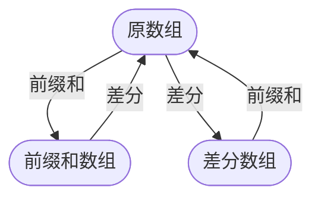

# 前缀和与差分
[toc]
## 介绍
一组对偶运算

## 作用
|运算|查询|更新|功能|
|-|-|-|-|
|前缀和|$O(1)$区间查询|$O(n)$单点更新|快速求区间聚合值|
|差分|$O(n)$单点查询|$O(1)$区间更新|快速区间更新|

## 前缀和
### 一维前缀和
<svg viewBox="0 0 340 140" width="100%" height="100%" xmlns="http://www.w3.org/2000/svg">
    <defs>
        <!-- 灰色箭头，尖朝上 -->
        <marker id="arrowGray" viewBox="0 0 10 10" refX="10" refY="5" 
                markerWidth="6" markerHeight="6" orient="auto">
            <path d="M 0 0 L 10 5 L 0 10 z" fill="rgb(140,140,140)" />
        </marker>
    </defs>
    <!-- 深灰底色 gray!50 ≈ rgb(128,128,128) -->
    <g fill="rgb(128,128,128)" stroke="none">
        <rect x="0" y="10" width="40" height="40" />
        <rect x="40" y="10" width="40" height="40" />
        <rect x="80" y="10" width="40" height="40" />
        <rect x="120" y="10" width="40" height="40" />
        <rect x="160" y="10" width="40" height="40" />
    </g>
    <!-- 浅灰底色 gray!15 ≈ rgb(217,217,217)，覆盖深灰 -->
    <g fill="rgb(217,217,217)" stroke="none">
        <rect x="0" y="10" width="40" height="40" />
        <rect x="40" y="10" width="40" height="40" />
    </g>
    <!-- 网格边框：提亮为 rgb(170,170,170)，与深浅灰底区分 -->
    <g stroke="rgb(100,100,100)" stroke-width="1.2" fill="none">
        <line x1="0" y1="10" x2="280" y2="10" />
        <line x1="0" y1="50" x2="280" y2="50" />
        <line x1="0" y1="10" x2="0" y2="50" />
        <line x1="40" y1="10" x2="40" y2="50" />
        <line x1="80" y1="10" x2="80" y2="50" />
        <line x1="120" y1="10" x2="120" y2="50" />
        <line x1="160" y1="10" x2="160" y2="50" />
        <line x1="200" y1="10" x2="200" y2="50" />
        <line x1="240" y1="10" x2="240" y2="50" />
        <line x1="280" y1="10" x2="280" y2="50" />
    </g>
    <!-- 单元格数字：与边框同色 -->
    <g font-family="sans-serif" font-size="16" text-anchor="middle" fill="rgb(90,90,90)">
        <text x="20" y="36">0</text>
        <text x="60" y="36">1</text>
        <text x="100" y="36">2</text>
        <text x="140" y="36">3</text>
        <text x="180" y="36">4</text>
        <text x="220" y="36">5</text>
        <text x="260" y="36">6</text>
    </g>
    <!-- 指针：灰色线条 + 灰色箭头，从下方指向上方 -->
    <g font-family="sans-serif" font-size="13" text-anchor="middle" fill="rgb(150,150,150)">
        <!-- L-1 -->
        <line x1="60" y1="85" x2="60" y2="51" stroke="rgb(150,150,150)" stroke-width="1" 
              marker-end="url(#arrowGray)" />
        <text x="60" y="102">L-1</text>
        <!-- L -->
        <line x1="100" y1="85" x2="100" y2="51" stroke="rgb(150,150,150)" stroke-width="1" 
              marker-end="url(#arrowGray)" />
        <text x="100" y="102">L</text>
        <!-- R -->
        <line x1="180" y1="85" x2="180" y2="51" stroke="rgb(150,150,150)" stroke-width="1" 
              marker-end="url(#arrowGray)" />
        <text x="180" y="102">R</text>
    </g>
</svg>

#### 递推公式
$sum_i = sum_{i-1} + a_i$
#### 区间和
$sum_{(l,r)} = sum_r - sum_{l-1}$

### 二维前缀和
<svg viewBox="0 0 340 360" width="100%" height="100%" xmlns="http://www.w3.org/2000/svg">
    <defs>
        
    </defs>
    <!-- 常量：格子尺寸 50，左下角原点 (0,0) 映射到 SVG (10, 310) -->
    <!-- SVG 坐标公式：x = 10 + i*50, y = 310 - (j+1)*50 -->
    <!-- i 从 0 到 5，j 从 0 到 5 -->
    <!-- 一、填充所有 deep 格子 -->
    <!-- i=0,1 且 j=4,5 -->
    <rect class="deep" x="10" y="10" width="50" height="50" />   <!-- (0,5) -->
    <rect class="deep" x="10" y="60" width="50" height="50" />   <!-- (0,4) -->
    <rect class="deep" x="60" y="10" width="50" height="50" />   <!-- (1,5) -->
    <rect class="deep" x="60" y="60" width="50" height="50" />   <!-- (1,4) -->
    <!-- i=2,3,4 且 j=1,2,3 -->
    <rect class="deep" x="110" y="210" width="50" height="50" />  <!-- (2,1) -->
    <rect class="deep" x="160" y="210" width="50" height="50" />  <!-- (3,1) -->
    <rect class="deep" x="210" y="210" width="50" height="50" />  <!-- (4,1) -->
    <rect class="deep" x="110" y="160" width="50" height="50" />  <!-- (2,2) -->
    <rect class="deep" x="160" y="160" width="50" height="50" />  <!-- (3,2) -->
    <rect class="deep" x="210" y="160" width="50" height="50" />  <!-- (4,2) -->
    <rect class="deep" x="110" y="110" width="50" height="50" />  <!-- (2,3) -->
    <rect class="deep" x="160" y="110" width="50" height="50" />  <!-- (3,3) -->
    <rect class="deep" x="210" y="110" width="50" height="50" />  <!-- (4,3) -->
    <!-- 二、填充所有 light 格子 -->
    <!-- i=0,1 且 j=1,2,3 -->
    <rect class="light" x="10" y="210" width="50" height="50" />  <!-- (0,1) -->
    <rect class="light" x="10" y="160" width="50" height="50" />  <!-- (0,2) -->
    <rect class="light" x="10" y="110" width="50" height="50" />  <!-- (0,3) -->
    <rect class="light" x="60" y="210" width="50" height="50" />  <!-- (1,1) -->
    <rect class="light" x="60" y="160" width="50" height="50" />  <!-- (1,2) -->
    <rect class="light" x="60" y="110" width="50" height="50" />  <!-- (1,3) -->
    <!-- i=2,3,4 且 j=4,5 -->
    <rect class="light" x="110" y="60" width="50" height="50" />  <!-- (2,4) -->
    <rect class="light" x="160" y="60" width="50" height="50" />  <!-- (3,4) -->
    <rect class="light" x="210" y="60" width="50" height="50" />  <!-- (4,4) -->
    <rect class="light" x="110" y="10" width="50" height="50" />  <!-- (2,5) -->
    <rect class="light" x="160" y="10" width="50" height="50" />  <!-- (3,5) -->
    <rect class="light" x="210" y="10" width="50" height="50" />  <!-- (4,5) -->
    <!-- 空白：i=5（整列）和 j=0（整行）— 不绘制填充，自然保留白色背景 -->
    <!-- 三、网格边框线 -->
    <g class="grid-line" fill="none">
        <!-- 水平线 y = 10, 60, 110, 160, 210, 260, 310 -->
        <line x1="10" y1="10" x2="310" y2="10" />
        <line x1="10" y1="60" x2="310" y2="60" />
        <line x1="10" y1="110" x2="310" y2="110" />
        <line x1="10" y1="160" x2="310" y2="160" />
        <line x1="10" y1="210" x2="310" y2="210" />
        <line x1="10" y1="260" x2="310" y2="260" />
        <line x1="10" y1="310" x2="310" y2="310" />
        <!-- 竖直线 x = 10, 60, 110, 160, 210, 260, 310 -->
        <line x1="10" y1="10" x2="10" y2="310" />
        <line x1="60" y1="10" x2="60" y2="310" />
        <line x1="110" y1="10" x2="110" y2="310" />
        <line x1="160" y1="10" x2="160" y2="310" />
        <line x1="210" y1="10" x2="210" y2="310" />
        <line x1="260" y1="10" x2="260" y2="310" />
        <line x1="310" y1="10" x2="310" y2="310" />
    </g>
    <!-- 四、节点文字 -->
    <!-- 格子中心 = (i+0.5, j+0.5) => SVG (10 + (i+0.5)*50, 310 - (j+0.5)*50) -->
    <!-- (4.5, 1.5) -> (4,1) -> (235, 235) -->
    <text class="t-deep" x="235" y="240">x₁, y₁</text>
    <!-- (2.5, 3.5) -> (2,3) -> (135, 135) -->
    <text class="t-deep" x="135" y="140">x₂, y₂</text>
    <!-- (4.5, 4.5) -> (4,4) -> (235, 85) -->
    <text class="t-light" x="235" y="90">x₁, y₂−1</text>
    <!-- (1.5, 1.5) -> (1,1) -> (85, 235) -->
    <text class="t-light" x="85" y="240">x₂−1, y₁</text>
    <!-- (1.5, 4.5) -> (1,4) -> (85, 85) -->
    <text class="t-deep" x="85" y="90">x₂−1, y₂−1</text>
    <!-- 五、坐标轴标签 -->
    <g class="axis">
        <!-- x 轴标签 (i=0..5) -->
        <text x="35" y="330">0</text>
        <text x="85" y="330">1</text>
        <text x="135" y="330">2</text>
        <text x="185" y="330">3</text>
        <text x="235" y="330">4</text>
        <text x="285" y="330">5</text>
        <!-- y 轴标签 (j=0..5) -->
        <text x="2" y="290">0</text>
        <text x="2" y="240">1</text>
        <text x="2" y="190">2</text>
        <text x="2" y="140">3</text>
        <text x="2" y="90">4</text>
        <text x="2" y="40">5</text>
    </g>
</svg>

#### 递推公式
$sum_{i,j} = sum_{i-1,j} + sum_{i,j-1} - sum_{i-1,j-1} + a_{i,j}$
#### 区间和
$sum_{(x_1,y_1),(x_2,y_2)} = sum_{x_2,y_2} - sum_{x_1-1,y_2} - sum_{x_2,y_1-1} + sum_{x_1-1,y_1-1}$

## 差分
### 一维差分
<svg viewBox="0 0 390 240" width="100%" height="100%" xmlns="http://www.w3.org/2000/svg">
    <defs>
        
        <marker id="arrowhead" markerWidth="8" markerHeight="6" refX="7" refY="3" orient="auto">
            <polygon points="2 0, 8 3, 2 6" fill="#575757" />
        </marker>
    </defs>
    <!-- ===== 网格参数 ===== -->
    <!-- 单元格大小: 48×48, 原点 (0,0) → SVG (15, 160) -->
    <!-- x_svg = 15 + x*48, y_svg = 160 - (y+1)*48 -->
    <!-- ===== 第0行 (y=0): 底部整行7格 ===== -->
    <!-- x=0 -->
    <rect class="cell" x="15"  y="112" width="48" height="48" fill="#fff" />
    <!-- x=1 -->
    <rect class="cell" x="63"  y="112" width="48" height="48" fill="#fff" />
    <!-- x=2 gray!10 -->
    <rect class="cell g10" x="111" y="112" width="48" height="48" />
    <text class="t-dark" x="135" y="136">+k</text>
    <!-- x=3 gray!10 -->
    <rect class="cell g10" x="159" y="112" width="48" height="48" />
    <text class="t-dark" x="183" y="136">+k</text>
    <!-- x=4 gray!10 -->
    <rect class="cell g10" x="207" y="112" width="48" height="48" />
    <text class="t-dark" x="231" y="136">+k</text>
    <!-- x=5 -->
    <rect class="cell" x="255" y="112" width="48" height="48" fill="#fff" />
    <!-- x=6 -->
    <rect class="cell" x="303" y="112" width="48" height="48" fill="#fff" />
    <!-- ===== 第1行 (y=1): x=2..6 五格 gray!50 ===== -->
    <rect class="cell g50" x="111" y="64" width="48" height="48" />
    <text class="t-light" x="135" y="88">+k</text>
    <rect class="cell g50" x="159" y="64" width="48" height="48" />
    <text class="t-light" x="183" y="88">+k</text>
    <rect class="cell g50" x="207" y="64" width="48" height="48" />
    <text class="t-light" x="231" y="88">+k</text>
    <rect class="cell g50" x="255" y="64" width="48" height="48" />
    <text class="t-light" x="279" y="88">+k</text>
    <rect class="cell g50" x="303" y="64" width="48" height="48" />
    <text class="t-light" x="327" y="88">+k</text>
    <!-- ===== 第2行 (y=2): x=5..6 两格 gray!80 ===== -->
    <rect class="cell g80" x="255" y="16" width="48" height="48" />
    <text class="t-light" x="279" y="40">−k</text>
    <rect class="cell g80" x="303" y="16" width="48" height="48" />
    <text class="t-light" x="327" y="40">−k</text>
    <!-- ===== 底部箭头与标签 ===== -->
    <!-- L 箭头: x=2.5 -->
    <line class="arrow" x1="135" y1="180" x2="135" y2="162" />
    <text class="alabel" x="135" y="198">L</text>
    <!-- R 箭头: x=4.5 -->
    <line class="arrow" x1="231" y1="180" x2="231" y2="162" />
    <text class="alabel" x="231" y="198">R</text>
    <!-- R+1 箭头: x=5.5 -->
    <line class="arrow" x1="279" y1="180" x2="279" y2="162" />
    <text class="alabel" x="279" y="198">R+1</text>
</svg>

#### 递推公式
$d_i = a_i - a_{i-1}$
#### 区间更新
$a_{(l,r)} + k$
$d_l + k,\\ d_{r+1} - k$

### 二维差分
<svg viewBox="0 0 340 340" width="100%" height="100%" xmlns="http://www.w3.org/2000/svg">
    <defs>
        
    </defs>
    <!-- 坐标转换：左下角(0,0) → SVG(20,320), 每格50px -->
    <!-- SVG x = 20 + x*50,  SVG y = 320 - y*50 -->
    <!-- 网格线 -->
    <!-- 水平线 -->
    <g stroke="#aaa" stroke-width="1">
        <line x1="20" y1="20" x2="320" y2="20" />
        <line x1="20" y1="70" x2="320" y2="70" />
        <line x1="20" y1="120" x2="320" y2="120" />
        <line x1="20" y1="170" x2="320" y2="170" />
        <line x1="20" y1="220" x2="320" y2="220" />
        <line x1="20" y1="270" x2="320" y2="270" />
        <!-- 竖直线 -->
        <line x1="20" y1="20" x2="20" y2="320" />
        <line x1="70" y1="20" x2="70" y2="320" />
        <line x1="120" y1="20" x2="120" y2="320" />
        <line x1="170" y1="20" x2="170" y2="320" />
        <line x1="220" y1="20" x2="220" y2="320" />
        <line x1="270" y1="20" x2="270" y2="320" />
        <line x1="320" y1="20" x2="320" y2="320" />
    </g>
    <!-- 第一组：绿色 +k, i=0..4, j=5..1 -->
    <!-- 位置：(i+0.8, j+0.2) -->
    <g class="g" dominant-baseline="central">
        <text x="60" y="60">+k</text>      <!-- i=0,j=5 -->
        <text x="60" y="110">+k</text>     <!-- i=0,j=4 -->
        <text x="60" y="160">+k</text>     <!-- i=0,j=3 -->
        <text x="60" y="210">+k</text>     <!-- i=0,j=2 -->
        <text x="60" y="260">+k</text>     <!-- i=0,j=1 -->
        <text x="110" y="60">+k</text>     <!-- i=1,j=5 -->
        <text x="110" y="110">+k</text>
        <text x="110" y="160">+k</text>
        <text x="110" y="210">+k</text>
        <text x="110" y="260">+k</text>
        <text x="160" y="60">+k</text>     <!-- i=2,j=5 -->
        <text x="160" y="110">+k</text>
        <text x="160" y="160">+k</text>
        <text x="160" y="210">+k</text>
        <text x="160" y="260">+k</text>
        <text x="210" y="60">+k</text>     <!-- i=3,j=5 -->
        <text x="210" y="110">+k</text>
        <text x="210" y="160">+k</text>
        <text x="210" y="210">+k</text>
        <text x="210" y="260">+k</text>
        <text x="260" y="60">+k</text>     <!-- i=4,j=5 -->
        <text x="260" y="110">+k</text>
        <text x="260" y="160">+k</text>
        <text x="260" y="210">+k</text>
        <text x="260" y="260">+k</text>
    </g>
    <!-- 第二组：红色 -k, i=0..4, j=5,4 -->
    <!-- 位置：(i+0.74, j+0.8) -->
    <g class="r" dominant-baseline="central">
        <text x="57" y="30">−k</text>      <!-- i=0,j=5 -->
        <text x="57" y="80">−k</text>      <!-- i=0,j=4 -->
        <text x="107" y="30">−k</text>     <!-- i=1,j=5 -->
        <text x="107" y="80">−k</text>
        <text x="157" y="30">−k</text>     <!-- i=2,j=5 -->
        <text x="157" y="80">−k</text>
        <text x="207" y="30">−k</text>     <!-- i=3,j=5 -->
        <text x="207" y="80">−k</text>
        <text x="257" y="30">−k</text>     <!-- i=4,j=5 -->
        <text x="257" y="80">−k</text>
    </g>
    <!-- 第三组：橙色 -k, i=0,1, j=5..1 -->
    <!-- 位置：(i+0.14, j+0.2) -->
    <g class="o" dominant-baseline="central">
        <text x="27" y="60">−k</text>      <!-- i=0,j=5 -->
        <text x="27" y="110">−k</text>     <!-- i=0,j=4 -->
        <text x="27" y="160">−k</text>     <!-- i=0,j=3 -->
        <text x="27" y="210">−k</text>     <!-- i=0,j=2 -->
        <text x="27" y="260">−k</text>     <!-- i=0,j=1 -->
        <text x="77" y="60">−k</text>      <!-- i=1,j=5 -->
        <text x="77" y="110">−k</text>
        <text x="77" y="160">−k</text>
        <text x="77" y="210">−k</text>
        <text x="77" y="260">−k</text>
    </g>
    <!-- 第四组：蓝色 +k, i=0,1, j=5,4 -->
    <!-- 位置：(i+0.2, j+0.8) -->
    <g class="b" dominant-baseline="central">
        <text x="30" y="30">+k</text>      <!-- i=0,j=5 -->
        <text x="30" y="80">+k</text>      <!-- i=0,j=4 -->
        <text x="80" y="30">+k</text>      <!-- i=1,j=5 -->
        <text x="80" y="80">+k</text>      <!-- i=1,j=4 -->
    </g>
</svg>

#### 递推公式
$d_{i,j} = (a_{i,j} - a_{i-1,j}) - (a_{i,j-1} - a_{i-1,j-1})$
#### 区间更新
$a_{(x_1,y_1),(x_2,y_2)} + x$
$d_{x_1,y_1} + x,\\ d_{x_1,y_2+1} - x,\\ d_{x_2+1,y_1} - x,\\ d_{x_2+1,y_2+1} + x$
