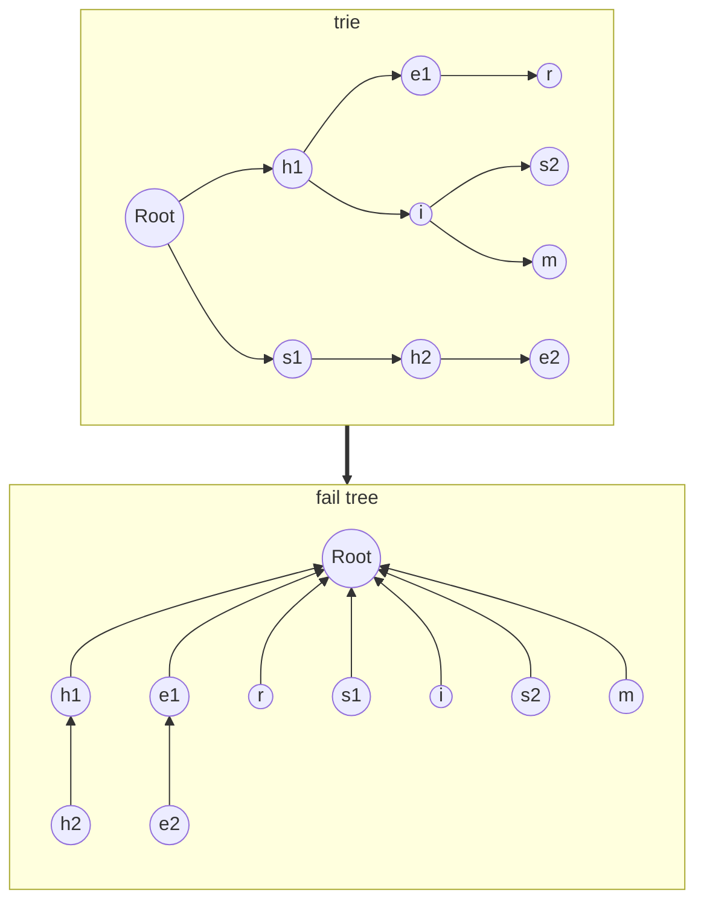

# AC自动机优化
[toc]
## Trie 图优化
### 优化
现在每次要遍历 fail 链，时间复杂度高，可以使用 Trie 图优化
- 每个节点的空 next 指向 fail 链上第一个能匹配该节点字符的节点
- `p = trie[p].next[c]` 可以直接跳转，无需再沿 fail 链找
> 其实就是路径压缩 :rofl:

### 示例
绿色箭头演示部分空 next 引导，其余大多导向根节点

<svg viewBox="0 0 380 460" width="100%" height="100%" xmlns="http://www.w3.org/2000/svg">
  <defs>
    <style>
      .node       { fill: #fafafa; stroke: #999; stroke-width: 1.5; }
      .node-text  { font-family: sans-serif; font-size: 14px; fill: #333; text-anchor: middle; dominant-baseline: central; }
      .edge       { fill: none; stroke: #555; stroke-width: 2; }
      .fail-edge  { fill: none; stroke: #c0392b; stroke-width: 2; stroke-dasharray: 6,4; }
      .trie-edge  { fill: none; stroke: #2d7d2d; stroke-width: 2; stroke-dasharray: 6,4; }
      .fail-label { font-family: sans-serif; font-size: 12px; fill: #c0392b; }
      .trie-label { font-family: sans-serif; font-size: 12px; fill: #2d7d2d; }
    </style>
    <!-- Fail edge arrow (red, small) -->
    <marker id="arrowFail" markerWidth="6" markerHeight="4.5" refX="6" refY="2.25" orient="auto">
      <polygon points="0,0 6,2.25 0,4.5" fill="#c0392b" />
    </marker>
    <!-- Trie edge arrow (dark green, small) -->
    <marker id="arrowTrie" markerWidth="6" markerHeight="4.5" refX="6" refY="2.25" orient="auto">
      <polygon points="0,0 6,2.25 0,4.5" fill="#2d7d2d" />
    </marker>
  </defs>
  <!-- Trie edges (back layer) -->
  <path class="trie-edge" marker-end="url(#arrowTrie)" d="M 120,135 C 150,170 150,250 120,285" />
  <text class="trie-label" x="150" y="220">s</text>
  <path class="trie-edge" marker-end="url(#arrowTrie)" d="M 120,285 C 80,250 80,170 120,135" />
  <text class="trie-label" x="75" y="220">h</text>
  <path class="trie-edge" marker-end="url(#arrowTrie)" d="M 315,318 C 335,265 335,155 315,102" />
  <text class="trie-label" x="315" y="220">r</text>
  <path class="trie-edge" marker-end="url(#arrowTrie)" d="M 210,195 C 185,150 150,135 135,120" />
  <text class="trie-label" x="180" y="150">h</text>
  <path class="trie-edge" marker-end="url(#arrowTrie)" d="M 210,333 C 180,340 140,335 120,315" />
  <text class="trie-label" x="166" y="350">s</text>
  <!-- Fail edges (middle layer) -->
  <path class="fail-edge" marker-end="url(#arrowFail)" d="M 195,318 C 160,318 90,200 125,140" />
  <text class="fail-label" x="100" y="225">fail</text>
  <path class="fail-edge" marker-end="url(#arrowFail)" d="M 285,318 C 210,318 145,195 200,120" />
  <text class="fail-label" x="205" y="250">fail</text>
  <!-- Regular tree edges (no arrows, endpoints slightly inside nodes) -->
  <line class="edge" x1="30" y1="210" x2="111.5" y2="128.5" />
  <line class="edge" x1="30" y1="210" x2="111.5" y2="291.5" />
  <line class="edge" x1="120" y1="120" x2="198.2" y2="104.4" />
  <line class="edge" x1="210" y1="102" x2="288" y2="102" />
  <line class="edge" x1="120" y1="300" x2="198.2" y2="315.6" />
  <line class="edge" x1="210" y1="318" x2="288" y2="318" />
  <line class="edge" x1="120" y1="120" x2="201.5" y2="201.5" />
  <line class="edge" x1="210" y1="210" x2="288.8" y2="178.5" />
  <line class="edge" x1="210" y1="210" x2="288.8" y2="241.5" />
  <!-- Nodes (top layer) -->
  <circle class="node" cx="30"  cy="210" r="15" /><text class="node-text" x="30"  y="210">Root</text>
  <circle class="node" cx="120" cy="120" r="15" /><text class="node-text" x="120" y="120">h</text>
  <circle class="node" cx="210" cy="102" r="15" /><text class="node-text" x="210" y="102">e</text>
  <circle class="node" cx="300" cy="102" r="15" /><text class="node-text" x="300" y="102">r</text>
  <circle class="node" cx="120" cy="300" r="15" /><text class="node-text" x="120" y="300">s</text>
  <circle class="node" cx="210" cy="318" r="15" /><text class="node-text" x="210" y="318">h</text>
  <circle class="node" cx="300" cy="318" r="15" /><text class="node-text" x="300" y="318">e</text>
  <circle class="node" cx="210" cy="210" r="15" /><text class="node-text" x="210" y="210">i</text>
  <circle class="node" cx="300" cy="174" r="15" /><text class="node-text" x="300" y="174">s</text>
  <circle class="node" cx="300" cy="246" r="15" /><text class="node-text" x="300" y="246">m</text>
</svg>

### 构建 fail 指针
```cpp
void get_fail(){
    queue<int> q;
    // 处理第一层，空 next 和 fail 已默认指向根
    for(int v: trie[0].next) if(v) q.push(v);
    while(!q.empty()){
        int u = q.front();
        q.pop();
        // 遍历 u 的所有子节点
        for(int c = 0;c < 26;c++){
            int v = trie[u].next[c];
            int fp = trie[u].fail;
            if(v){
                // fp 的空 next 已经处理过，直接跳转
                trie[v].fail = trie[fp].next[c];
                q.push(v);
            }
            // 空 next 指向 fp 的 c 子节点，会一路引导向 c 第一次出现的地方
            else trie[u].next[c] = trie[fp].next[c];
        }
    }
}
```
### 匹配
直接按 next 跳转即可，会自动引导向 fail 链上能匹配的节点
```cpp
int match(string &s){
    int p = 0, res = 0;
    for(char c: s){
        // 直接按 next 跳转
        p = trie[p].next[c-'a'];
        // 在 fail 链上统计，这个不能省
        for(int i = p;i;i = trie[i].fail) 
            res += trie[i].end;
    }
    return res;
}
```

## last 指针优化
### 优化
每次匹配时统计 fail 链上，会经过很多不为模式串结尾的无意义节点，可以使用 last 指针优化

### 定义
last[u] 表示 u 的fail 链上第一个为模式串结尾
$$last[u] = \begin{cases}
    fail[u] & \text{fail[u] 为模式串结尾} \\
    last[fail[u]] & \text{fail[u] 不为模式串结尾}
\end{cases}$$
```cpp
struct Node{
    ...
    int last = 0;
};
```

### 构建 last 指针
BFS时顺便构建 last 指针
```cpp
void get_fail_last(){
    queue<int> q;
    // 第一层 last 已默认指向根
    for(int v: trie[0].next) if(v) q.push(v);
    while(!q.empty()){
        int u = q.front();
        q.pop();
        for(int c = 0;c < 26;c++){
            int v = trie[u].next[c];
            int fp = trie[u].fail;
            if(v){
                trie[v].fail = trie[fp].next[c];
                // 如果 fail[u] 为模式串结尾，last[u] 就是 fail[u]
                int fv = trie[v].fail;
                if(trie[fv].end) trie[v].last = fv;
                // 不是结尾，则继承 fail[u] 的 last，引导向第一个结尾
                else trie[v].last = trie[fv].last;
                q.push(v);
            }
            else trie[u].next[c] = trie[fp].next[c];
        }
    }
}
```

### 匹配
统计时沿 last 链统计就好
```cpp
int match(string &s){
    int p = 0, res = 0;
    for(char c: s){
        p = trie[p].next[c-'a'];
        // 沿 last 链统计，也可维护其他信息
        for(int i = p;i;i = trie[i].last)
            res += trie[i].end;
    }
    return res;
}
```

## fail 树优化
### 优化
统计时，每次要沿 fail 链或 last 链遍历，效率低。可以把所有操作积攒起来，最后统一进行一次统计。

### 定义
fail 树表示将 fail 链视为有向父边的树，也就是如果 `fail[v] = u`，那么 `u` 就是 `v` 在 fail 树上的子节点


> 除非需要复杂树上操作，fail 树并不需要显式构建，直接用 fail 指针简单维护即可

### 拓扑序
#### 原理
- 每个节点只受其在 fail 树上的所有子节点影响
- 因此需要先处理子节点，再处理父节点
- 即按自底向上的拓扑序处理

#### 获取方式
- 根据 fail 指针的定义，不难注意到 `fail[u]` 必然比 `u` 的层浅
> 注意力惊人 :rofl:
- 因此 Trie 的 BFS 反序就是 fail 树拓扑序

#### 实现
BSF 构建 fail 指针时顺手反向记录
```cpp
// 建议用链表或deque，反向插入效率高
list<int> order;
void get_fail(){
    ...
    while(!q.empty()){
        int u = q.front();
        // 出队时头插，反向记录
        order.push_front(u);
        ...
    }
    ...
}
```

### 统计
#### 原理
- 每个节点只记录自己被匹配的次数
- 最后根据拓扑序累加，相当于自底向上对 fail 树做dp
#### 实现
- 维护数组记录每个节点被匹配的次数
- 每次匹配记录当前节点的匹配次数
- 最后按拓扑序累加
> 这里代码统计了每个节点的匹配次数，实际上一般要再映射到模式串的编号
```cpp
// 注意，order.size() < trie.size()，因为根节点不在拓扑序里
vector<int> res(trie.size(), 0);
void match(string &s){
    // 先正常匹配
    int p = 0;
    for(char c: s){
        p = trie[p].next[c-'a'];
        // 记录单点信息，而不是遍历 fail 链
        res[p]++;
    }
    // 然后按拓扑序累加
    for(int i: order) res[trie[i].fail] += res[i];
}
```

### 意义
- 沿 fail 树上升的过程相当于取模式串的某个后缀
- 每个模式串被匹配时，它的所有后缀也被匹配
```
主串          e x a m p l e
被匹配的模式串    x a m p 
它的所有后缀        a m p
                    m p
                      p
```
