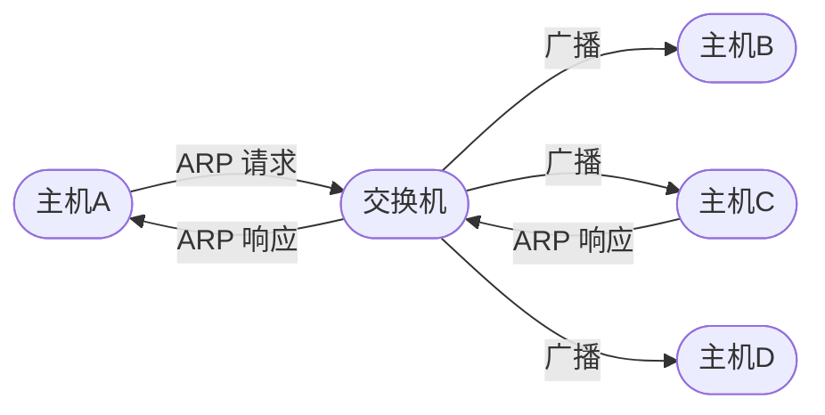
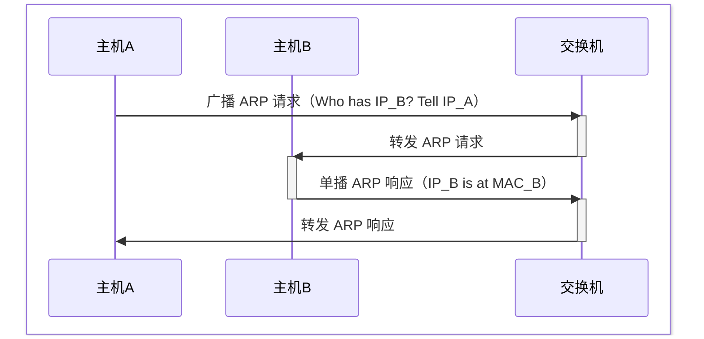
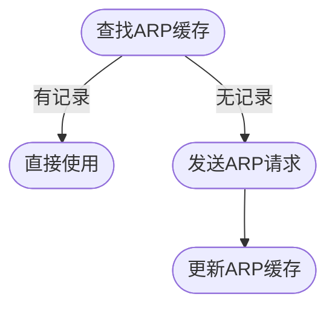
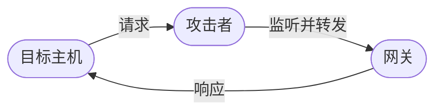

# ARP
[TOC]

## ARP协议
### 简介
地址解析协议（Address Resolution Protocol），用于将 网络层 的 IP 地址解析为 数据链路层 的 MAC 地址。

### 报文主要内容
| 字段 | 描述 |
|------|------|
| 操作码 | 请求为1，响应为2 |
| 发送方 MAC 地址 | 发送方的 MAC 地址 |
| 发送方 IP 地址 | 发送方的 IP 地址 |
| 目标 MAC 地址 | 目标的 MAC 地址，请求时为0 |
| 目标 IP 地址 | 目标的 IP 地址 |

### 工作原理

### ARP缓存
存储 IP-MAC 映射关系的表格，每台主机维护一个。

### 免费ARP
免费ARP（Gratuitous ARP）是指主机主动发送ARP响应报文，更新网络中其他主机的ARP缓存
- **IP 变更**: 主机 IP 地址变化通知其他主机更新缓存

- **MAC 变更**: 主机 MAC 地址变化通知其他主机更新缓存

- **冲突检测**: 检查网络中是否有其他主机使用相同 IP 地址

> 免费 ARP 常常成为 ARP 攻击的切入点

## ARP攻击
### 作用范围
同一二层广播域（网段、VLAN）内的主机。

### 产生原因
- **无状态**: 不校验自己有没有发过对应请求
- **无认证**: 不验证报文来源
- **广播**: 所有主机接收处理

### ARP欺骗
通过伪造 ARP 包，篡改其他主机的 ARP 缓存，实现中间人攻击。

#### 单向 ARP 欺骗
篡改目标主机对网关的 ARP 缓存
- **单向监听**: 监听目标主机的请求，并转发

- **单向阻断**: 丢弃目标主机的请求，使其无法访问网关

#### 双向 ARP 欺骗
篡改目标主机和网关相互的 ARP 缓存为攻击者的 MAC 地址
- **窃听**: 监听目标主机和网关的通信
- **篡改**: 修改其通信内容
- **阻断**: 丢弃指定请求或指定响应

#### 全网关欺骗
利用广播包或免费 ARP，篡改整个网段内所有主机对网关的 ARP 缓存，实现全网监听和劫持。

### ARP 洪泛
发送大量伪造 ARP 请求或响应，导致网络中 ARP 缓存频繁更新，甚至耗尽交换机的 CAM 表。
> CAM 表（Content Addressable Memory）用于交换机中存储 MAC-端口 映射关系

#### 原理
伪造海量 ARP 包，携带不同源 MAC 地址，导致交换机的 CAM 表被填满，退化成集线器模式
> 集线器模式: 交换机无法根据 MAC 地址转发数据包，而是将数据包广播到所有端口

#### 影响
- **网络拥塞**: 网络拥塞，性能下降
- **中间人攻击**: 攻击者可以抓取全网流量，实现嗅探

### ARP 扫描
批量发送 ARP 请求，发现存活主机并获取其 MAC 地址。
> 属于内网信息收集，不破坏网络

#### 优势
为什么不用 `ping` 扫描？
- **ICMP 屏蔽**: 许多主机或防火墙屏蔽 ICMP 请求，ARP 请求很少被屏蔽
- **高效**: 速度更快，且准确率更高
- **MAC 地址**: 顺便可以获取 MAC 地址

### 衍生组合攻击
一般通过 ARP 欺骗成为中间人，进行其他后续攻击。
#### DNS 劫持
- **前置**: 通过 ARP 欺骗成为中间人
- **操作**: 篡改 DNS 响应，返回伪造的 IP 地址
- **效果**: 使用户访问恶意网站

#### SSL 降级
- **前置**: 通过 ARP 欺骗成为中间人
- **操作**: 拦截 HTTPS 请求，篡改证书或强制降级为 HTTP
- **效果**: 攻击者可以窃取敏感信息

#### 网页注入
- **前置**: 通过 ARP 欺骗成为中间人
- **操作**: 全改 HTTP 响应包，注入恶意脚本或广告

## 防御策略
|策略|描述|针对攻击类型|隐患|
|----|----|----|----|
|静态 ARP 表|手动配置 IP-MAC 映射关系|ARP 欺骗|维护困难|
|动态 ARP 检测（DAI）|交换机检测 ARP 包的合法性，丢弃异常包|ARP 欺骗|需要支持 DAI 的交换机|
|交换机端口限制|限制端口的 MAC 地址数量，防止 CAM 表被填满|ARP 洪泛|可能误伤合法设备|
|全链路加密|使用 HTTPS、SSH 等加密协议，防止中间人窃听|所有|保护数据安全，但无法防止网络破坏|
|入侵检测系统（IDS）|监控异常 ARP 包和 IP-MAC 变动|所有|需要专业配置和维护|

## 工具
- `arp`

- [arp-scan](../tools/arp-scan.md)

- [dsniff](../tools/dsniff.md)

- BetterCap

