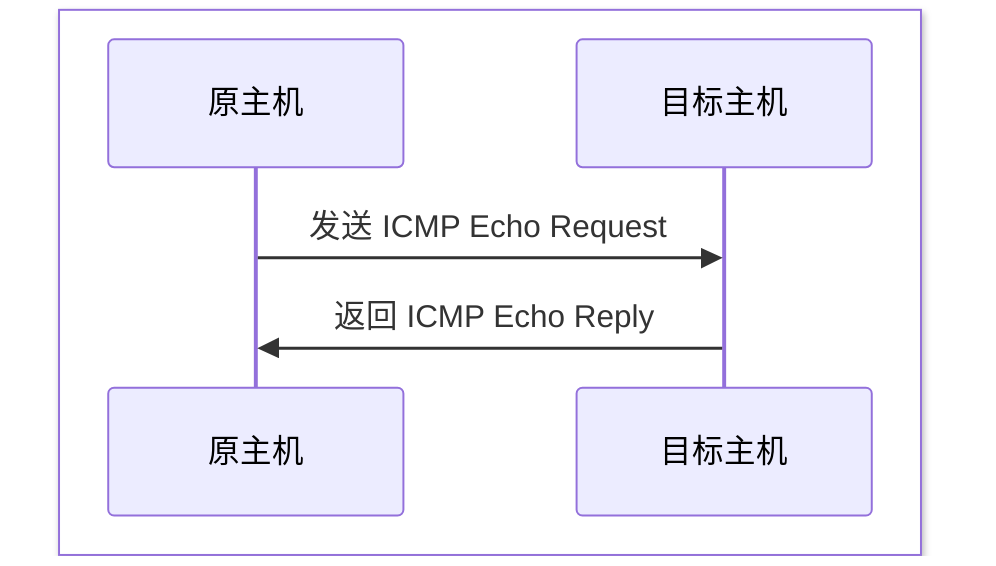

# ICMP
[TOC]

## 简介
互联网控制报文协议（Internet Control Message Protocol）用于在网络设备之间传递控制信息和错误报告，诊断网络问题以及提供网络状态信息。

## 报文结构
<table style="width:100%;border-collapse:collapse;font-family:Consolas,monospace;font-size:13px;text-align:center;table-layout:fixed;border:1px solid #555;">
  <tr style="background:#2c3e50;color:#fff;">
    <td style="border:1.5px solid #666;" colspan="8">0–7</td>
    <td style="border:1.5px solid #666;" colspan="8">8–15</td>
    <td style="border:1.5px solid #666;" colspan="8">16–23</td>
    <td style="border:1.5px solid #666;" colspan="8">24–31</td>
  </tr>
  <tr style="color:#000;">
    <td style="border:1px solid #666;background:#f1948a;" colspan="8"><b>类型 Type</b> 8 bit</td>
    <td style="border:1px solid #666;background:#f5b7b1;" colspan="8"><b>代码 Code</b> 8 bit</td>
    <td style="border:1px solid #666;background:#fdebd0;" colspan="16"><b>校验和 Checksum</b> 16 bit</td>
  </tr>
  <tr style="color:#000;">
    <td style="border:1px solid #666;background:#eaecee;" colspan="32"><b>消息体（因 Type/Code 而异）</b> 例如：标识符 + 序列号（Echo 请求/应答） 或：未用 + 出错 IP 头部 + 原始数据前 8 字节（不可达/超时）</td>
  </tr>
</table>

### 类型（Type）
8 位字段，指示 ICMP 消息的类型

|编号|0|3|8|11|
|-|-|-|-|-|
|类型|Echo Reply|Destination Unreachable|Echo Request|Time Exceeded|

### 代码（Code）
8 位字段，指示 Type 下的子类型

> 例如 Type=3（Destination Unreachable）下的 Code 有：
>|编号|0|1|2|3|4|5|
>|---|---|---|---|---|---|---|
>|子类型|网络不可达|主机不可达|协议不可达|端口不可达|需要分片但设置了 DF 标志|源路由失败|

## 原理

## 工具
- **ping**：测试网络连通性，发送 ICMP Echo Request 并接收 ICMP Echo Reply

- **traceroute**：追踪数据包经过的路由路径，发送带有递增 TTL（生存时间）的 ICMP Echo Request 获取每一跳路由信息

- **nmap**：网络扫描工具，可以使用 ICMP 扫描

