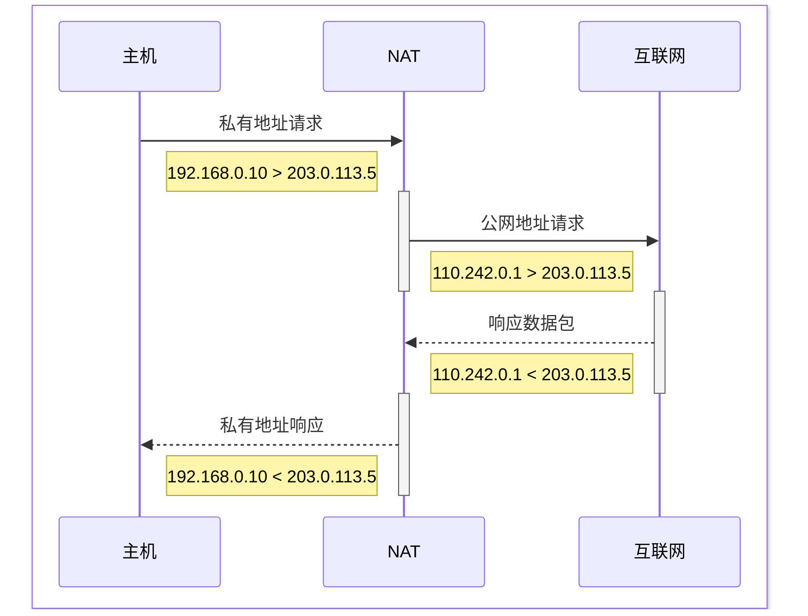

# IPv4
[TOC]

## 简介
Internet Protocol version 4，网络层核心协议，用于在基于分组交换的网络中进行数据传输。

## 格式
32 位二进制数，通常以点分十进制表示

||第一字节|第二字节|第三字节|第四字节|
|--|--|--|--|--|
|二进制|$11000000.$|$10101000.$|$00000000.$|$00000001$|
|十进制|$192.$|$168.$|$0.$|$1$|

- 每个点分十进制数的范围是 0~255
- 总共 有 $2^{32}$ 个地址，约为 42 亿

## 划分
IPv4 地址包含两部分信息
- **网络号**：用于标识网段
- **主机号**：用于标识网段中的主机

### 子网掩码
用 32 位掩码表示，1 表示网络号，0 表示主机号
||十进制|二进制|
|--|:--|--|
|IP|$192.168.0.1$|$11000000.10101000.00000000.00000001$|
|子网掩码|$255.255.255.0$|$11111111.11111111.11111111.00000000$|
|网络号|$192.168.0.0$|$11000000.10101000.00000000.00000000$|
|主机号|$0.0.0.1$|$00000000.00000000.00000000.00000001$|
- IP 地址 & 子网掩码 = 网络号 
- IP 地址 & ~子网掩码 = 主机号

### CIDR
无类域间路由选择（Classless Inter-Domain Routing）使用斜杠表示法表示网络号长度

|子网掩码|CIDR|
|--|--|
|$255.255.255.0$|$/24$|

## 分类
以前将 IPv4 地址分为五类，固定网络号和主机号长度，因不够灵活已被 CIDR 取代。

| 类别 | 前缀 | 网络号位数 | 范围 | 网络数 | 主机数 | 适用 |
|------|------|---------|------|------|------|------|
| **A** | `0` | 8 位 | `1.0.0.0` ~ `126.255.255.255` | 128 | 16,777,214 | 超大型网络 |
| **B** | `10` | 16 位 | `128.0.0.0` ~ `191.255.255.255` | 16,384 | 65,534 | 中型网络 |
| **C** | `110` | 24 位 | `192.0.0.0` ~ `223.255.255.255` | 2,097,152 | 254 | 小型网络 |
| **D** | `1110` | - | `224.0.0.0` ~ `239.255.255.255` | - | - | **组播** |
| **E** | `11110` | - | `240.0.0.0` ~ `255.255.255.255` | - | - | 保留（实验） |

## 特殊地址
| 地址 | 用途 |
|-----------|------|
| `0.0.0.0` | 表示"任意地址" |
| `127.0.0.0/8` | **回环地址**（localhost） |
| `169.254.0.0/16` | APIPA 自动分配（DHCP失败时） |
| `10.0.0.0/8` | **私有地址** A类 |
| `172.16.0.0/12` | **私有地址** B类 |
| `192.168.0.0/16` | **私有地址** C类 |
| `255.255.255.255` | 受限广播 | 可用于 Smurf 放大攻击 |

## NAT
网络地址转换（Network Address Translation），用于将私有地址映射为公网地址。

### 工作原理

### 映射表
记录 $IP_{in}:port_{in} \leftrightarrow IP_{out}:port_{out}$ 映射关系

| 私有地址 | 内部端口 | 外部端口 | 公网地址 |
|--------|----------|--------|---------|
|$192.168.0.10$|$1000$|$60000$|$203.0.113.5$|
|...|...|...|...|

