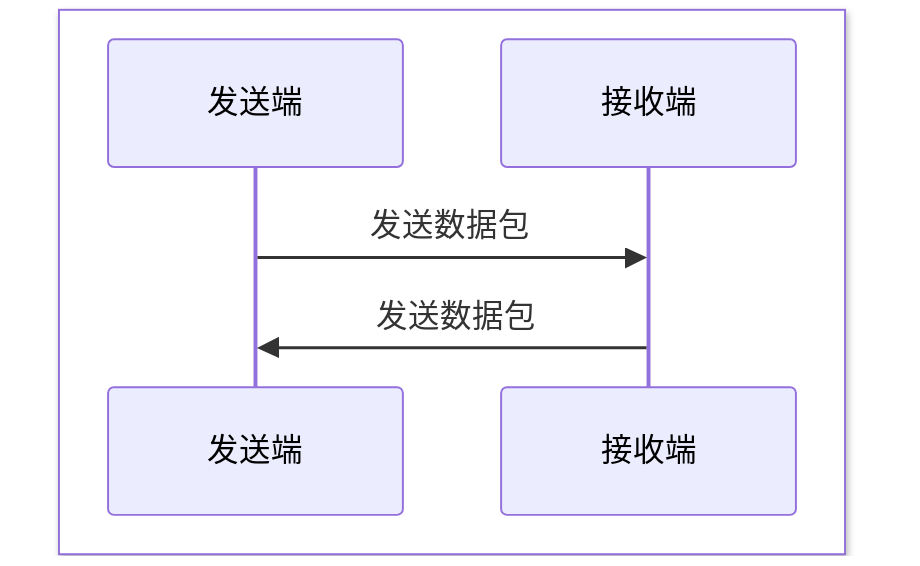
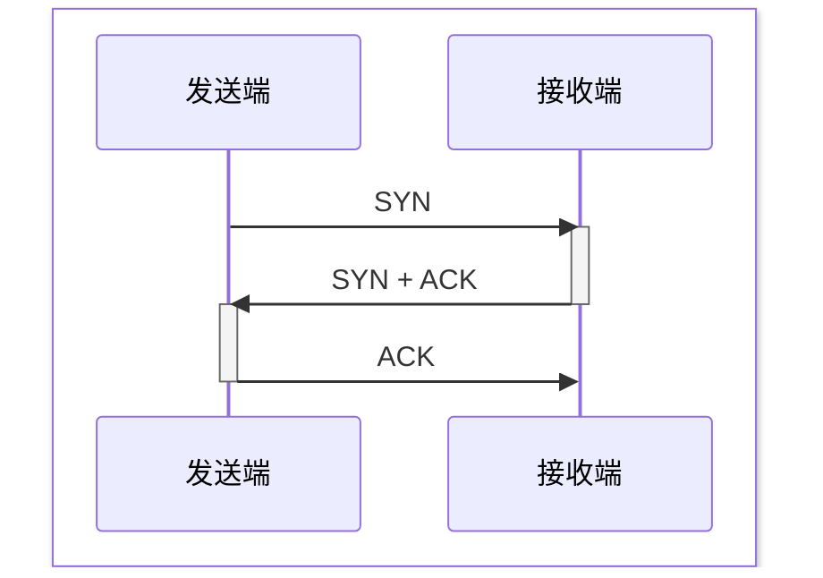
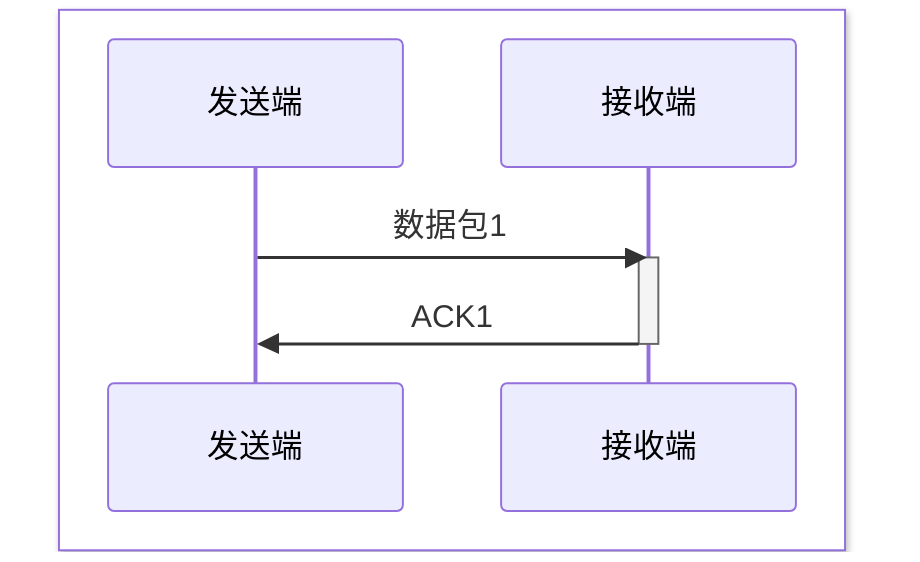
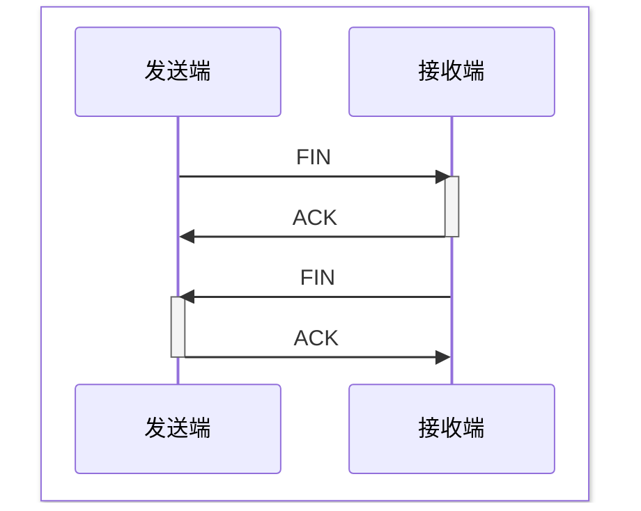

# 传输层协议（TCP/UDP）
[TOC]

## UDP 协议
### 简介
用户数据报协议（User Datagram Protocol，UDP）提供简单快速但不可靠的传输。

### 报文格式
<table style="width:100%;border-collapse:collapse;font-family:Consolas,monospace;font-size:13px;text-align:center;border:1px #FFFFFF;">
  <tr style="background:#2c3e50;color:#fff;">
    <td style="border:1.5px solid #666;" colspan="16">Bits 0–15</td>
    <td style="border:1.5px solid #666;" colspan="16">Bits 16–31</td>
  </tr>
  <tr style="background:#d6eaf8;color:#000;">
    <td style="border:1px solid #666;" colspan="16"><b>源端口</b> (16 bit) · Byte 0–1</td>
    <td style="border:1px solid #666;" colspan="16"><b>目的端口</b> (16 bit) · Byte 2–3</td>
  </tr>
  <tr style="background:#fdebd0;color:#000;">
    <td style="border:1px solid #666;" colspan="16"><b>长度</b> (16 bit) · Byte 4–5</td>
    <td style="border:1px solid #666;" colspan="16"><b>校验和</b> (16 bit) · Byte 6–7</td>
  </tr>
  <tr style="background:#eaecee;color:#000;">
    <td style="border:1px solid #666;" colspan="32"><b>数据载荷</b> (可变)</td>
  </tr>
</table>

### 原理
直接发送数据包

### 特点
- **无连接**: 发送数据前不需要建立连接
- **不可靠**: 不保证数据包到达、完整性、顺序
- **支持广播多播**: 可以将数据包发送到多个接收端

### 应用场景
- **实时应用**: 视频会议、在线游戏、语音通话等
- **广播和多播**: DNS 查询、DHCP 等

## TCP 协议
### 简介
传输控制协议（Transmission Control Protocol，TCP）提供可靠的、面向连接的传输服务。

### 报文格式
<table style="width:100%;border-collapse:collapse;font-family:Consolas,monospace;font-size:12px;text-align:center;border:1px solid #555;">
  <tr style="background:#2c3e50;color:#fff;">
    <td style="border:1.5px solid #666;" colspan="8">0–7</td>
    <td style="border:1.5px solid #666;" colspan="8">8–15</td>
    <td style="border:1.5px solid #666;" colspan="8">16–23</td>
    <td style="border:1.5px solid #666;" colspan="8">24–31</td>
  </tr>
  <tr style="background:#d6eaf8;color:#000;">
    <td style="border:1.5px solid #666;" colspan="16"><b>源端口</b> (16 bit) · Byte 0–1</td>
    <td style="border:1.5px solid #666;" colspan="16"><b>目的端口</b> (16 bit) · Byte 2–3</td>
  </tr>
  <tr style="background:#d5f5e3;color:#000;">
    <td style="border:1.5px solid #666;" colspan="32"><b>序列号 Sequence Number</b> (32 bit) · Byte 4–7</td>
  </tr>
  <tr style="background:#d5f5e3;color:#000;">
    <td style="border:1.5px solid #666;" colspan="32"><b>确认号 Acknowledgment Number</b> (32 bit) · Byte 8–11</td>
  </tr>
  <tr style="color:#000;">
    <td style="border:1.5px solid #666;background:#f1948a;" colspan="4"><b>数据偏移</b> (4 bit)</td>
    <td style="border:1.5px solid #666;background:#f5b7b1;" colspan="6"><b>保留</b> (6 bit)</td>
    <td style="border:1.5px solid #666;background:#e74c3c;color:#fff;font-weight:bold;">U R G</td>
    <td style="border:1.5px solid #666;background:#f39c12;color:#fff;font-weight:bold;">A C K</td>
    <td style="border:1.5px solid #666;background:#2ecc71;color:#fff;font-weight:bold;">P S H</td>
    <td style="border:1.5px solid #666;background:#c0392b;color:#fff;font-weight:bold;">R S T</td>
    <td style="border:1.5px solid #666;background:#3498db;color:#fff;font-weight:bold;">S Y N</td>
    <td style="border:1.5px solid #666;background:#9b59b6;color:#fff;font-weight:bold;">F I N</td>
    <td style="border:1.5px solid #666;background:#fdebd0;" colspan="16"><b>窗口大小</b> (16 bit) · Byte 14–15</td>
  </tr>
  <tr style="background:#e8daef;color:#000;">
    <td style="border:1.5px solid #666;" colspan="16"><b>校验和</b> (16 bit) · Byte 16–17</td>
    <td style="border:1.5px solid #666;" colspan="16"><b>紧急指针</b> (16 bit) · Byte 18–19</td>
  </tr>
  <tr style="background:#f2f3f4;color:#000;">
    <td style="border:1.5px solid #666;" colspan="32"><b>选项 Options</b> (0–320 bit) · Byte 20–59（数据偏移 &gt; 5 时存在）</td>
  </tr>
  <tr style="background:#eaecee;color:#000;">
    <td style="border:1.5px solid #666;" colspan="32"><b>数据载荷 Payload</b> (可变)</td>
  </tr>
</table>

- **序列号**: 本文段的第一个字节的编号，用于排序去重
- **确认号**: 期望收到的下一个字节的编号，用于确认收到的数据

### 原理
#### 标志位
|标志|说明|
|:--|:--|
|**SYN**|**同步序列号，用于建立连接**|
|**ACK**|**确认序列号，用于确认收到的数据**|
|**FIN**|**结束连接**|
|RST|重置连接|
|PSH|立即发送数据|
|URG|紧急指针有效|

#### 建立连接（三次握手）

> 本质是双向的“通知-确认”，中间合并

#### 传输数据（确认应答）

> 单向“通知-确认”（发送端向接收端）

#### 断开连接（四次挥手）

> 还是双向“通知-确认”，ACK 自动回复，FIN 主动调用，所以分开了

#### 关键机制
- **确认应答**: 接收端收到数据包后发送 ACK，发送端收到答后才认为传输成功
- **超时重传**: 发送端在一定时间内没有收到 ACK，会重传数据包
- **滑动窗口**: 可发送多个包，控制流量或丢包补偿
- **全双工**: 通信过程中不区分客户端和服务端

> 理解这些流程图的关键在于，在每一个箭头上假设“在此处丢包”，利用“确认应答”和“超时重传”机制，推导协议如何解决

### 特点
- **面向连接**: 发送数据前需要建立连接
- **可靠传输**: 通过确认、重传、序列号等机制保证数据包的到达、完整性和顺序
- **流量控制**: 通过滑动窗口机制控制数据流量

## 安全视角
### UDP 可能攻击
| 攻击类型 | 利用原理 |
|----------|---------|
| **UDP Flood** | 海量 UDP 包打满带宽 |
| **DNS 放大攻击** | 伪造源IP，小请求换大响应 |
| **UDP 扫描** | 发 UDP 包，看是否返回 ICMP Port Unreachable |
| **SNMP/NTP 放大** | 利用 UDP 协议的公共服务放大流量 |

### TCP 可能攻击
| 攻击类型 | 利用原理 |
|----------|---------|
| **SYN Flood** | 只发 SYN 不应答，填满半连接队列 |
| **RST 攻击** | 伪造 RST 包强制断开连接 |
| **TCP 会话劫持** | 预测序列号后伪造数据包注入 |
| **端口扫描** | SYN 扫描、Connect 扫描、FIN 扫描 |

