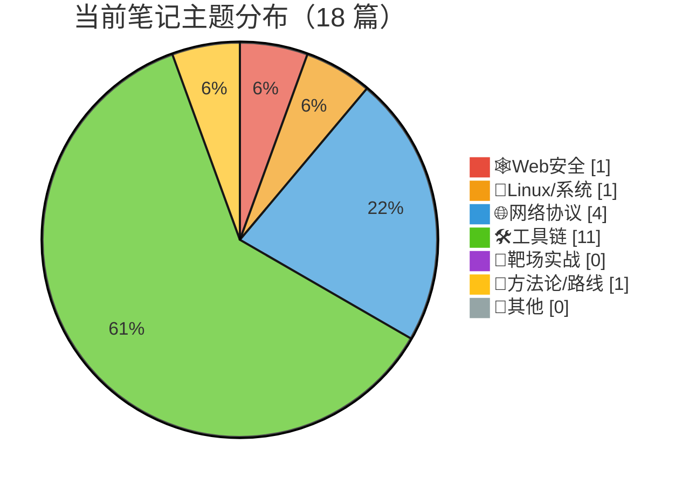

# 网络安全自学 — 2026年8月 学习历程

**首次创建**：2026-08-02  
**上次更新**：2026-08-02（第1期总结）

---

> 📋 本文件记录网络安全自学每周总结。  
> 每周日 20:00 自动更新，或在需要时手动触发。

---

## 📅 2026-08-02（第1期 · 初始盘点）

**统计周期**：项目初始化 → 2026-08-02（累计积累期）
**新增笔记**：18 篇 | **OverTheWire 进度**：Bandit 34/34（已完成🎉）| Natas 6/34（+0 本周无新增）

### 📝 学习内容总览

这是网络安全自学笔记的**首次盘点** 🎬。Alex 在过去两周悄悄积累了 18 篇笔记，涵盖从 Linux 命令基础到 SQL 注入、ARP 攻击的广泛内容。按主题分类：

#### 🐧 Linux/系统（1 篇）
- **Linux 命令大全**：从快捷键、正则、重定向到文件操作、权限管理、网络通信、进程管理的速查手册 — `linux/linux命令.md`

#### 🌐 网络协议（4 篇）
- **ARP 协议与攻击**：ARP 工作原理 + ARP 欺骗/洪泛/扫描 + 衍生攻击（DNS 劫持、SSL 降级）— `web/arp.md` ⭐ 内容最扎实的一篇
- **HTTP 协议**：请求/响应结构、状态码全解、Cookie/Referer 等关键头部 — `web/http.md`
- **TCP/UDP**（骨架）— `web/tcp_udp.md`
- **IPv4**（骨架）— `web/ipv4.md`

#### 🕸️ Web安全（1 篇）
- **SQL 注入**：从 SQL 基础到注入分类（认证绕过、UNION、报错、布尔盲注、时间盲注）+ sqlmap 速查 — `web/sql注入.md`

#### 🛠️ 工具链（11 篇）
- **编辑器**：Vim 完整速查 — `linux/tools/vim.md`
- **版本控制**：Git 工作流 + 常用命令 — `linux/tools/git.md`
- **Shell**：脚本语法（变量/条件/循环/函数）— `linux/tools/shellscript.md`
- **终端复用**：tmux 会话/窗口/分屏 — `linux/tools/tmux.md`
- **定时任务**：cron 语法 + 系统/用户 crontab — `linux/tools/cron.md`
- **扫描工具**：nmap、arp-scan、hping3、dirsearch
- **嗅探/劫持**：tcpdump、dsniff 全家桶（arpspoof/dnsspoof/macof/tcpkill/urlsnarf）

#### 📐 方法论/路线（1 篇）
- **学习路线图**：从「Linux 基础」到「综合项目」的四阶段路线，含靶场贯穿始终的设计 — `学习路线框架/00-初始路线图.md`

### 🎯 OverTheWire 进度

- **Bandit：34/34 关完成 ✅**（全通！）
  - 已覆盖：文件操作 → 权限管理 → cron → git → shell 逃逸 → setuid
  - 覆盖了从 level 0（cat 读文件）到 level 33（完整通关）的所有内容
  - 🏆 **Bandit 满级通关**！Alex 已经是 Linux 命令行老兵了

- **Natas：6/34 关完成**
  - 已通：natas0（网页检查）→ natas1（F12）→ natas2（目录列举）→ natas3（robots.txt）→ natas4（Referer 伪造）→ natas5（cookie 篡改）
  - natas6-9 已标记但未获取密码，停在半路
  - Natas 进度说明 Web 安全实践刚起步，后面还有 SQLi、XSS 等经典关卡等着

### 📊 主题分布

> 🛠️ 工具链独占 61%，说明 Alex 当前阶段是「磨刀不误砍柴功」——先把武器库配齐再上战场。Web 安全和 Linux 系统各 1 篇，靶场实战 0 篇（密码文件不纳入笔记统计），骨架笔记（tcp_udp/ipv4）等着填坑中 🔨

### 💡 亮点 & 彩蛋

1. **Bandit 通关速度惊人** — 34 关全部拿下，从「cat 读文件」一路杀到「setuid 提权 + git 操作」，说明 Alex 的 Linux 基本功是有的。回想 level 25 的 `more` 分页器逃逸和 level 32 的 `$0` shell 名漏洞，应该都是那种「看了答案才恍然大悟」的关卡 🤯

2. **ARP 笔记写得很系统** — 从协议原理到攻击分类再到防御策略，结构清晰。ARP 欺骗 → DNS 劫持 → SSL 降级这条攻击链画得很完整，适合后续做实验验证

3. **DSniff 工具链笔记** — 一张表列出 10 个子工具 + 用法示例，实战感很强。macof 的「把交换机打成集线器」这个比喻通俗易懂 👏

4. **hping3 笔记里藏了个彩蛋**：「我的 macOS 适配不对，需要 `sudo hping3 -I en0 <target>`」——典型的 macOS 用户的痛，Linux 下直接 `sudo` 就行的工具到了 macOS 总要多踩几个坑 😂

5. **tcp_udp.md 和 ipv4.md 目前只有标题** — 这两个坑记得填！TCP 三次握手、四次挥手、拥塞控制这些是网络安全的底层内功

### 🔍 笔记审查结果

发现 **5 处问题**，3 个需要修正的知识点错误 + 2 个小笔误：

1. ⚠️ **`linux/linux命令.md` 正则表达式部分**：`*` 和 `?` 的描述用了 shell glob 语义而非正则语义。
   - 当前：「`*` 匹配任意字符」「`?` 匹配单个字符」
   - 正确：`*` = 匹配前一个字符零次或多次，`?` = 匹配前一个字符零次或一次，`.` = 匹配任意单个字符
   - 这个混淆很常见，shell 通配符和正则长得像但语义不同，建议分两节写清楚

2. ⚠️ **`linux/linux命令.md` awk 参数部分**：
   - `-F` 描述「使用固定字符串而非正则表达式」—— **错误**。`-F` 设置字段分隔符，且支持正则表达式。例如 `awk -F'[ ,]'` 以空格或逗号分隔
   - `-v` 描述「反向匹配（显示不匹配的行）」—— **错误**。`-v` 用于传递变量，如 `awk -v threshold=100 '$1 > threshold'`。反向匹配用 `!` 运算符 
   - 怀疑是把 grep 的 `-v` 参数记混到 awk 上了 😅

3. ✏️ **`web/tools/arp-scan.md`**：标题行写的是 `[ROC]` 应为 `[TOC]`（Table of Contents）

4. ✏️ **`web/sql注入.md`**：「布尔盲注」部分步骤编号跳过了 3（1 → 2 → 4），补上第 3 步或者重编号即可

5. 📝 **`linux/linux命令.md` 第 385 行**：`curl -H` 描述中「自定义请求头s」多了一个 s

### 🎯 下周展望

当前学习路线处在**阶段 0（实验室与安全边界）之前**。建议方向：

1. **补坑优先**：把 tcp_udp.md 和 ipv4.md 填上，TCP 三次握手/四次挥手是后续抓包分析的基础
2. **继续 Natas**：从 natas6 继续往后打，Natas 的 Web 关卡和 SQL 注入笔记正好互补。natas6 可能需要读源码找 secret，natas8 涉及编码/加密
3. **阶段 0 启动**：按照路线图，可以开始搭建 Kali/靶机实验环境了，「只测试自有、授权或靶场目标」的安全边界要刻在 DNA 里
4. **考虑建立 Anki 卡片**：工具参数太多容易忘（nmap/dsniff/hping3 各几十个参数），可以开始用 Anki 巩固

---

## 🆕 补充：CTFHub 集成（2026-08-06）

**本周彩蛋** 🥚：Alex 问「能不能看 CTFHub 练习记录」，于是我们打通了完整的数据链路！

### 过程回顾
1. 用微信扫码登录 CTFHub（浏览器独立会话，不碰你的本地 cookie）
2. 发现登录态存在 localStorage 的 `pro__Access-Token`（Vue antd pro 框架的惯例）
3. 逆向出 API baseURL：`https://api.ctfhub.com/User_API`，认证用 **`Authorization` 头**而非 Cookie
4. 参数结构：`{"target":"self"}`（看自己）或 `{"target":"other","user_id":xxx}`（看别人）
5. 配置存到 `.cherry/ctfhub_cookies.txt` + `.cherry/ctfhub_api.md`，**以后周报全自动拉取**

### 📊 首次快照（digamos）
| 指标 | 数值 |
|------|------|
| 解题数 challenge | **18** |
| 金币 coin | **671** |
| 经验 exp | **165** |
| 今日签到 | 1 |
| 连续签到 | 12 |
| 登录方式 | 微信 |

### 🎯 技能树进度（从 getRecordSkill 解析）
已完成技能按模块：
- **Web 前置**：CTF简介 → 基础 → 题目类型/比赛形式/竞赛模式 → HTTP 协议 → 请求方式 → Cookie → 302跳转 → 基础认证 → 响应包源码
- **信息泄露**：目录遍历 → PHPINFO → 备份文件下载 → 网站源码
- **文件包含**：file 包含 → php://input → filter 伪协议 → 远程包含
- **命令注入**：PHP 命令执行基础

> 解读：Alex 正在按技能树顺序推进 Web 安全，信息泄露 → 文件包含 → 命令注入这条线走得很顺，下一站大概率是 **RCE 深入**（已在「进行中」）。这和你的 SQL 注入笔记 + Natas 练习是同一波 Web 安全学习浪潮 🌊

### 🔮 周报自动化规划
- 每周总结时用 curl 调 `getRecordSkill` / `getRecordExp` / `getRecordTask` 统计本周新增技能数、经验变化
- token 失效时会返回「你还未登录」，届时提醒 Alex 重新扫码（不需要每次手动登）
