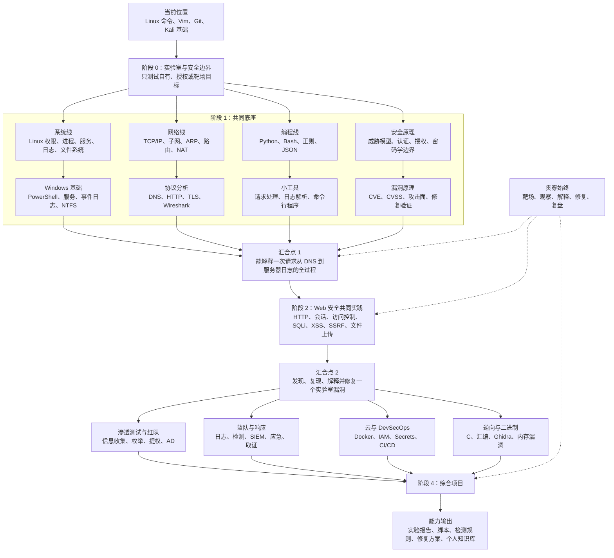

# 网络安全自学路线图

后续讲解文档统一使用 Markdown 格式，并写入对应阶段或分支目录。

```mermaid
flowchart TB
    S["当前位置<br/>Linux 命令、Vim、Git、Kali 基础"] --> E["阶段 0：实验室与安全边界<br/>只测试自有、授权或靶场目标"]

    E --> L1
    E --> N1
    E --> P1
    E --> K1

    subgraph F["阶段 1：共同底座"]
        L1["系统线<br/>Linux 权限、进程、服务、日志、文件系统"] --> L2["Windows 基础<br/>PowerShell、服务、事件日志、NTFS"]
        N1["网络线<br/>TCP/IP、子网、ARP、路由、NAT"] --> N2["协议分析<br/>DNS、HTTP、TLS、Wireshark"]
        P1["编程线<br/>Python、Bash、正则、JSON"] --> P2["小工具<br/>请求处理、日志解析、命令行程序"]
        K1["安全原理<br/>威胁模型、认证、授权、密码学边界"] --> K2["漏洞原理<br/>CVE、CVSS、攻击面、修复验证"]
    end

    L2 --> M1["汇合点 1<br/>能解释一次请求从 DNS 到服务器日志的全过程"]
    N2 --> M1
    P2 --> M1
    K2 --> M1

    M1 --> W["阶段 2：Web 安全共同实践<br/>HTTP、会话、访问控制、SQLi、XSS、SSRF、文件上传"]
    W --> M2["汇合点 2<br/>发现、复现、解释并修复一个实验室漏洞"]

    M2 --> R["渗透测试与红队<br/>信息收集、枚举、提权、AD"]
    M2 --> B["蓝队与响应<br/>日志、检测、SIEM、应急、取证"]
    M2 --> C["云与 DevSecOps<br/>Docker、IAM、Secrets、CI/CD"]
    M2 --> V["逆向与二进制<br/>C、汇编、Ghidra、内存漏洞"]

    R --> CAP["阶段 4：综合项目"]
    B --> CAP
    C --> CAP
    V --> CAP

    CAP --> OUT["能力输出<br/>实验报告、脚本、检测规则、修复方案、个人知识库"]

    LAB["贯穿始终<br/>靶场、观察、解释、修复、复盘"] -.-> M1
    LAB -.-> W
    LAB -.-> CAP
```
